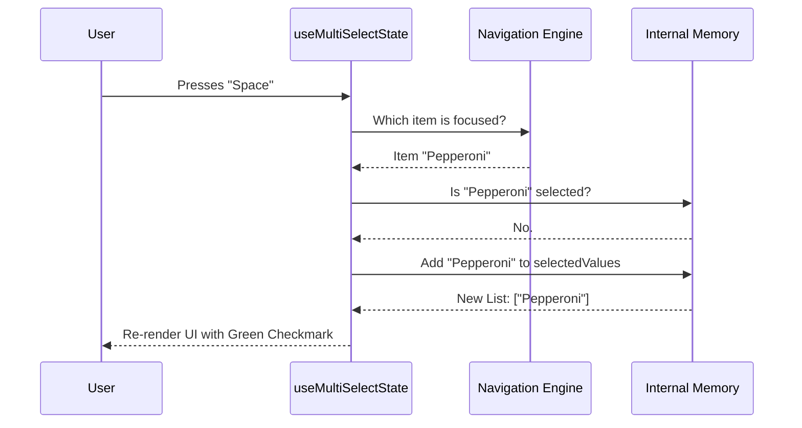

# Chapter 3: Selection Behavior Hooks

Welcome to Chapter 3! In [Chapter 2: Option Renderers](02_option_renderers.md), we met the "Painters" responsible for drawing our UI. We now have a beautiful list of items, but if you press a key on your keyboard, nothing happens yet.

To bring our component to life, we need **Selection Behavior Hooks**. 

## Motivation: The "Rulebook"

Imagine playing a board game. You have the board (the Container) and the pieces (the Renderers). But you can't play until you open the **Rulebook**.

The Rulebook answers questions like:
1.  **"What happens when I press Enter?"** (Does it pick the item? Or just check a box?)
2.  **"Can I pick more than one item?"**
3.  **"What happens when I press Escape?"**

In **CustomSelect**, we have two distinct Rulebooks implemented as React Hooks:
*   **`useSelectState`**: For single-choice lists (like a radio button).
*   **`useMultiSelectState`**: For multiple-choice lists (like a shopping cart).

## The Core Concepts

These hooks act as the "Brain" of the operation. They sit between the user's keyboard and the visual component.

### 1. Single Selection (`useSelectState`)
This is the simpler logic.
*   **Goal:** Pick one option immediately.
*   **Behavior:** As you move up and down, the focus changes. Pressing `Enter` confirms that choice and closes the prompt.

### 2. Multi-Selection (`useMultiSelectState`)
This is more complex.
*   **Goal:** Collect a set of items (e.g., `['cheese', 'pepperoni']`).
*   **Behavior:** 
    *   Pressing `Enter` or `Space` usually **toggles** selection (adds/removes from the basket).
    *   There is often a specific "Submit" action to finish the whole process.

## Usage: Plugging in the Brain

Using these hooks is very standard in React. You give them the data (`options`) and configuration (`isDisabled`), and they give you back the current state.

Here is how the Container (from Chapter 1) uses the Multi-Select hook:

```tsx
// Inside SelectMulti.tsx
const state = useMultiSelectState({
  options: myOptions,
  defaultValue: ['initial_selection'],
  onSubmit: (finalList) => console.log("Done!", finalList),
  onCancel: () => console.log("Cancelled"),
});

// Now 'state' contains everything we need to render!
console.log(state.selectedValues); // ['initial_selection']
```

The component doesn't need to know *how* selection works. It just reads `state.selectedValues` and passes it to the Renderers.

## Internal Implementation: How it Works

Let's trace what happens when a user presses the `Space` bar in a Multi-Select list.

### The Flow

1.  **Input:** The user presses Space.
2.  **Listener:** The hook's `useInput` listener catches the event.
3.  **Logic:** It checks, "Is the user currently looking at an option?"
4.  **Update:** It toggles that option inside the `selectedValues` array.
5.  **Re-render:** React detects the state change and updates the UI.



*Note: The hook asks the Navigation Engine for the current focus. We will build that engine in [Chapter 5: Navigation Engine & Viewport](05_navigation_engine___viewport.md).*

### Code Walkthrough: `use-multi-select-state.ts`

Let's look at the actual code that acts as the Rulebook.

#### 1. Keeping Score (State)

First, the hook needs to remember what is selected. It uses a standard React `useState`.

```tsx
// use-multi-select-state.ts
export function useMultiSelectState(props) {
  // The Basket: keeps track of chosen IDs
  const [selectedValues, setSelectedValues] = useState(props.defaultValue);
  
  // The Submit Button: keeps track if we are focusing the "Done" button
  const [isSubmitFocused, setIsSubmitFocused] = useState(false);
  
  // ...
```

#### 2. The Helper Function

To make updates clean, we create a helper function. This ensures that whenever selection changes, we notify the parent component via `onChange`.

```tsx
  const updateSelectedValues = (newValues) => {
    // Update local memory
    setSelectedValues(newValues);
    
    // Notify the outside world
    if (props.onChange) {
      props.onChange(newValues);
    }
  };
```

#### 3. Listening for Keys

This is the most critical part. We use `useInput` from the Ink library to intercept keystrokes. This is our "Game Loop."

```tsx
  useInput((input, key) => {
    // 1. Get the current context
    const focusedItem = navigation.focusedValue;
    
    // 2. Handle Space Bar
    if (input === ' ') {
      // Logic to toggle selection goes here...
      toggleSelection(focusedItem);
    }
    
    // 3. Handle Enter Key
    if (key.return) {
      // Logic to submit or toggle...
    }
  });
```

#### 4. The Rules of "Enter"

The logic for the `Enter` key is interesting in Multi-Select. It can mean two different things depending on configuration.

**Scenario A: Quick Submit**
If there is no specific "Submit" button, pressing Enter usually means "I'm done, send it!"

**Scenario B: Toggle Mode**
If there *is* a "Submit" button at the bottom, pressing Enter on an item usually just selects it (same as Space). You have to go down to the button and press Enter there to finish.

Here is the simplified logic structure:

```tsx
    // Inside useInput...
    if (key.return) {
      // If we are physically on the Submit Button -> FINISH
      if (isSubmitFocused) {
        props.onSubmit(selectedValues);
        return;
      }

      // If we are on an item, just toggle it (select/deselect)
      const isSelected = selectedValues.includes(focusedItem);
      
      const newList = isSelected
        ? selectedValues.filter(v => v !== focusedItem) // Remove
        : [...selectedValues, focusedItem];             // Add

      updateSelectedValues(newList);
    }
```

## Special Case: Input Fields

Remember the `SelectInputOption` from Chapter 2? The one that lets you type? 

The behavior hooks handle that too! If the focused item is a text input, the hook disables standard navigation keys (like 'j' or 'k') so you can actually type the letter 'j' into the box without the cursor moving down.

```tsx
      const isInInput = focusedOption?.type === 'input';

      // If typing in a box, ignore most shortcuts
      if (isInInput) {
        // Only allow Up/Down/Enter/Tab to escape the box
        if (!key.upArrow && !key.downArrow && !key.return) {
          return; // Let the input component handle the keystroke
        }
      }
```

*We will discuss exactly how the input captures that text in [Chapter 4: Input Controller](04_input_controller.md).*

## Summary

The **Selection Behavior Hooks** are the unseen heroes of our component.

1.  **`useSelectState`** handles the "Pick One" game rules.
2.  **`useMultiSelectState`** handles the "Pick Many" game rules, including complex logic for toggling vs. submitting.
3.  They use `useInput` to listen to the keyboard and update the `selectedValues` state.

However, we just saw a glimpse of complexity: **Typing**. How do we handle a user typing "Pepperoni" to filter the list or fill in a text box?

That requires a dedicated controller.

[Next Chapter: Input Controller](04_input_controller.md)

---

Generated by [Code IQ](https://github.com/adityasoni99/Code-IQ)