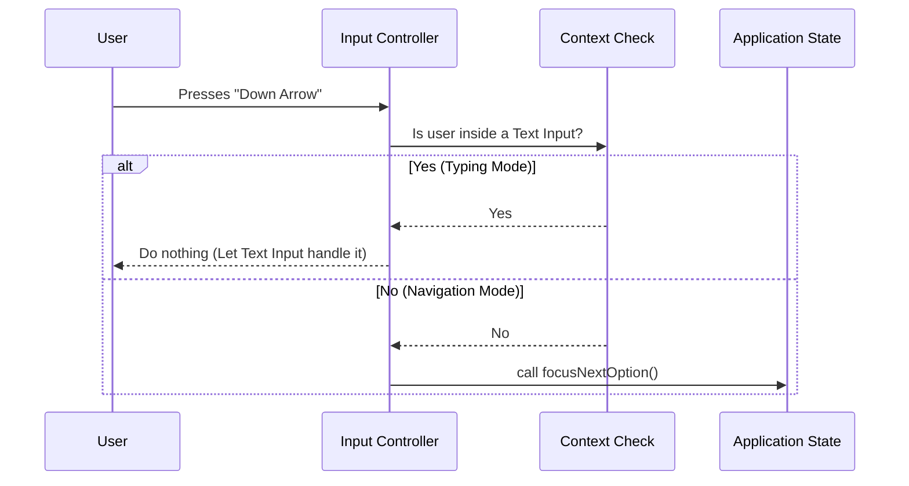

# Chapter 4: Input Controller

Welcome to Chapter 4!

In the previous chapter, [Chapter 3: Selection Behavior Hooks](03_selection_behavior_hooks.md), we built the "Brain" of our application. We defined the rules for selecting items, toggling checkboxes, and storing state.

But a brain without a body is stuck. We have the logic, but we haven't connected it to the user's keyboard yet.

That is the job of the **Input Controller**.

## Motivation: The Device Driver

Imagine you are playing a video game. You press the `A` button on your controller to jump.
*   To the hardware, that button is just a raw electrical signal.
*   To the game logic, the action is `player.jump()`.

You need a bridge in the middle to say: **"When Signal 'A' is received -> Trigger `player.jump()`."**

In **CustomSelect**, our Input Controller (`useSelectInput`) acts as this bridge (or device driver). It intercepts raw terminal keystrokes and translates them into the actions we defined in Chapter 3.

### The Problem: Context Matters

It seems simple: "Press Down Arrow -> Go to next item."

But what if the user is currently focused on a **Text Input** option (like the one we built in [Chapter 2: Option Renderers](02_option_renderers.md))?
*   If they press `Right Arrow`, they probably want to move the text cursor, not the menu focus.
*   If they press the number `1`, they want to type the character "1", not jump to Option #1.

The Input Controller must be smart enough to know the **Context** before deciding what to do.

## Usage: Plugging in the Controller

The Input Controller is a hook called `useSelectInput`. It doesn't return any values (like `state`). Instead, it silently runs in the background, listening to the keyboard.

We use it inside our main components by passing it the `state` (from Chapter 3) and the list of `options`.

```tsx
// Inside a component like SelectMulti
useSelectInput({
  state: state,       // The "Brain" to manipulate
  options: options,   // The data to look at
  isMultiSelect: true // Configuration flag
});
```

Once this line runs, your component reacts to the keyboard!

## Internal Implementation: How it Works

Let's break down the decision-making process of this controller.

### The Flow

1.  **Listen:** The controller waits for a keypress.
2.  **Check Context:** It asks, "Is the user currently typing inside a text box?"
3.  **Route:**
    *   If **Yes (Typing):** Let the key pass through to the text box (mostly).
    *   If **No (Navigating):** Capture the key and move the menu selection.



### Code Walkthrough

Let's look at `use-select-input.ts`. We will break it down into small, digestible logic blocks.

#### 1. Checking the Context

Before handling any keys, we calculate if we are currently "inside" an input option.

```tsx
  // Check if the currently focused item is of type 'input'
  const isInInput = useMemo(() => {
    // Find the option object that matches the current focus ID
    const focusedOption = options.find(opt => opt.value === state.focusedValue);
    
    // Return true if it is an input type
    return focusedOption?.type === 'input';
  }, [options, state.focusedValue]);
```
*We rely on the `state.focusedValue` from [Chapter 3: Selection Behavior Hooks](03_selection_behavior_hooks.md) to know where we are.*

#### 2. Handling Navigation (The "Normal" Mode)

If we are **not** in an input, we map standard keys to state actions. We use a helper called `useKeybindings` for clean, readable mappings.

```tsx
    if (!isInInput) {
      handlers['select:next'] = () => {
        // Trigger the state logic to move down
        state.focusNextOption();
      }
      
      handlers['select:previous'] = () => {
        // Trigger the state logic to move up
        state.focusPreviousOption();
      }
      
      handlers['select:accept'] = () => {
        // The "Enter" key was pressed -> Confirm selection
        state.selectFocusedOption?.();
      }
    }
```
*Notice how the controller doesn't know *how* to calculate the next option. It just tells the `state` to do it. The calculation logic lives in [Chapter 5: Navigation Engine & Viewport](05_navigation_engine___viewport.md).*

#### 3. Handling Raw Input (The "Typing" Mode)

For more complex logic—like determining if a specific number key was pressed, or handling behavior when inside an input box—we use the raw `useInput` hook.

Here is how we handle the conflict between typing and navigating:

```tsx
  useInput((input, key, event) => {
    // If we are currently inside a text box...
    if (isInInput) {
      
      // Allow Up/Down arrows to still navigate the menu list
      if (key.downArrow) {
        state.focusNextOption();
        return; 
      }

      // STOP! Do not process other keys (like letters or numbers).
      // We return early so the TextInput component can catch them.
      return;
    }
    
    // ... logic for normal mode continues below ...
  });
```

This acts as a filter. By returning early, we ensure that if you type the letter "A" into a text box, the Input Controller doesn't try to interpret "A" as a menu command.

#### 4. The Numeric Shortcuts

A nice feature of this controller is allowing users to jump to an option by pressing a number (e.g., pressing `3` selects the 3rd item).

```tsx
      // Only runs if NOT in an input (handled by code block above)
      if (/^[0-9]+$/.test(input)) {
        // Convert string "1" to index 0
        const index = parseInt(input) - 1; 

        // Check if that item exists
        if (index >= 0 && index < state.options.length) {
          const target = state.options[index];
          
          // Select it immediately!
          state.onChange?.(target.value);
        }
      }
```

## Summary

The **Input Controller** (`useSelectInput`) is the bridge between the user and the logic.

1.  It listens for keyboard events.
2.  It intelligently checks context (`isInInput`).
3.  It dispatches commands to the `state` hooks we built in Chapter 3.

It ensures that when you press "Down," the menu scrolls; but when you are typing "Hello," the menu stays put.

Now that we can change focus and select items, we have one final visual problem. If we have 100 items, but our terminal only fits 10 lines, how do we handle scrolling?

We need a way to calculate which items are visible.

[Next Chapter: Navigation Engine & Viewport](05_navigation_engine___viewport.md)

---

Generated by [Code IQ](https://github.com/adityasoni99/Code-IQ)