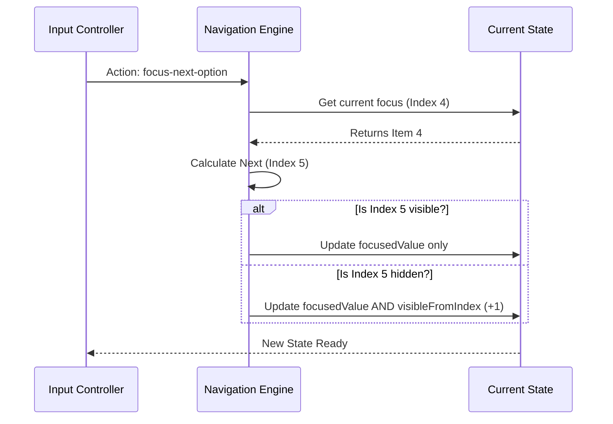

# Chapter 5: Navigation Engine & Viewport

Welcome to Chapter 5!

In the previous chapter, [Chapter 4: Input Controller](04_input_controller.md), we built the bridge between your keyboard and the application. We know when the user presses "Down Arrow," but we haven't actually moved anything yet.

The Input Controller just shouts "Move Down!" It is up to the **Navigation Engine** to actually calculate where "Down" is.

## Motivation: The "Netflix" Problem

Imagine you are browsing a library of 1,000 movies on your TV.
1.  **Focus:** You can only highlight one movie cover at a time.
2.  **Viewport:** Your TV screen fits only 5 movies in a row.

When you are at the 5th movie and press "Right," the screen must **scroll** to show the 6th movie. The first movie disappears off the left side.

This logic—tracking where you are and sliding the "camera" to keep you in view—is the job of the **Navigation Engine**. Without it, you would highlight an item that is off the screen, and the user would be flying blind.

## Core Concepts

Our engine, `useSelectNavigation`, manages two specific things:

### 1. The Focus (The Cursor)
This is simple. It tracks the `value` of the item currently highlighted.
*   *Example:* `focusedValue: "pepperoni"`

### 2. The Viewport (The Camera)
This is a sliding window. It tracks the start and end indices of what is visible.
*   *Example:* If you have 50 items but only show 5 lines:
    *   `visibleFromIndex: 10`
    *   `visibleToIndex: 15`

## Usage: The Camera Operator

Using this hook is like hiring a camera operator. You tell them your list of actors (options) and how big the lens is (visible count).

```tsx
// Inside your component
const navigation = useSelectNavigation({
  options: allToppings,  // Array of 50 items
  visibleOptionCount: 5  // Only show 5 at a time
});
```

The hook returns the calculated data needed to draw the screen:

```tsx
// What the hook gives back:
console.log(navigation.focusedValue);   // "pepperoni"
console.log(navigation.visibleOptions); // Only 5 items!
```

**Note:** In [Chapter 1: Multi-Select Container](01_multi_select_container.md), we looped over `navigation.visibleOptions` to render our list. This is why! We never render the full list of 50 items, only the 5 the engine gives us.

## Internal Implementation: How it Works

The engine uses a pattern called a **Reducer**. Think of a Reducer as a "State Machine." It takes the current situation, applies an action, and returns the new situation.

### The Flow: Moving Down

Let's see what happens when the Input Controller triggers `focusNextOption()`.

1.  **Identify:** Where are we now? (Item 4)
2.  **Look Ahead:** What is the next item? (Item 5)
3.  **Check Viewport:** Is Item 5 currently visible on screen?
    *   **Yes:** Just move the focus.
    *   **No:** Move the focus AND scroll the viewport down by 1.



### Code Walkthrough: The Reducer Logic

Let's look at the heart of the engine in `use-select-navigation.ts`. We will simplify the code to understand the logic of "Scrolling."

#### 1. The Setup

We store the viewport boundaries in the state.

```tsx
// The internal memory of the engine
type State = {
  focusedValue: string;
  visibleFromIndex: number; // e.g., 0
  visibleToIndex: number;   // e.g., 5
  // ...
}
```

#### 2. The Movement Logic

When the action `focus-next-option` comes in, we run this calculation:

```tsx
// Inside the reducer function
case 'focus-next-option': {
  // 1. Find the next item in the list
  const nextItem = currentItem.next; 

  // 2. Check if we need to scroll
  // If the next item's index is greater than what we can see...
  const needsToScroll = nextItem.index >= state.visibleToIndex;

  if (!needsToScroll) {
    // Simple case: Just highlight the new item
    return { ...state, focusedValue: nextItem.value };
  }

  // ...
```

#### 3. The Scroll Logic

If `needsToScroll` is true, we have to "push" the window down.

```tsx
  // ... continued from above
  
  // Shift the window down by 1
  const newEnd = state.visibleToIndex + 1;
  const newStart = newEnd - state.visibleOptionCount;

  return {
    ...state,
    focusedValue: nextItem.value,
    visibleFromIndex: newStart, // The window moved!
    visibleToIndex: newEnd
  };
}
```

This ensures that the `focusedValue` is *always* inside the range of `visibleFromIndex` and `visibleToIndex`.

### Page Navigation

The engine also handles `Page Down` and `Page Up`. The logic is similar, but instead of moving by **1**, it jumps by the `visibleOptionCount`.

```tsx
case 'focus-next-page': {
  // Jump ahead by 5 items (or whatever the view count is)
  const targetIndex = currentItem.index + state.visibleOptionCount;
  
  // Recalculate the viewport to surround this new index
  // ... logic to shift window ...
}
```

## The Computed Viewport

Finally, the hook exposes `visibleOptions`. This isn't stored in state; it is calculated on the fly (derived) to ensure it is always perfectly in sync with the indices.

```tsx
// use-select-navigation.ts
const visibleOptions = useMemo(() => {
  // Take the full list
  return options
    // Add index numbers for reference
    .map((opt, i) => ({ ...opt, index: i }))
    // Slice it using our calculated window!
    .slice(state.visibleFromIndex, state.visibleToIndex);
}, [options, state.visibleFromIndex, state.visibleToIndex]);
```

This `visibleOptions` array is exactly what [Chapter 1: Multi-Select Container](01_multi_select_container.md) uses to draw the UI.

## Summary

The **Navigation Engine** is the GPS and Camera Operator of our application.

1.  It maintains the **State** of where the cursor is (`focusedValue`).
2.  It calculates the **Viewport** (start/end indices) to ensure the cursor is never hidden.
3.  It handles the math for **Scrolling** when the user moves past the edge of the screen.

You might have noticed a property called `.next` in the code examples above (`currentItem.next`). How do we know what comes next? Do we loop through the array every time to find the neighbor? That would be slow!

Instead, we convert our options array into a smart **Linked List** structure to make finding neighbors instant.

[Next Chapter: Linked Option Data Structure](06_linked_option_data_structure.md)

---

Generated by [Code IQ](https://github.com/adityasoni99/Code-IQ)