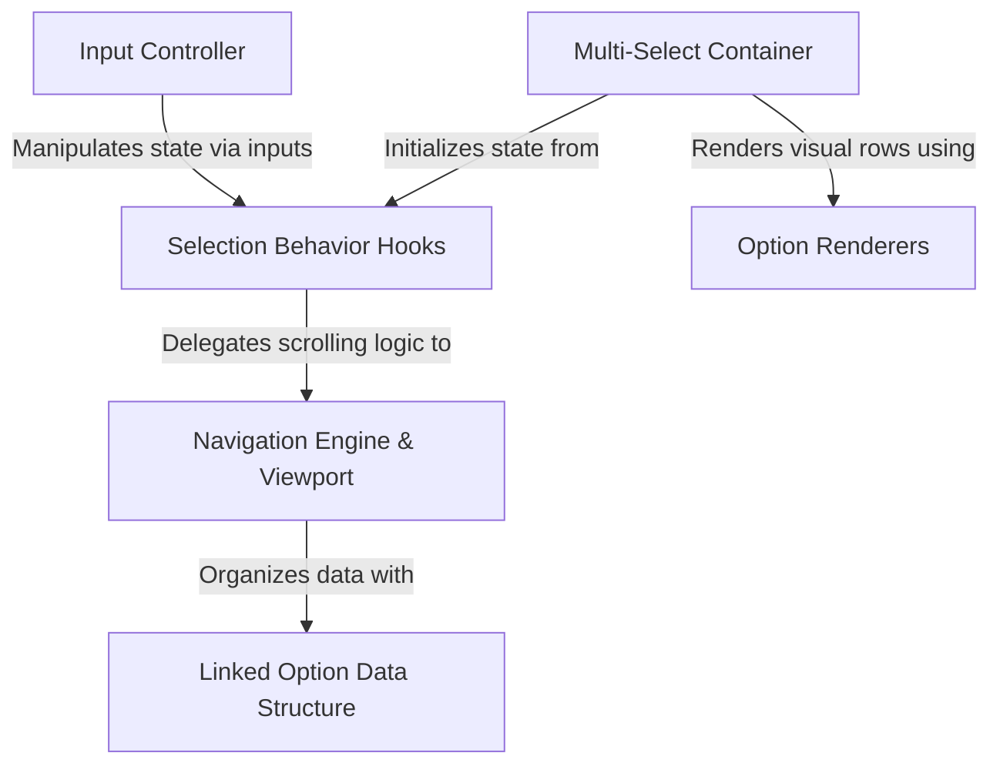

# Tutorial: CustomSelect

This project creates a sophisticated **interactive list** component for terminal applications using React Ink. It separates the "brain" (navigation and viewport logic) from the "rules" (selection behavior) to efficiently handle both single and **multi-select** workflows. It leverages a specialized *doubly-linked list* data structure for fast scrolling and includes versatile renderers for displaying text, inputs, and images.

## Chapters

1. [Multi-Select Container](01_multi_select_container.md)
2. [Option Renderers](02_option_renderers.md)
3. [Selection Behavior Hooks](03_selection_behavior_hooks.md)
4. [Input Controller](04_input_controller.md)
5. [Navigation Engine & Viewport](05_navigation_engine___viewport.md)
6. [Linked Option Data Structure](06_linked_option_data_structure.md)

---

Generated by [Code IQ](https://github.com/adityasoni99/Code-IQ)