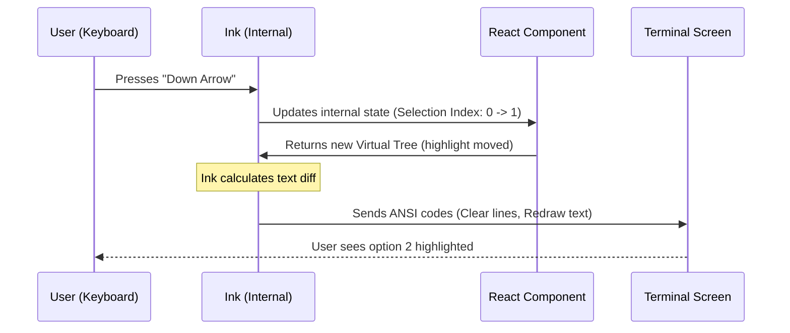

# Chapter 1: Terminal UI Rendering (Ink)

Welcome to the **DesktopUpsell** project! In this first chapter, we are going to explore how we build beautiful, interactive user interfaces inside a command-line window.

## The Challenge: Drawing with Text

Imagine you want to build a popup window asking a user a question, like "Do you want to try our new app?"

On a website, you use HTML and CSS: `<div>`, `<button>`, and colors.
But inside a **Terminal** (the black command-line screen), you don't have HTML. You only have text characters and "Escape Codes" (special hidden codes that tell the terminal to change color or move the cursor).

Writing these raw codes manually is hard. It feels like trying to paint a portrait using a typewriter.

## The Solution: Ink

We use a library called **Ink**. Think of Ink as a **Translator**.

1.  **You speak React:** You write code using standard React components like `<Box>` and `<Text>`, and use hooks like `useState`.
2.  **Ink translates:** It converts your React components into the raw text strings and escape codes the terminal understands.

This allows us to build complex, interactive CLI (Command Line Interface) tools using the same mental model we use for web development.

---

## Key Concepts

Before we look at the code, let's understand the building blocks.

### 1. The `<Box>`
Think of `<Box>` exactly like a `<div>` in web development, but with **Flexbox** built-in. It creates a container to hold other elements.
*   `flexDirection="column"`: Stacks items vertically.
*   `paddingX={2}`: Adds spaces on the left and right.
*   `borderColor="green"`: Draws a colored border around the box using text characters (like `│`, `─`, `┌`, `┐`).

### 2. The `<Text>`
This is like a `<span>` or `<p>`. It creates the actual text content. You can add props like `bold` or `color="red"`.

### 3. Interactive Widgets (`Select`)
Since we can't click with a mouse in most terminals, we use keyboard navigation. Components like `<Select>` listen for Arrow Key presses to highlight options and Enter to select one.

---

## How We Use It: The Upsell Dialog

Let's look at how `DesktopUpsellStartup.tsx` uses Ink to render a permission dialog.

### Step 1: Defining the Layout

We want a dialog with a title, some description text, and a menu.

```tsx
// Simplified example from DesktopUpsellStartup.tsx
return (
  <PermissionDialog title="Try Claude Code Desktop">
    <Box flexDirection="column" paddingX={2} paddingY={1}>
      <Box marginBottom={1}>
        <Text>
          Same Claude Code with visual diffs and more.
        </Text>
      </Box>
      {/* Selection Menu goes here */}
    </Box>
  </PermissionDialog>
);
```

**Explanation:**
*   We wrap everything in a custom `<PermissionDialog>` (which uses `<Box>` internally to draw a border).
*   Inside, we use a `<Box>` with `flexDirection="column"` to make sure the text sits *above* the menu.
*   We add `padding` so the text doesn't touch the borders.

### Step 2: Handling User Input

We need a menu so the user can choose "Try," "Not now," or "Don't ask again."

```tsx
// Defining the menu options
const options = [
  { label: "Open in Claude Code Desktop", value: "try" },
  { label: "Not now", value: "not-now" },
  { label: "Don't ask again", value: "never" }
];
```

**Explanation:**
This is a standard JavaScript array. Each object represents a choice the user can make.

### Step 3: Rendering the Select Component

Now we render the interactive list.

```tsx
// Inside the Component return logic
<Select
  options={options}
  onChange={(value) => handleSelect(value)}
  onCancel={() => handleSelect("not-now")}
/>
```

**Explanation:**
*   The `<Select>` component renders the list.
*   **Magical Translation:** Ink detects when you press the **Down Arrow** on your keyboard. It re-renders the text, removing the highlight color from the first item and adding it to the second item.
*   When you press **Enter**, `onChange` runs.

### Step 4: Logic with Hooks

Just like a web app, we use `useState` to control the UI flow.

```tsx
export function DesktopUpsellStartup({ onDone }) {
  // Standard React Hook
  const [showHandoff, setShowHandoff] = useState(false);

  // If state is true, render a different screen
  if (showHandoff) {
    return <DesktopHandoff onDone={onDone} />;
  }

  // ... otherwise render the dialog
}
```

**Explanation:**
*   Ink fully supports React Hooks.
*   When `setShowHandoff(true)` is called, Ink "clears" the previous text from the terminal and draws the `<DesktopHandoff>` component instead.

---

## Internal Implementation: How It Works

How does React logic turn into pixels (well, characters) on a screen?

### The "Printer" Analogy
Imagine the Terminal is a physical printer. You can't change what's already printed; you can only print new lines. However, modern terminals allow you to "overwrite" previous lines.

Ink acts as a specialized manager that knows exactly how many lines your component takes up. When React updates, Ink rewrites just those lines.

### Sequence Diagram

Here is what happens when the user presses the "Down Arrow" key:



### Under the Hood: The Reconciler

React is separate from the web (DOM). React is just a logic engine. It calculates "What should the UI look like?"

Usually, a "Renderer" (like `ReactDOM`) takes that logic and updates HTML tags.
Here, **Ink** is the Renderer.

1.  **Interception:** Ink intercepts `stdout` (standard output). This ensures that if you use `console.log` elsewhere, it doesn't break the UI drawing.
2.  **Layout Engine:** Ink uses a layout engine called **Yoga**. It calculates where every `<Box>` should be, similar to how a browser calculates CSS.
3.  **Output Generation:** Finally, it generates a giant string containing the text and color codes and pushes it to the terminal.

---

## Summary

In this chapter, we learned:
1.  **Ink** allows us to write CLI tools using React syntax.
2.  We use components like `<Box>` for layout and `<Text>` for content.
3.  We handle logic using standard hooks like `useState`.
4.  Ink handles the hard work of translating React updates into raw terminal text codes.

Now that we know *how* to draw the UI, we need to decide *when* to show it. Not everyone should see this dialog every time they start the app.

In the next chapter, we will learn how we determine if a user is eligible to see this upsell.

[Next Chapter: Feature Gating & Targeting Logic](02_feature_gating___targeting_logic.md)

---

Generated by [Code IQ](https://github.com/adityasoni99/Code-IQ)