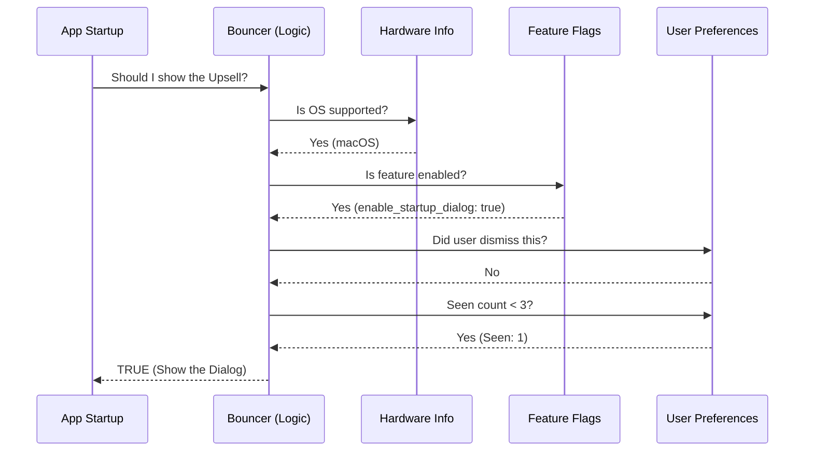

# Chapter 2: Feature Gating & Targeting Logic

In the previous chapter, [Terminal UI Rendering (Ink)](01_terminal_ui_rendering__ink_.md), we learned how to draw beautiful interface components like the Upsell Dialog.

However, just because we *can* draw a dialog doesn't mean we *should* show it every single time. Imagine if every time you opened your terminal, a popup asked you to buy something. You would uninstall that tool immediately!

In this chapter, we will build the **Logic Layer**—the "brain" that decides whether the user is eligible to see the Upsell Dialog.

---

## The Concept: The "Bouncer" Analogy

Think of your application as an exclusive nightclub. The **Upsell Dialog** is a special VIP party inside. Not everyone gets in.

We need a **Bouncer** (or Doorman) at the entrance. Before opening the door (rendering the UI), the Bouncer checks three things in a specific order:

1.  **The ID Check (Hardware):** Is the user on a compatible Operating System?
2.  **The "Open" Sign (Feature Flags):** Has the developer turned this feature on remotely?
3.  **The "Do Not Disturb" List (User Preference):** Has the user already said "No" or seen this too many times?

If any of these checks fail, the Bouncer says "Move along," and the app starts normally without the popup.

---

## The Implementation

We implement this logic in a function called `shouldShowDesktopUpsellStartup`. Let's build it layer by layer.

### Layer 1: Hardware Compatibility

First, we check if the user's computer can actually run the software we are promoting. There is no point in upsizing a Linux user if the desktop app only runs on macOS and Windows.

```typescript
function isSupportedPlatform(): boolean {
  // Check for macOS OR Windows (x64 architecture)
  return (
    process.platform === 'darwin' || 
    (process.platform === 'win32' && process.arch === 'x64')
  );
}
```

**Explanation:**
*   `process.platform`: Built-in Node.js information about the OS.
*   If this returns `false`, the Bouncer stops here. The user never sees the dialog.

### Layer 2: Remote Feature Flags

Even if the user has the right hardware, we might want to turn the feature off globally (perhaps we found a bug, or we are only rolling it out to 10% of users).

```typescript
export function shouldShowDesktopUpsellStartup(): boolean {
  // 1. Check Hardware
  if (!isSupportedPlatform()) return false;

  // 2. Check Remote Configuration
  if (!getDesktopUpsellConfig().enable_startup_dialog) return false;
  
  // ... continued below
```

**Explanation:**
*   `getDesktopUpsellConfig()`: This fetches a configuration file from a server (we will build this in [Dynamic Configuration (Feature Flags)](03_dynamic_configuration__feature_flags_.md)).
*   If `enable_startup_dialog` is false, the club is closed.

### Layer 3: User Persistence (The "Nag" Factor)

Finally, we check the local user history. We want to be polite.

```typescript
  // 3. Load Local User Config
  const config = getGlobalConfig();

  // Did they click "Don't ask again"?
  if (config.desktopUpsellDismissed) return false;

  // Have they seen it 3 times already?
  if ((config.desktopUpsellSeenCount ?? 0) >= 3) return false;

  return true; // All checks passed!
}
```

**Explanation:**
*   `getGlobalConfig()`: Reads a local file where we save user choices (covered in [Global User State Persistence](04_global_user_state_persistence.md)).
*   **Dismissal:** If the user previously selected "Never," we respect that forever.
*   **Fatigue Cap:** If they have seen it 3 times and clicked "Not Now" every time, we stop bothering them.

---

## Visualizing the Flow

Here is how our "Bouncer" makes the decision in milliseconds before the app starts.



---

## Using the Logic

Now, let's look at how we use this in our main application file. We wrap the UI rendering code from Chapter 1 inside this check.

```typescript
// Inside the main entry point
import { shouldShowDesktopUpsellStartup } from './DesktopUpsellStartup';

export async function run() {
  // The Bouncer Check
  const showUpsell = shouldShowDesktopUpsellStartup();

  if (showUpsell) {
    // Render the Ink UI (Chapter 1)
    render(<DesktopUpsellStartup />);
  } else {
    // Skip UI, run normal CLI command
    runMainCommand();
  }
}
```

**What happens here?**
1.  The CLI starts.
2.  It asks `shouldShowDesktopUpsellStartup`.
3.  If it returns `false`, the user sees absolutely nothing different; the command simply runs.
4.  If it returns `true`, the CLI pauses and renders the Ink dialog.

---

## Internal Implementation Details

While the logic seems simple, it relies on two other powerful systems to work correctly.

### 1. The config Object
In the code snippets above, you saw `getGlobalConfig()`. This is not just a variable in memory. If it were just a variable, the "Seen Count" would reset to 0 every time you closed the terminal.

This function actually reads from a JSON file stored on the user's hard drive.
*   **Input:** `getGlobalConfig()`
*   **Output:** `{ desktopUpsellSeenCount: 2, desktopUpsellDismissed: false }`

### 2. The Dynamic Config
You also saw `getDesktopUpsellConfig()`. This connects to a remote service.
*   **Why?** It allows us to turn off the upsell for *everyone* instantly without forcing users to update their CLI tool.

---

## Summary

In this chapter, we created a smart gating system—our "Bouncer."

1.  We learned that showing UI is a privilege, not a guarantee.
2.  We implemented **Hardware Checks** (OS compatibility).
3.  We implemented **Remote Checks** (Feature Flags).
4.  We implemented **Local Checks** (User Preference/Nagging).

Right now, our "Remote Check" is just reading a hardcoded default value. In the next chapter, we will connect this to a real remote configuration system so we can control our CLI tool from the cloud.

[Next Chapter: Dynamic Configuration (Feature Flags)](03_dynamic_configuration__feature_flags_.md)

---

Generated by [Code IQ](https://github.com/adityasoni99/Code-IQ)