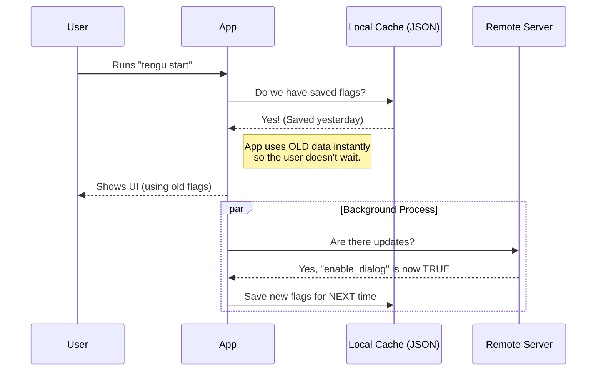

# Chapter 3: Dynamic Configuration (Feature Flags)

In the previous chapter, [Feature Gating & Targeting Logic](02_feature_gating___targeting_logic.md), we built the "Bouncer"—the logic that decides if a user enters the upsell experience.

One of the key checks the Bouncer performed was looking at **Remote Configuration**:
```typescript
if (!getDesktopUpsellConfig().enable_startup_dialog) return false;
```

But where does `getDesktopUpsellConfig` come from?

## The Problem: Once It's Shipped, It's Out of Reach

Imagine you release your CLI tool. 10,000 users download it.
Suddenly, you realize there is a typo in the dialog, or worse, the upsell is causing the app to crash.

If you hardcoded `enable_startup_dialog = true` in your code, you are stuck. You have to:
1.  Fix the code.
2.  Release a new version.
3.  Hope all 10,000 users run `npm update` (which they might not do for months).

## The Solution: The "Remote Control"

**Dynamic Configuration** (often called Feature Flags) acts like a remote control for your application. Even though the code is running on the user's computer, you can flip a switch on a server (like GrowthBook, LaunchDarkly, or a custom backend) to change how the app behaves **instantly**.

In this project, we use a specific function with a very honest name:
`getDynamicConfig_CACHED_MAY_BE_STALE`

---

## Implementing the Configuration

Let's build the connection to our remote control.

### Step 1: Define the Shape (Types)

First, we need to tell TypeScript what switches are available on our remote control.

```typescript
// Define what the config looks like
type DesktopUpsellConfig = {
  enable_shortcut_tip: boolean;   // Switch 1
  enable_startup_dialog: boolean; // Switch 2
};
```

**Explanation:**
This acts as a contract. We expect the server to send us an object with exactly these two true/false switches.

### Step 2: The Safety Net (Defaults)

What if the user is offline? or the server crashes? We must always have a fallback plan.

```typescript
// Default values if the internet is down
const DESKTOP_UPSELL_DEFAULT: DesktopUpsellConfig = {
  enable_shortcut_tip: false,
  enable_startup_dialog: false
};
```

**Explanation:**
**Safety First:** We default everything to `false`. It is better to show *nothing* than to crash the app or show a broken feature. If the remote fetch fails, the app behaves as if the feature doesn't exist.

### Step 3: Fetching the Config

Now, we call the magic function to get the values.

```typescript
import { getDynamicConfig_CACHED_MAY_BE_STALE } from '../../services/analytics/growthbook.js';

export function getDesktopUpsellConfig(): DesktopUpsellConfig {
  // Ask for the config named 'tengu_desktop_upsell'
  return getDynamicConfig_CACHED_MAY_BE_STALE(
    'tengu_desktop_upsell', 
    DESKTOP_UPSELL_DEFAULT
  );
}
```

**Input:**
1.  **Key:** `'tengu_desktop_upsell'` (The unique ID we use on the server).
2.  **Default:** `DESKTOP_UPSELL_DEFAULT` (Our safety net).

**Output:**
*   If online and synced: Returns `{ enable_startup_dialog: true, ... }`
*   If offline: Returns `{ enable_startup_dialog: false, ... }`

---

## Internal Implementation: "Cached" and "Stale"?

You might be wondering about the long name: `getDynamicConfig_CACHED_MAY_BE_STALE`.

### The Speed vs. Freshness Trade-off

When you run a command like `ls` or `git status`, you expect it to run **instantly**.
If our CLI tool had to connect to a server, wait 500ms for a response, and *then* run the command, it would feel incredibly slow and laggy.

To solve this, we use a **Caching Strategy**.

### The "Newspaper" Analogy

1.  **Real-time (Web):** When you visit a website, it fetches the latest data. This is like checking Twitter. It's fresh, but takes time to load.
2.  **Cached (CLI):** This function is like reading a **Newspaper** delivered to your doorstep this morning.
    *   Is it instant? Yes (it's right there).
    *   Is it 100% up to date? No, it might be 4 hours old ("Stale").

For an upsell dialog, **speed is more important than freshness**. It's okay if the user gets the feature flag 1 hour later than everyone else, as long as their CLI command runs instantly.

### Sequence Diagram: How it Works

Here is what happens when the user runs the app:



### Under the Hood Code

While the actual implementation of `getDynamicConfig...` is complex, here is a simplified version of what it does internally:

```typescript
function getDynamicConfig_CACHED_MAY_BE_STALE(key, defaultValue) {
  // 1. Read from a hidden file on your hard drive
  const cached = readJsonFile('.growthbook_cache.json');
  
  // 2. Trigger a background refresh (fire and forget)
  // This runs silently and doesn't block the UI
  refreshConfigInBackground(key);

  // 3. Return the cached value immediately
  return cached[key] || defaultValue;
}
```

**Why this matters:**
*   **Zero Latency:** The function returns in microseconds (reading memory/disk) rather than milliseconds (network).
*   **Eventually Consistent:** If you flip the switch on the server, the user won't see it immediately. They will see it the *second* time they run the command.

---

## Putting It All Together

Now our logic flow is complete:

1.  **Developer** logs into the GrowthBook dashboard.
2.  Sets `enable_startup_dialog` to `true`.
3.  **User** runs the CLI.
4.  `getDesktopUpsellConfig` reads the cached config (which might say `false` initially).
5.  **Background process** downloads the new `true` value and saves it.
6.  **User** runs the CLI again.
7.  `getDesktopUpsellConfig` reads the cache -> returns `true`.
8.  The **Bouncer** (Chapter 2) sees `true` and allows the **Ink UI** (Chapter 1) to render.

---

## Summary

In this chapter, we learned:
1.  **Feature Flags** allow us to control the app remotely without forcing user updates.
2.  We use a **Default Config** to ensure the app never crashes if offline.
3.  We use a **Cached/Stale** strategy to ensure the CLI remains lightning fast, even if it means using slightly old data.

We have the UI (Chapter 1), the Logic (Chapter 2), and the Remote Control (Chapter 3).
But there is one piece missing.

If a user clicks "Don't ask again," we need to remember that choice forever. We can't store that on a remote server (privacy/offline issues). We need to store it on their computer.

[Next Chapter: Global User State Persistence](04_global_user_state_persistence.md)

---

Generated by [Code IQ](https://github.com/adityasoni99/Code-IQ)