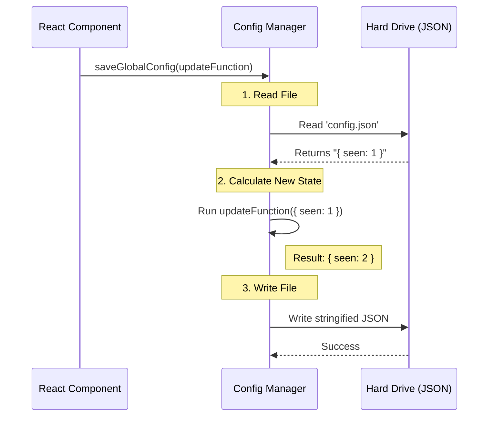

# Chapter 4: Global User State Persistence

In the previous chapter, [Dynamic Configuration (Feature Flags)](03_dynamic_configuration__feature_flags_.md), we gave you a "Remote Control" to turn features on and off for everyone.

But we still have a major problem: **Amnesia**.

Imagine you meet someone, introduce yourself, and they say, "Nice to meet you!"
The next day, you meet them again, and they say, "Nice to meet you!" as if they've never seen you before.
By the third day, this becomes very annoying.

Currently, our CLI tool has amnesia. If a user clicks "Don't ask again," and then restarts the tool, the variable in memory is lost. The tool forgets the user's choice and asks them again.

In this chapter, we will fix this by giving the application **Long-Term Memory** using **Global User State Persistence**.

---

## The Concept: The "Notebook"

Think of `Global User State Persistence` as a small **Notebook** that the application keeps in the user's pocket.

*   **Memory (RAM):** Like a whiteboard. When you close the app, the whiteboard is wiped clean.
*   **Persistence (Disk):** Like a notebook. When you close the app, what is written in the notebook stays there. When you open the app tomorrow, you can read what you wrote yesterday.

We use this notebook to store small facts like:
1.  `desktopUpsellSeenCount`: "This user has seen the ad 2 times."
2.  `desktopUpsellDismissed`: "This user explicitly said 'No'."

---

## The Toolkit

We interact with this notebook using two simple functions.

### 1. Reading History (`getGlobalConfig`)

This function opens the notebook and reads the current status.

```typescript
import { getGlobalConfig } from '../../utils/config.js';

// Read the entire notebook
const config = getGlobalConfig();

// Check specific facts
console.log(config.desktopUpsellSeenCount); // Output: 2
console.log(config.desktopUpsellDismissed); // Output: false
```

**What happens:**
The code looks for a specific JSON file on your hard drive, parses it, and returns a JavaScript object.

### 2. Writing History (`saveGlobalConfig`)

This function writes a new fact into the notebook.

```typescript
import { saveGlobalConfig } from '../../utils/config.js';

// Update the notebook
saveGlobalConfig((currentConfig) => {
  return {
    ...currentConfig, // Keep all old notes
    desktopUpsellDismissed: true // Add/Update this specific note
  };
});
```

**Key Concept: The Updater Function**
Notice we don't just say `save(true)`. We pass a function.
1.  We receive the `currentConfig` (what's currently in the notebook).
2.  We copy it using `...currentConfig` (so we don't erase other important data).
3.  We change only the specific part we care about.

---

## Solving the Use Case

Let's look at how we use this in our **Upsell Dialog** to be polite.

### Part 1: Incrementing the "Seen" Count

Every time the component mounts (appears on screen), we want to make a tally mark in our notebook.

```typescript
// Inside DesktopUpsellStartup.tsx
useEffect(() => {
  // 1. Read current count (default to 0 if missing)
  const currentCount = getGlobalConfig().desktopUpsellSeenCount ?? 0;
  const newCount = currentCount + 1;

  // 2. Save the new count
  saveGlobalConfig(prev => ({
    ...prev,
    desktopUpsellSeenCount: newCount
  }));
}, []);
```

**Explanation:**
*   `useEffect` runs once when the dialog appears.
*   We read the old number (e.g., 1), add 1 to it (making it 2), and save it back to the file.
*   Next time the "Bouncer" (from [Feature Gating & Targeting Logic](02_feature_gating___targeting_logic.md)) runs, it will see the number 2.

### Part 2: Handling "Don't Ask Again"

If the user selects "Never" in the menu, we need to respect that forever.

```typescript
const handleSelect = (value) => {
  if (value === 'never') {
    // Write "True" to the dismissed flag
    saveGlobalConfig(prev => ({
      ...prev,
      desktopUpsellDismissed: true
    }));
    
    // Close the dialog
    onDone();
  }
};
```

**Explanation:**
Once `desktopUpsellDismissed` is saved as `true`, the check we wrote in Chapter 2 (`if (config.desktopUpsellDismissed) return false;`) will permanently block this dialog from showing again.

---

## Internal Implementation: Under the Hood

How does a JavaScript object persist after the computer is turned off? It utilizes the **File System**.

### The Sequence

Here is what happens when you call `saveGlobalConfig`:



### The Code Implementation

While the real code handles errors and file locking, here is the simplified version of what is happening inside `utils/config.js`.

```typescript
import fs from 'fs'; // Node.js File System module

const CONFIG_PATH = '~/.tengu/config.json';

export function getGlobalConfig() {
  // Read file from disk
  const rawData = fs.readFileSync(CONFIG_PATH, 'utf-8');
  // Convert text to Object
  return JSON.parse(rawData);
}

export function saveGlobalConfig(updater) {
  // 1. Get current
  const current = getGlobalConfig();
  
  // 2. Calculate new
  const newData = updater(current);
  
  // 3. Save to disk
  fs.writeFileSync(CONFIG_PATH, JSON.stringify(newData));
}
```

**Why is this cool?**
By using a simple JSON file, the user can actually open this file in a text editor and see exactly what data we are storing about them. This builds trust and transparency.

---

## Summary

In this chapter, we solved the "Amnesia" problem.

1.  We learned that **Persistence** is like a notebook that survives app restarts.
2.  We used `getGlobalConfig` to read the user's history.
3.  We used `saveGlobalConfig` to remember the user's choices ("Don't ask again").
4.  We understood that under the hood, this is just reading and writing a **JSON file** on the user's disk.

Now our application is:
*   **Beautiful** (Chapter 1: Ink)
*   **Smart** (Chapter 2: Targeting Logic)
*   **Controllable** (Chapter 3: Feature Flags)
*   **Polite** (Chapter 4: Persistence)

The final piece of the puzzle is **Feedback**. We know we are showing the dialog, but do we know if users are actually clicking "Try"? Are they clicking "Not Now"?

In the final chapter, we will learn how to send anonymous signals back to our servers to measure success.

[Next Chapter: Analytics & Telemetry](05_analytics___telemetry.md)

---

Generated by [Code IQ](https://github.com/adityasoni99/Code-IQ)