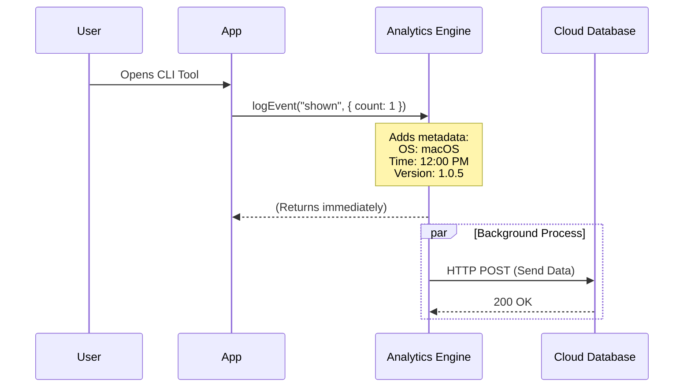
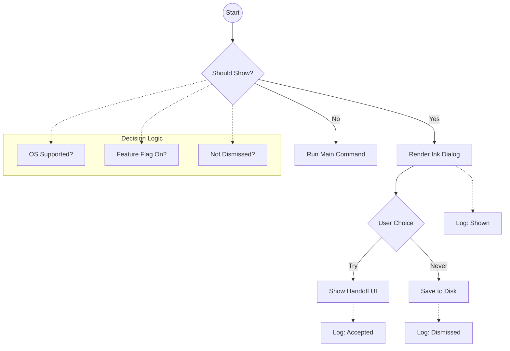

# Chapter 5: Analytics & Telemetry

Welcome to the final chapter of our **DesktopUpsell** tutorial!

In the previous chapter, [Global User State Persistence](04_global_user_state_persistence.md), we gave our application a "long-term memory" so it remembers if a user asked us not to bother them again.

However, we have one final blind spot.
Imagine you are a store manager. You set up a beautiful display for a new product. Then, you put on a blindfold and earplugs.
*   Did customers stop and look at it?
*   Did they buy the product?
*   Did they get annoyed and walk out of the store?

Without **Analytics**, you are developing blindfolded. You don't know if your feature is a success or a failure.

In this chapter, we will build the application's "Nervous System"—a way for the app to send signals back to us about how it is being used.

---

## The Concept: Telemetry

**Telemetry** is the automatic recording and transmission of data from real-world use.

We don't want to spy on the user's personal files. We just want to answer specific questions about our feature, such as:
1.  **Impressions:** How many people saw the Upsell Dialog?
2.  **Conversions:** How many people actually clicked "Try"?
3.  **Fatigue:** How many people clicked "Don't ask again"?

We achieve this using a function called `logEvent`.

---

## The Implementation

Using analytics is surprisingly simple. It usually involves sending a "Message" with a "Name" and some "Details."

### Step 1: Tracking the "View" (Impression)

We want to know every time the dialog is shown to a user. We add this right where we increment the view count (from the previous chapter).

```typescript
import { logEvent } from '../../services/analytics/index.js';

// Inside our useEffect hook
logEvent("tengu_desktop_upsell_shown", {
  seen_count: newCount
});
```

**Input:**
*   **Event Name:** `"tengu_desktop_upsell_shown"` (This is the unique ID we look for in our dashboards).
*   **Properties:** `{ seen_count: 2 }`.

**Output:**
This sends a signal to our server saying: *"Hey! Someone just saw the dialog. By the way, this is the 2nd time they've seen it."*

### Step 2: Tracking the "Click" (Action)

Knowing people saw the dialog is good, but knowing they engaged with it is better.

```typescript
const handleSelect = (value) => {
  if (value === 'try') {
    // 1. Log the success
    logEvent("tengu_desktop_upsell_accepted");
    
    // 2. Perform the action
    setShowHandoff(true);
  }
};
```

**Explanation:**
When we look at our data later, we can do simple math:
*   Total "Accepted" events / Total "Shown" events = **Conversion Rate**.
*   If 1,000 people saw it, and 100 people accepted, we have a 10% conversion rate.

---

## Internal Implementation: How It Works

What happens when you call `logEvent`? Does it slow down the app?

### The "Postcard" Analogy

Think of `logEvent` like dropping a postcard in a mailbox.
1.  You write the message (The Event).
2.  You write your return address (System Info).
3.  You drop it in the box.
4.  You walk away immediately. You don't wait for the postman to pick it up.

This is called **Fire-and-Forget**. The application does not pause to wait for the server to say "Okay, got it." This ensures the user interface remains snappy.

### Sequence Diagram

Here is the journey of a single analytics event:



### Under the Hood Code

While the real implementation handles batching (sending multiple events at once to save battery), here is a simplified version of what `logEvent` does internally.

```typescript
export function logEvent(eventName: string, props: object) {
  // 1. Combine user data with system context
  const payload = {
    event: eventName,
    properties: props,
    // Automatically add useful context
    context: {
      os: process.platform, // e.g., 'darwin' (macOS)
      timestamp: Date.now()
    }
  };

  // 2. Send to backend (Fire and Forget)
  // We don't use 'await' here because we don't want to block UI
  sendToBackend(payload).catch(err => {
    // If analytics fail, suppress the error.
    // Never crash the app just because tracking failed.
    console.error('Analytics failed silently');
  });
}
```

**Why the "Context" matters:**
By automatically adding `os`, we can later answer questions like: *"Do Windows users click 'Try' more often than macOS users?"* without having to manually pass that data every time.

---

## Putting It All Together: The Complete Project

Congratulations! You have completed the **DesktopUpsell** system. Let's review the architecture we have built over these five chapters.

1.  **The Face ([Chapter 1](01_terminal_ui_rendering__ink_.md)):**
    We used **Ink** to render a beautiful, interactive React-based UI inside the terminal.
2.  **The Brain ([Chapter 2](02_feature_gating___targeting_logic.md)):**
    We built a "Bouncer" that checks Hardware compatibility before showing the UI.
3.  **The Remote ([Chapter 3](03_dynamic_configuration__feature_flags_.md)):**
    We added **Feature Flags** to turn the feature on/off remotely without code changes.
4.  **The Memory ([Chapter 4](04_global_user_state_persistence.md)):**
    We added **Persistence** to remember user choices and prevent nagging.
5.  **The Nervous System ([Chapter 5](05_analytics___telemetry.md)):**
    We added **Telemetry** to measure success and learn from user behavior.

### Final Flow



## Conclusion

You have gone from rendering simple text to building a robust, production-grade feature with targeting, safety rails, and feedback loops.

These five pillars—**Rendering, Logic, Configuration, Persistence, and Telemetry**—are the building blocks of almost every modern software feature you will encounter.

Happy Coding!

---

Generated by [Code IQ](https://github.com/adityasoni99/Code-IQ)