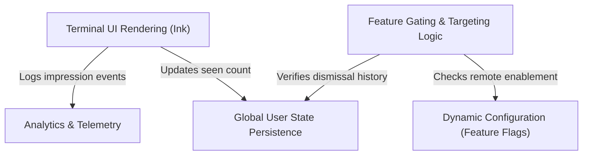

# Tutorial: DesktopUpsell

This project implements a smart **promotional dialog** displayed during the startup of a command-line application. It uses a **terminal-based UI** to invite users to try a desktop version of the tool, ensuring the message is only shown to eligible users by checking **remote feature flags** and the user's local history. The system handles user interaction (like dismissing the message) and records engagement via *telemetry* to track the feature's effectiveness.

## Chapters

1. [Terminal UI Rendering (Ink)](01_terminal_ui_rendering__ink_.md)
2. [Feature Gating & Targeting Logic](02_feature_gating___targeting_logic.md)
3. [Dynamic Configuration (Feature Flags)](03_dynamic_configuration__feature_flags_.md)
4. [Global User State Persistence](04_global_user_state_persistence.md)
5. [Analytics & Telemetry](05_analytics___telemetry.md)

---

Generated by [Code IQ](https://github.com/adityasoni99/Code-IQ)