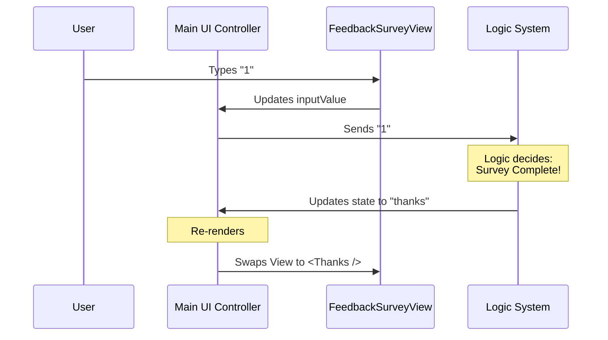

# Chapter 1: Main UI Controller

Welcome to the first chapter of the **FeedbackSurvey** tutorial! 

Building a command-line survey tool involves managing multiple visual states: asking for a rating, asking for permission to share a transcript, and showing a "Thank You" message.

Instead of jamming all this logic into one messy block of code, we use a **Main UI Controller**.

## What is the Main UI Controller?

Think of your application as a theater play. 
*   **The Views** (Screens) are the **actors**—they are the ones the audience actually sees.
*   **The State Machine** (Logic) is the **script**—it defines what *should* happen next.
*   **The Main UI Controller** is the **Stage Manager**.

The audience never sees the Stage Manager. However, the Stage Manager stands behind the curtain and decides:
1.  Is the curtain up or down? (Is the survey visible?)
2.  Which actor should be on stage right now? (Are we rating or saying thanks?)

In our code, the component `FeedbackSurvey` plays this role. It takes the current `state` and decides which component to `return` (render).

## The Core Concept: State-Based Routing

The controller relies entirely on a single prop: `state`. It acts as a switchboard. 

Here is a high-level look at how the controller thinks:

```mermaid
graph TD
    A[Input State] --> B{What is the State?}
    B -- "closed" --> C[Render Null (Hidden)]
    B -- "open" --> D[Render Rating View]
    B -- "transcript_prompt" --> E[Render Transcript Prompt]
    B -- "thanks" --> F[Render Thank You View]
```

## How to Use It

To use this controller, you don't need to know *how* the survey calculates ratings. You just need to pass it the current status.

### 1. The Setup

The controller is a React Functional Component. It receives a bag of properties (Props), but the most important one is `state`.

```typescript
// FeedbackSurvey.tsx

export function FeedbackSurvey({
  state,           // 'open', 'thanks', 'closed', etc.
  inputValue,      // What the user is currently typing
  handleSelect,    // What to do when user picks a rating
  ...otherProps    // Other helpers
}: Props) {
  // Logic will go here...
}
```

*   **`state`**: The current phase of the survey lifecycle.
*   **`inputValue`**: The raw text the user has typed into the terminal.

### 2. Handling the "Closed" State

If the survey shouldn't be visible, the Stage Manager pulls the curtain down. In React/Ink, returning `null` renders nothing.

```typescript
// inside FeedbackSurvey function...

if (state === "closed") {
  return null;
}
```

This is crucial because it ensures the survey doesn't clutter the user's terminal when it's not needed.

### 3. Handling the "Thanks" State

When the user finishes the survey, we want to show a gratitude message. The controller checks for `"thanks"` and swaps in a specific view component.

```typescript
if (state === "thanks") {
  return (
    <FeedbackSurveyThanks 
      lastResponse={lastResponse} 
      inputValue={inputValue} 
      // ... passing down other props
    />
  );
}
```

Here, `<FeedbackSurveyThanks />` is one of our "Actors." The controller simply gives it the spotlight.

### 4. Handling the "Transcript Prompt" State

If the user gave a bad rating, the [Survey Lifecycle State Machine](03_survey_lifecycle_state_machine.md) might decide to ask for transcript permissions. The controller sees this state and renders the Prompt view.

```typescript
if (state === "transcript_prompt") {
  // Safety check: ensure we have a handler
  if (!handleTranscriptSelect) return null;

  return (
    <TranscriptSharePrompt 
      onSelect={handleTranscriptSelect} 
      inputValue={inputValue} 
      setInputValue={setInputValue} 
    />
  );
}
```

### 5. The Default "Open" State

If we aren't closed, thanking the user, or asking for a transcript, we default to the main rating screen (`FeedbackSurveyView`).

```typescript
// This is the default view (state === 'open')

return (
  <FeedbackSurveyView 
    onSelect={handleSelect} 
    inputValue={inputValue} 
    setInputValue={setInputValue} 
    message={message} 
  />
);
```

This is the initial view where the user selects "Good", "Bad", or "Neutral".

## Internal Implementation Flow

Let's look at a sequence diagram to understand how data flows through this controller when a user interacts with the app.

**Scenario:** The user is looking at the rating screen and presses "1" (Good).



## Preventing Accidental Input

One subtle but important job of the Main UI Controller is to act as a guard. If the user is typing something that *doesn't* look like a survey response (e.g., they are typing a CLI command like `s3cmd`), the controller hides the survey to prevent accidental submissions.

```typescript
// Inside FeedbackSurvey function

// Helper function from Chapter 2
import { isValidResponseInput } from './FeedbackSurveyView.js';

// If input exists but isn't valid for the survey, hide UI
if (inputValue && !isValidResponseInput(inputValue)) {
  return null;
}
```

This ensures the "Stage Manager" only opens the curtain when the actors are actually ready to perform.

## Conclusion

The **Main UI Controller** is the structural backbone of our UI. It separates the "decision of what to show" from the "actual showing." 

*   It checks the `state`.
*   It selects the correct component (`FeedbackSurveyView`, `TranscriptSharePrompt`, etc.).
*   It handles the transition between these views seamlessly.

Now that our Stage Manager is ready, we need to train our actors! In the next chapter, we will build the actual visual components that the user interacts with.

[Next Chapter: Interactive Prompt Views](02_interactive_prompt_views.md)

---

Generated by [Code IQ](https://github.com/adityasoni99/Code-IQ)