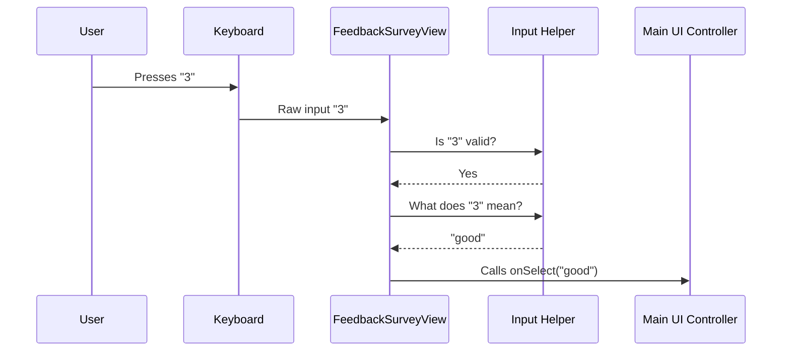

# Chapter 2: Interactive Prompt Views

In the [Chapter 1: Main UI Controller](01_main_ui_controller.md), we built the **Stage Manager**—the system that decides *when* to show the survey.

Now, we need to build the **Actors**. These are the visual components that actually appear on the screen to ask the user questions.

## The Paper Form Analogy

Think of your application as a front desk. When a user stops by, you might hand them a paper form to fill out. In our project, we have two specific forms:

1.  **The Rating Card (`FeedbackSurveyView`)**: A simple card asking, "How did we do?" (Good/Bad/Neutral).
2.  **The Waiver Form (`TranscriptSharePrompt`)**: A legal permission slip asking, "Can we record this session?" (Yes/No).

These views have two jobs:
1.  **Look good**: Display text and options clearly.
2.  **Listen**: Capture specific keyboard numbers (1, 2, 3) to fill out the form.

---

## 1. The Rating Card: `FeedbackSurveyView`

This is the first screen the user sees. It displays a question and a list of numeric options.

### The Inputs (Props)

Like any good employee, this view needs instructions from the boss (the Controller). It receives these via **Props**:

```typescript
type Props = {
  // The function to call when the user picks an answer
  onSelect: (option: 'good' | 'bad' | 'fine') => void;
  
  // Custom text to display (optional)
  message?: string;
  
  // Helpers for reading raw keystrokes
  inputValue: string;
  setInputValue: (value: string) => void;
};
```

### Mapping Keys to Meaning

Computers understand keys like "1" or "3". Humans understand "Bad" or "Good". We need a translator.

We define a simple mapping object (a dictionary) to handle this translation:

```typescript
const inputToResponse = {
  '0': 'dismissed',
  '1': 'bad',
  '2': 'fine',
  '3': 'good'
} as const;
```

This acts as our decoder ring. If the user presses `1`, the View knows they really mean `bad`.

### Handling the Keystrokes

To capture keyboard input in a command-line tool without blocking the entire screen, we use a helper hook called `useDebouncedDigitInput`.

You don't need to know exactly how the helper works internally, just how to use it inside the component:

```typescript
// Inside FeedbackSurveyView function

useDebouncedDigitInput({
  inputValue,
  setInputValue,
  // Check if the key pressed is allowed (0, 1, 2, or 3)
  isValidDigit: (digit) => ['0','1','2','3'].includes(digit),
  // If valid, look up the meaning and tell the parent
  onDigit: (digit) => onSelect(inputToResponse[digit]),
});
```

**What is happening here?**
1.  The user types a key.
2.  `isValidDigit` checks: "Is this a number 0-3?"
3.  If yes, `onDigit` runs.
4.  It converts "3" -> "good".
5.  It calls `onSelect('good')`.

### Visual Layout

Finally, we render the UI using `Box` (layout) and `Text` (styling) components from the `ink` library. This is similar to HTML `<div>` and `<span>`.

```tsx
return (
  <Box flexDirection="column" marginTop={1}>
    {/* The Question */}
    <Box>
      <Text bold>{message || "How is Claude doing?"}</Text>
    </Box>

    {/* The Options */}
    <Box marginLeft={2}>
      <Text>1: Bad  </Text>
      <Text>2: Fine  </Text>
      <Text>3: Good</Text>
    </Box>
  </Box>
);
```

---

## 2. The Waiver Form: `TranscriptSharePrompt`

If a user rates the session poorly, we might want to ask to see their transcript to debug the issue. This requires a different form.

The logic is almost identical to the Rating Card, but the **question** and the **options** change.

### The Mapping

Instead of rating options, we map numbers to permissions:

```typescript
const inputToResponse = {
  '1': 'yes',
  '2': 'no',
  '3': 'dont_ask_again'
} as const;
```

### The Visuals

We change the text to be a legal/privacy request:

```tsx
return (
  <Box flexDirection="column">
    <Text bold>
      Can Anthropic look at your session transcript?
    </Text>
    
    <Box marginLeft={2}>
      <Text color="cyan">1</Text>: Yes
      <Text color="cyan">2</Text>: No
    </Box>
  </Box>
);
```

By keeping these Views separate, we can easily change the wording of the legal prompt without breaking the logic of the star rating system.

---

## Internal Implementation Flow

Let's trace exactly what happens when a user interacts with one of these Prompt Views.

**Scenario:** The user sees the Rating Card and presses "3" (Good).



### Why use a Helper for Input?

You might notice we use `useDebouncedDigitInput` in both views. This is to solve a common problem in terminal apps: **Double Typing**.

If a user holds the "3" key for a fraction of a second too long, the computer might read it as "333".
1.  The first "3" submits the rating.
2.  The survey closes.
3.  The next "33" gets typed into the user's terminal prompt unexpectedly!

The helper "debounces" the input, meaning it ignores rapid-fire duplicates to keep the user experience clean.

## Summary

In this chapter, we created the **Interactive Prompt Views**:
1.  **`FeedbackSurveyView`**: Handles user ratings.
2.  **`TranscriptSharePrompt`**: Handles data permissions.

These components are "dumb" regarding the larger application flow. They simply:
*   Show a question.
*   Wait for a valid number key.
*   Report the choice back to the Main UI Controller.

Now that we have a Stage Manager (Chapter 1) and Actors (Chapter 2), we need a **Script** to tell them what to do next. For example, if the user says "Bad", do we say "Thanks" immediately, or do we ask for a transcript?

That logic lives in the **State Machine**.

[Next Chapter: Survey Lifecycle State Machine](03_survey_lifecycle_state_machine.md)

---

Generated by [Code IQ](https://github.com/adityasoni99/Code-IQ)