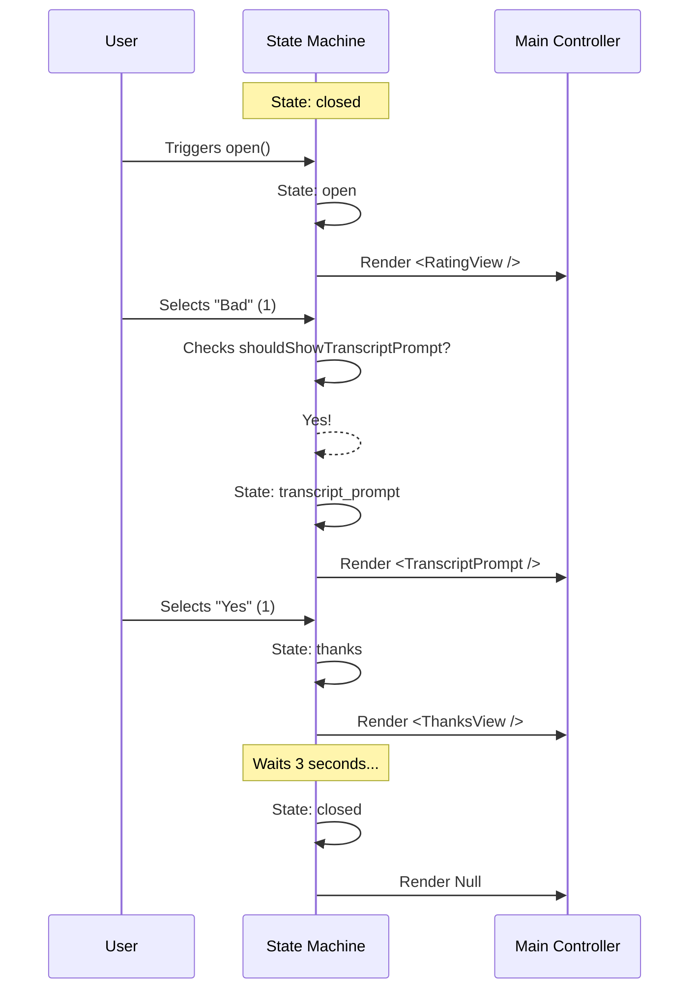

# Chapter 3: Survey Lifecycle State Machine

In [Chapter 1: Main UI Controller](01_main_ui_controller.md), we built the **Stage Manager** (the Controller).
In [Chapter 2: Interactive Prompt Views](02_interactive_prompt_views.md), we built the **Actors** (the Views).

However, if you put actors on stage without instructions, they will just stand there. They need a **Script**. 

In software engineering, specifically for UI, this script is often called a **State Machine**. It ensures the conversation flows in a logical order and prevents the app from doing two contradictory things at once (like asking for a rating while saying goodbye).

## The Motivation: Traffic Control

Imagine a traffic light. It has a specific cycle: Green $\to$ Yellow $\to$ Red. 
It should never jump from Green immediately to Red without a warning, and it should certainly never show Green and Red at the same time.

Our survey has a similar lifecycle:
1.  **Hidden** (Closed)
2.  **Rating** (Open)
3.  **Waiver** (Transcript Prompt - *optional*)
4.  **Gratitude** (Thank You)
5.  **Hidden** (Closed again)

The **Survey Lifecycle State Machine** manages these transitions so the rest of your code doesn't have to worry about "what happens next."

---

## 1. Defining the States

First, let's look at the possible "modes" our survey can be in. In `useSurveyState.tsx`, we define these states plainly:

```typescript
type SurveyState = 
  | 'closed'             // Survey is invisible
  | 'open'               // Showing the 1-3 rating stars
  | 'thanks'             // Showing "Thank You"
  | 'transcript_prompt'  // Asking for permission
  | 'submitting'         // Sending data to server
  | 'submitted';         // Done sending
```

This list acts as the single source of truth. At any millisecond, the app is in exactly **one** of these states.

---

## 2. The Brain: `useSurveyState`

We package this logic into a React Hook called `useSurveyState`. This hook is the brain that holds the current state and provides functions to change it.

### usage

You initialize the hook with configuration options, like how long to show the "Thank You" message.

```typescript
// Inside a parent component
const surveyLogic = useSurveyState({
  hideThanksAfterMs: 3000, // Close after 3 seconds
  onSelect: (id, rating) => console.log('User picked:', rating),
  shouldShowTranscriptPrompt: (rating) => rating === 'bad', 
});
```

The hook returns the variables and functions you need to wire up your UI:

```typescript
return {
  state: surveyLogic.state,   // e.g., 'open'
  open: surveyLogic.open,     // Function to start survey
  handleSelect: surveyLogic.handleSelect, // Function when user rates
  // ... other handlers
};
```

---

## 3. The "Fork in the Road" Logic

The most critical job of this state machine is deciding what happens after a user selects a rating. 

*   **Scenario A:** User clicks "Good" (3). $\to$ Say Thanks $\to$ Close.
*   **Scenario B:** User clicks "Bad" (1). $\to$ Ask for Transcript $\to$ Say Thanks $\to$ Close.

This logic lives inside `handleSelect`.

### The Implementation

Let's look at the simplified logic inside the hook:

```typescript
// Inside handleSelect(selectedRating)

// 1. If user dismissed (pressed 0), just close.
if (selected === 'dismissed') {
  setState('closed');
} 
// 2. Check if we need to ask for a transcript (e.g., if rating is 'bad')
else if (shouldShowTranscriptPrompt?.(selected)) {
  setState('transcript_prompt'); // Switch to the waiver form
} 
// 3. Otherwise, just say thanks
else {
  showThanksThenClose(); // Switch to 'thanks' -> wait -> 'closed'
}
```

This `if/else` block is the core "Script" of our play. It directs the actors where to go based on audience input.

---

## 4. Handling Timeouts (The "Yellow Light")

When the survey ends, we don't want it to vanish instantly. We want to show a "Thank You" message for a few seconds.

The state machine handles this pacing automatically using `setTimeout`.

```typescript
const showThanksThenClose = () => {
  // 1. Show the message
  setState('thanks');

  // 2. Set a timer to close it later
  setTimeout(() => {
    setState('closed');
    setLastResponse(null); // Reset data
  }, hideThanksAfterMs);
};
```

By keeping this timer logic inside the State Machine, the [Main UI Controller](01_main_ui_controller.md) doesn't need to know about milliseconds or timeouts. It just renders whatever the state tells it to.

---

## Internal Implementation Flow

Let's visualize the "Bad Rating" scenario to see how the state updates step-by-step.



## Internal Code Details: The Session ID

One detail we haven't touched on is the `appearanceId`. 

Every time the survey opens, we generate a unique ID (a UUID). This acts like a "Ticket Number" for that specific interaction.

```typescript
// useSurveyState.tsx

const open = useCallback(() => {
  // Don't open if already open
  if (state !== 'closed') return; 

  setState('open');
  
  // Generate a new ID for this specific session
  appearanceId.current = randomUUID(); 
}, [state]);
```

This ID is passed to all your event handlers (`onSelect`, `onTranscriptSelect`). This ensures that if a user rates the survey five times, your database knows they are five separate events, not one event changing over and over.

## Conclusion

The **Survey Lifecycle State Machine** is the invisible brain of our operation. 

1.  It defines the **States** (Open, Closed, Thanks, etc.).
2.  It creates the **Rules of Travel** (If "Bad" $\to$ go to Transcript).
3.  It manages **Timing** (Auto-closing the thank you message).

By abstracting this complex logic into a single hook `useSurveyState`, our visible UI components stay simple and focused on drawing text to the screen.

Now that we have a Controller, Views, and a State Machine, we have a working survey! But... when does it actually open? We don't want to annoy the user by opening it randomly.

In the next chapter, we will look at how to control *when* the survey appears using **Pacing and Configuration**.

[Next Chapter: General Pacing and Configuration](04_general_pacing_and_configuration.md)

---

Generated by [Code IQ](https://github.com/adityasoni99/Code-IQ)