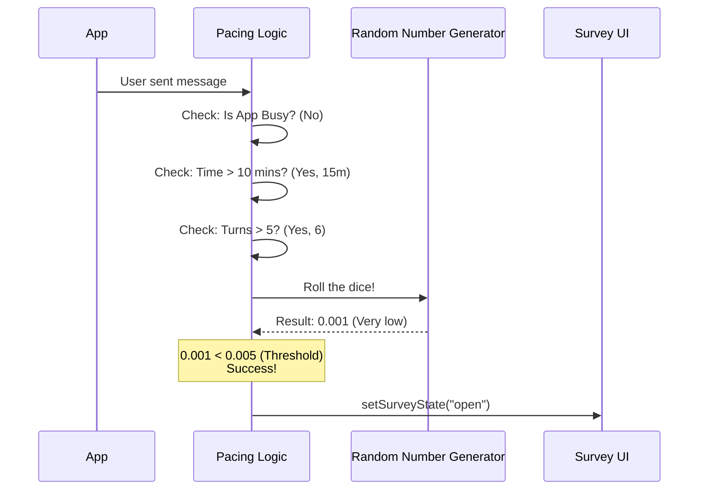

# Chapter 4: General Pacing and Configuration

In [Chapter 3: Survey Lifecycle State Machine](03_survey_lifecycle_state_machine.md), we built the logic that handles the survey once it is open (e.g., transitioning from Rating to Thank You).

But we are missing the most important question: **When should the survey open?**

If we asked the user for feedback after every single message, they would quickly uninstall our tool. We need a system that decides the perfect moment to interrupt.

## The "Polite Waiter" Analogy

Imagine a waiter at a restaurant. A polite waiter follows specific rules before approaching your table:
1.  **Time Rule:** Don't ask "How is the meal?" 10 seconds after serving it. Wait 5 minutes.
2.  **Usage Rule:** Don't ask before the customer has taken a bite.
3.  **Busy Rule:** Don't interrupt if the customer is in the middle of a serious conversation.
4.  **Randomness:** Don't robotically ask every single customer at exactly 12:00 PM.

In our code, `useFeedbackSurvey` is that waiter. It checks clocks, counts messages, and rolls dice to decide if it's time to show the [Main UI Controller](01_main_ui_controller.md).

---

## 1. The Configuration (The Rulebook)

First, we define the rules. These are stored in a configuration object. This allows us to tweak the "politeness" of the app without rewriting code.

Here are the key settings we care about:

```typescript
type FeedbackSurveyConfig = {
  // Wait 10 minutes (600,000ms) after app start before first survey
  minTimeBeforeFeedbackMs: number; 
  
  // Wait 60 minutes between surveys in the same session
  minTimeBetweenFeedbackMs: number; 

  // User must send at least 5 messages before we ask
  minUserTurnsBeforeFeedback: number;

  // Only show to 0.5% of eligible users (Probabilistic)
  probability: number; 
};
```

By changing these numbers, we can make the waiter very aggressive or very shy.

---

## 2. Tracking History

To enforce these rules, the system needs to remember what happened in the past. We use React state to track when the survey was last seen.

```typescript
// Inside useFeedbackSurvey.tsx

const [feedbackSurvey, setFeedbackSurvey] = useState({
  // Timestamp of the last time we bothered the user
  timeLastShown: null, 
  
  // How many messages they had sent at that time
  submitCountAtLastAppearance: null 
});
```

We also track when the current session started:

```typescript
// When did the user open the app?
const sessionStartTime = useRef(Date.now());
```

---

## 3. The Decision Logic (`shouldOpen`)

The heart of this chapter is a function called `shouldOpen`. It runs every time something changes in the app (like a new message arriving) and returns `true` or `false`.

It acts like a checklist. If **any** check fails, the survey stays hidden.

### Check A: Is the app busy?

If the AI is currently typing (`isLoading`) or the user is looking at another prompt, we should stay quiet.

```typescript
if (isLoading) {
  return false;
}

// Don't overlay on top of other prompts
if (hasActivePrompt) {
  return false;
}
```

### Check B: Is it too soon?

We check the clock. If it hasn't been long enough since the app started, we abort.

```typescript
const timeSinceStart = Date.now() - sessionStartTime.current;

// If we haven't hit the 10-minute mark yet...
if (timeSinceStart < config.minTimeBeforeFeedbackMs) {
  return false;
}
```

### Check C: Has the user done enough?

We don't want to survey someone who just opened the app and hasn't done anything. We check the `submitCount` (number of messages sent).

```typescript
// If user has sent fewer than 5 messages...
if (submitCount < config.minUserTurnsBeforeFeedback) {
  return false;
}
```

### Check D: The Dice Roll (Probability)

Finally, even if the time is right and the user is active, we don't want to show the survey *every* time. We might only want to sample 0.5% of interactions.

```typescript
// Generate a random number between 0 and 1
const randomRoll = Math.random(); 

// If roll is greater than 0.005, don't show
if (randomRoll > config.probability) {
  return false;
}

return true; // All checks passed! Open the survey.
```

---

## Internal Implementation Flow

Let's visualize the decision process when a user sends a message.

**Scenario:** The user has been using the app for 15 minutes and just sent their 6th message. The config requires 10 minutes and 5 messages.



---

## 4. Updating the History

Once the logic decides to return `true`, the survey opens. Immediately after opening, we must update our records so we don't ask again 5 seconds later.

We use a callback `onOpen` to update the state we defined earlier.

```typescript
const onOpen = useCallback(() => {
  // Update the state with current time and count
  updateLastShownTime(
    Date.now(),           // Current Time
    submitCountRef.current // Current Message Count
  );
  
  // Log analytics that the survey appeared
  logEvent('feedback_survey_appeared', { ... });
}, []);
```

Now, the next time `shouldOpen` runs, it will calculate time relative to *this* timestamp, effectively resetting the timer.

---

## 5. Global vs. Session Pacing

There is one advanced detail: **Global Pacing**.

If a user closes the app and opens it again immediately, `sessionStartTime` resets. If we only checked session time, we might annoy them again.

To solve this, we store a timestamp in a global configuration file on the user's computer.

```typescript
// Inside useFeedbackSurvey.tsx

// Read from disk
const globalState = getGlobalConfig().feedbackSurveyState;

if (globalState?.lastShownTime) {
  const timeSinceGlobal = Date.now() - globalState.lastShownTime;
  
  // e.g. Don't show if they saw one in the last 24 hours
  if (timeSinceGlobal < config.minTimeBetweenGlobalFeedbackMs) {
    return false;
  }
}
```

This ensures our "Polite Waiter" remembers you even if you leave the restaurant and come back the next day.

## Summary

In this chapter, we implemented the **General Pacing and Configuration**. 

1.  We defined a **Config** (The Rulebook).
2.  We tracked **State** (Last time shown).
3.  We built a **Checklist** (Time, Usage, and Busy checks).
4.  We added **Probability** (Dice rolling) to prevent spam.

This system runs automatically in the background. However, sometimes we want to break these rules. What if a specific event happens—like the AI crashes or produces an error—and we want to ask about *that specific moment*?

For that, we need **Event-Driven Triggers**.

[Next Chapter: Event-Driven Survey Triggers](05_event_driven_survey_triggers.md)

---

Generated by [Code IQ](https://github.com/adityasoni99/Code-IQ)