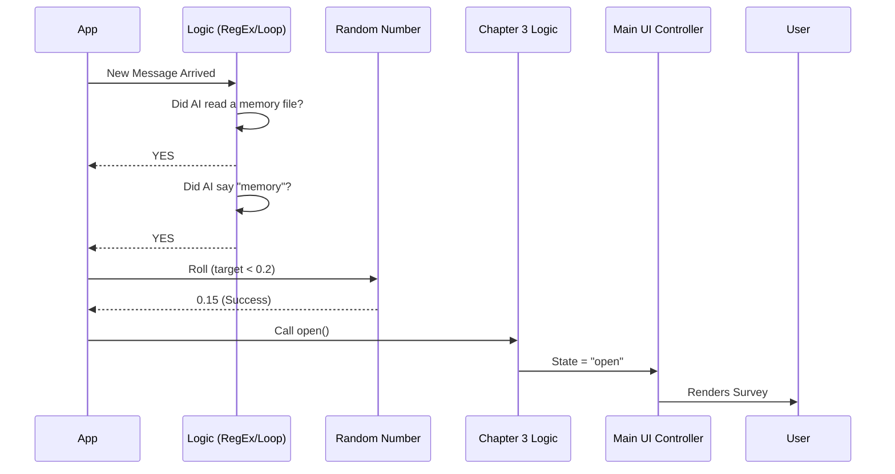

# Chapter 5: Event-Driven Survey Triggers

In the previous [Chapter 4: General Pacing and Configuration](04_general_pacing_and_configuration.md), we built a "Polite Waiter" that opens the survey based on time and message counts.

However, sometimes we want to ask for feedback not because enough time has passed, but because **something specific and technical just happened**.

## The Car Sensor Analogy

Think of your car's dashboard:
1.  **General Pacing:** The "Maintenance Required" light turns on every 5,000 miles. This is routine.
2.  **Event-Driven:** The "Check Engine" light turns on **only** if a sensor detects a specific problem, like overheating or low oil pressure.

In `FeedbackSurvey`, we have two "Check Engine" lights:
1.  **Memory Survey:** Triggered when the Assistant reads a long-term memory file.
2.  **Post-Compaction Survey:** Triggered when the conversation gets too long and is summarized (compacted).

These triggers ignore the general timer. They want to know: *"Did that specific technical action work correctly?"*

---

## 1. The Memory Survey (`useMemorySurvey`)

**The Goal:** If the Assistant pulls up a memory from 3 weeks ago, we want to ask the user, *"Did remembering that context help?"*

### Detecting the Event

Unlike the General Pacing, which just counts messages, this trigger looks **inside** the messages. It scans the conversation history for a specific tool use.

We need a helper function to look for the "fingerprint" of a memory read:

```typescript
// Helper to scan messages
function hasMemoryFileRead(messages): boolean {
  for (const message of messages) {
    // 1. Check if the Assistant used a tool
    if (message.content.type === 'tool_use') {
       // 2. Was it the File Read tool? 
       // 3. Was the file a "memory" file?
       if (isMemoryFile(message.input.file_path)) {
         return true;
       }
    }
  }
  return false;
}
```

### The Trigger Logic

The hook `useMemorySurvey` runs every time the AI finishes a turn. It acts as a gatekeeper.

It uses a series of simple `if` statements to filter out false alarms before opening the survey.

```typescript
// Inside useMemorySurvey.tsx

// 1. Only run if we actually found a memory read
if (!hasMemoryFileRead(messages)) {
  return;
}

// 2. Check if the Assistant actually mentioned the word "memory"
// (This prevents confusion if it read the file silently)
if (!text.includes("memory")) {
  return;
}

// 3. Roll the dice (20% chance) so we don't annoy the user
if (Math.random() < 0.2) {
  open(); // Triggers the State Machine from Chapter 3
}
```

This ensures we only interrupt the user when the memory feature was clearly used and acknowledged.

---

## 2. The Post-Compaction Survey (`usePostCompactSurvey`)

**The Goal:** When a conversation gets very long, our system "compacts" (summarizes) the older messages to save space. We want to know: *"Did the AI lose the thread of the conversation after summarizing?"*

### The "Wait-and-See" Strategy

This trigger is tricky. We don't want to ask *during* the compaction. We want to ask **after the next message**.

Why? Imagine someone cleans your room (Compaction). You don't know if they lost your keys until you try to find them (Next Message).

### Tracking the Boundary

We identify the exact message where compaction happened (the "Boundary").

```typescript
// Inside usePostCompactSurvey.tsx

// 1. Find the message that marks the compaction point
const boundaryIndex = messages.findIndex(
  msg => msg.uuid === boundaryUuid
);

// 2. Check if there are NEW messages after that point
if (boundaryIndex === -1) return false;

// If there are messages AFTER the boundary, returns true
return messages.length > boundaryIndex + 1; 
```

### The Trigger Effect

We use a React Effect to watch the message list. If we see that we crossed a boundary, we roll the dice.

```typescript
// Inside the Effect loop

// If we are tracking a boundary...
if (pendingBoundaryUuid) {
  
  // ...and the user has sent a new message since then
  if (hasMessageAfterBoundary(messages, pendingBoundaryUuid)) {
    
    // Clear the tracker
    pendingBoundaryUuid = null;

    // 20% chance to open survey
    if (Math.random() < 0.2) {
       open();
    }
  }
}
```

---

## Internal Implementation Flow

Let's look at how the **Memory Survey** decides to open. This happens entirely in the background while the user is reading the AI's response.



Notice that once `open()` is called, the [Survey Lifecycle State Machine](03_survey_lifecycle_state_machine.md) takes over completely. The Event Trigger doesn't care about handling clicks or "Thank You" messages. It just pushes the button to start the process.

## Reusing Core Logic

Both `useMemorySurvey` and `usePostCompactSurvey` utilize the exact same state machine we built in Chapter 3.

```typescript
// Both files use this:
const { state, open, handleSelect } = useSurveyState({
  // Custom tracking event for analytics
  onOpen: (id) => logEvent('specific_event_triggered', { id }),
  
  // Reuse standard behavior
  hideThanksAfterMs: 3000, 
});
```

This demonstrates the power of the architecture:
1.  **Chapter 1 & 2** handle the Visuals.
2.  **Chapter 3** handles the Logic/Flow.
3.  **Chapter 4 & 5** handle the *Triggering*.

## Conclusion

You have now learned how to trigger surveys based on technical events!

*   **Memory Trigger:** Watches for specific tool usage.
*   **Compaction Trigger:** Watches for conversation boundaries and waits for the next turn.

We have covered how to show the survey, how it behaves, and when it opens. But there is one final piece of the puzzle. When the user says "Bad" and agrees to share their transcript, where does that data actually go?

[Next Chapter: Transcript Data Submission](06_transcript_data_submission.md)

---

Generated by [Code IQ](https://github.com/adityasoni99/Code-IQ)