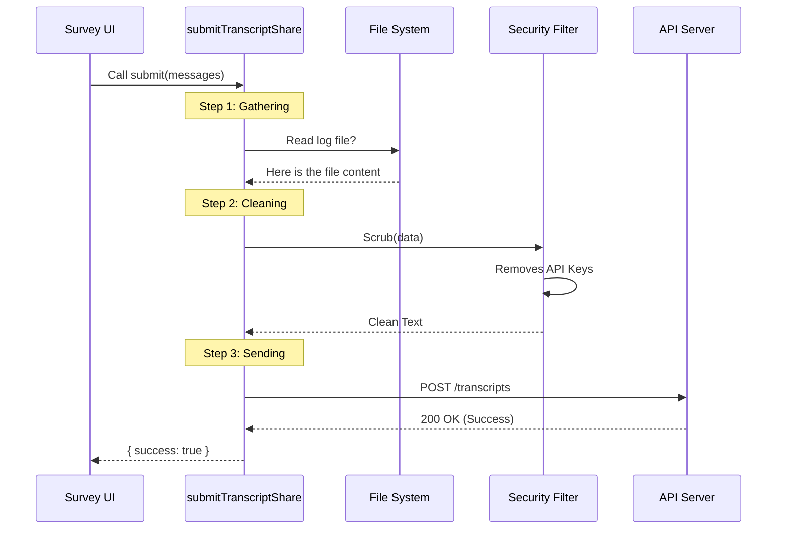

# Chapter 6: Transcript Data Submission

Welcome to the final chapter of the **FeedbackSurvey** tutorial!

In [Chapter 5: Event-Driven Survey Triggers](05_event_driven_survey_triggers.md), we learned how to detect specific moments to ask for feedback. In [Chapter 2: Interactive Prompt Views](02_interactive_prompt_views.md), we built the "Waiver Form" where users click "Yes" to share their data.

But what actually happens when they click "Yes"?

The application has a massive amount of data: chat history, file contents, and error logs. We need to package all of this up, clean it of secrets, and send it to the server.

This is handled by the **Transcript Data Submission** module.

---

## The Secure Mailroom Analogy

Imagine your application is a corporate office. When a user agrees to share their session, it’s like they’ve signed a document to mail to headquarters.

We don't just throw the loose papers out the window. We use a **Secure Mailroom** (`submitTranscriptShare`).

1.  **Gathering (The Envelope)**: We collect the chat history, the specific error that occurred, and the system version.
2.  **Redaction (The Black Marker)**: Before sealing the envelope, a security officer reads every line and blacks out credit card numbers, API keys, or passwords.
3.  **Authentication (The Stamp)**: We stamp the envelope with a verified token so the receiver knows it's from a trusted source.
4.  **Transmission (The Courier)**: We hand it to the courier (the Internet) to drive it to the API.

---

## 1. How to Use It

The main entry point is a single function called `submitTranscriptShare`. You don't need to worry about HTTP headers or JSON formatting. You just hand it the "pile of papers."

### The Inputs

```typescript
import { submitTranscriptShare } from './submitTranscriptShare';

await submitTranscriptShare(
  messages,          // The entire chat history
  'bad_feedback_survey', // The reason (Trigger)
  'unique-session-id-123' // The Ticket Number
);
```

*   **`messages`**: The list of everything the User and the AI said.
*   **`trigger`**: A label explaining *why* we are sending this (e.g., "User was frustrated", "Memory bug").
*   **`appearanceId`**: The unique ID we generated in [Chapter 3: Survey Lifecycle State Machine](03_survey_lifecycle_state_machine.md).

### The Output

The function returns a **Promise** (a receipt).

```typescript
// The result looks like this:
{
  success: true,
  transcriptId: "txt_8f9s8d9f" // The ID assigned by the server
}
```

If the internet is down or the server rejects us, `success` will be `false`.

---

## 2. Step-by-Step Implementation

Let's look at what happens inside the mailroom.

### Step 1: Gathering the Data

First, we need to convert the chat messages into a clean format the server understands. We also try to read the raw log file from the disk.

```typescript
// inside submitTranscriptShare...

// 1. Clean up the message objects
const transcript = normalizeMessagesForAPI(messages);

// 2. Try to read the raw log file from disk
let rawTranscriptJsonl;

// SAFETY CHECK: Only read if file is small enough!
if (fileSize <= MAX_TRANSCRIPT_READ_BYTES) {
  rawTranscriptJsonl = await readFile(transcriptPath, 'utf-8');
}
```

**Why check the size?**
If a user has been chatting for 5 days straight, the log file might be 500MB. Trying to load that into memory could crash the application. If it's too big, we skip it.

### Step 2: The Black Marker (Redaction)

This is the most critical step for user trust. We take the data we prepared and pass it through a "Redactor."

```typescript
// 3. Create the full data package
const data = {
  trigger: trigger,
  version: '1.0.0',
  transcript: transcript,
  rawTranscriptJsonl: rawTranscriptJsonl
};

// 4. Scrub secrets!
// jsonStringify converts the object to text
// redactSensitiveInfo replaces keys with [REDACTED]
const content = redactSensitiveInfo(jsonStringify(data));
```

`redactSensitiveInfo` uses Regular Expressions (pattern matching) to find things that look like API keys or passwords and replaces them with `****`.

### Step 3: The Stamp (Authentication)

We need permission to speak to the server. We check if our "ID Badge" (OAuth Token) is valid.

```typescript
// 5. Ensure we are logged in
await checkAndRefreshOAuthTokenIfNeeded();

// 6. Get the headers (The "Stamp")
const authResult = getAuthHeaders();

if (authResult.error) {
  return { success: false }; // Abort if not logged in
}
```

### Step 4: The Courier (Sending the Request)

Finally, we use a library called `axios` (our truck driver) to send the package to the API URL.

```typescript
// 7. Send the POST request
const response = await axios.post(
  'https://api.anthropic.com/.../transcripts',
  { content, appearance_id: appearanceId },
  { headers: authResult.headers }
);

// 8. Check if it arrived safely
if (response.status === 200) {
  return { success: true, transcriptId: response.data.id };
}
```

---

## Internal Implementation Flow

Let's visualize the journey of a transcript when a user clicks "Yes."



## Handling Sub-Agents

You might notice a reference to `subagentTranscripts` in the full code.

Sometimes, the main AI assistant spawns "Sub-Agents" (little helper bots) to do specific tasks like searching code. These helpers have their own separate chat logs.

```typescript
// Collect logs from the little helper bots
const agentIds = extractAgentIdsFromMessages(messages);
const subagentTranscripts = await loadSubagentTranscripts(agentIds);
```

We bundle these logs into the same envelope so the developers can see the *entire* picture of what went wrong, not just the main conversation.

## Conclusion

Congratulations! You have completed the **FeedbackSurvey** tutorial.

Let's review the full journey we've built:

1.  **[Main UI Controller](01_main_ui_controller.md)**: The stage manager that decides which screen to show.
2.  **[Interactive Prompt Views](02_interactive_prompt_views.md)**: The actual "Rating" and "Waiver" cards the user sees.
3.  **[Survey Lifecycle State Machine](03_survey_lifecycle_state_machine.md)**: The logic brain that transitions from Rating $\to$ Waiver $\to$ Thanks.
4.  **[General Pacing and Configuration](04_general_pacing_and_configuration.md)**: The "polite waiter" that ensures we don't annoy the user.
5.  **[Event-Driven Survey Triggers](05_event_driven_survey_triggers.md)**: The sensors that detect technical events like memory usage.
6.  **[Transcript Data Submission](06_transcript_data_submission.md)**: The secure mailroom that cleans and ships the data.

You now understand the architecture of a professional-grade CLI survey tool. It balances user experience (not being annoying), legal compliance (asking for permission), and engineering robustness (redaction and safe data handling).

Happy coding!

---

Generated by [Code IQ](https://github.com/adityasoni99/Code-IQ)