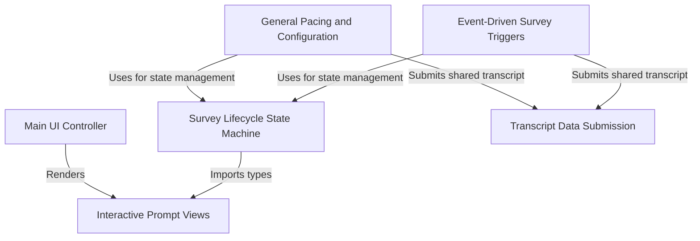

# Tutorial: FeedbackSurvey

The `FeedbackSurvey` project implements a **feedback system** for an AI assistant, designed to collect user ratings and optional conversation transcripts. It relies on a central **state machine** to manage the survey's lifecycle (opening, closing, thanking) and employs logic to trigger surveys based on time, usage turns, or specific **events** like memory compaction. The system renders an interactive CLI-based UI and handles the secure **submission** of redacted transcript data upon user approval.

## Chapters

1. [Main UI Controller](01_main_ui_controller.md)
2. [Interactive Prompt Views](02_interactive_prompt_views.md)
3. [Survey Lifecycle State Machine](03_survey_lifecycle_state_machine.md)
4. [General Pacing and Configuration](04_general_pacing_and_configuration.md)
5. [Event-Driven Survey Triggers](05_event_driven_survey_triggers.md)
6. [Transcript Data Submission](06_transcript_data_submission.md)

---

Generated by [Code IQ](https://github.com/adityasoni99/Code-IQ)