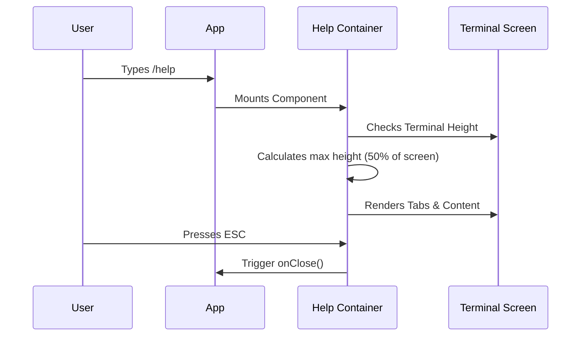

# Chapter 1: Help System Container

Welcome to the **HelpV2** project! If you are new to building terminal user interfaces (TUIs), you are in the right place.

In this first chapter, we are going to explore the **Help System Container**. Before we worry about *what* text to show the user, we need to build the *window* that holds that text.

## What is a Help System Container?

Imagine you are building a house. Before you can arrange the furniture (the text and commands), you need to build the frame, the walls, and the door.

The **Help System Container** (`HelpV2.tsx`) is that frame. It acts as a **Window Manager** for the help interface. It solves three specific problems:

1.  **Sizing:** It calculates how much screen space it is allowed to use.
2.  **Navigation:** It creates the structure for tabs (like "General" vs "Commands").
3.  **Lifecycle:** It handles opening the window and, importantly, *closing* it (when you press Escape or Ctrl+C).

### The Use Case

The user is confused and types `/help`. We need to:
1.  Pop up a "modal" (a floating window) over their current work.
2.  Make sure the window isn't too tall (so they can still see some context behind it).
3.  Let them browse commands.
4.  Let them press `Esc` to go back to work.

## High-Level Flow

Here is what happens when the Help System Container is activated:



## Step-by-Step Implementation

Let's look at how we build this, piece by piece. We will be looking at the file `HelpV2.tsx`.

### 1. Setting the Stage (Props)

The container needs two things to do its job: a way to exit (`onClose`) and the raw data (`commands`) to display.

```typescript
// HelpV2.tsx
type Props = {
  // A function to call when the user wants to leave
  onClose: (result?: string, options?: any) => void;
  // The list of all available commands
  commands: Command[];
};

export function HelpV2({ onClose, commands }: Props) {
  // Logic goes here...
}
```

**Explanation:** This is the entry point. We accept a list of commands (the furniture) and a generic "close door" button (`onClose`).

### 2. Calculating Screen Real Estate

A help window that takes up 100% of the screen can be annoying. Users often want to see their previous command output while reading help. We limit the height to half the screen.

```typescript
// Inside HelpV2 function
const { rows, columns } = useTerminalSize();

// Calculate 50% of the screen height
const maxHeight = Math.floor(rows / 2);

// If we are inside a modal, we might handle height differently
const insideModal = useIsInsideModal();
```

**What happens here:**
1.  `useTerminalSize()` acts like a measuring tape, telling us the terminal is, for example, 40 rows high.
2.  `maxHeight` becomes 20 rows. We strictly enforce this limit later.

### 3. The Exit Strategy

A good window manager knows how to close the window. We listen for specific keystrokes.

```typescript
// Define the close action
const close = () => onClose("Help dialog dismissed", { display: "system" });

// Listen for the "Dismiss" keybinding (usually ESC)
useKeybinding("help:dismiss", close, { context: "Help" });

// Also listen for Ctrl+C to exit gracefully
const exitState = useExitOnCtrlCDWithKeybindings(close);
```

**Explanation:**
*   `useKeybinding` attaches an event listener. When the user hits `Esc`, the `close` function runs.
*   `onClose` notifies the parent app that we are done, so it can remove this component from the screen.

### 4. Organizing the Content (Tabs)

We don't want to dump all commands in one giant list. We organize them into Tabs.

This involves filtering the `commands` list. We will dive deeper into *how* we categorize these in the [Command Categorization Strategy](03_command_categorization_strategy.md) chapter, but here is the high-level setup:

```typescript
// Separate built-in commands from user commands
const customCommands = commands.filter(
  cmd => !builtinNames.has(cmd.name) && !cmd.isHidden
);

// Create the Tabs
const tabs = [
  <Tab key="general" title="general"><General /></Tab>,
  <Tab key="commands" title="commands">
     <Commands commands={builtinCommands} ... />
  </Tab>
];
```

**Explanation:**
*   We create a `tabs` array.
*   The first tab is **General**, which uses the `<General />` component (covered in [General Info Panel](02_general_info_panel.md)).
*   The second tab is **Commands**, which uses the `<Commands />` renderer (covered in [Command Catalog Renderer](04_command_catalog_renderer.md)).

### 5. The Final Render

Finally, we put it all together inside a `Box` and a `Pane`.

```typescript
return (
  <Box flexDirection="column" height={insideModal ? undefined : maxHeight}>
    <Pane color="professionalBlue">
      <Tabs defaultTab="general" color="professionalBlue">
        {tabs}
      </Tabs>
      {/* Footer text regarding Exit keys goes here */}
    </Pane>
  </Box>
);
```

**Explanation:**
*   **Box:** This is the outer shell. It applies the `height` limit we calculated earlier.
*   **Pane:** This gives the window its background color ("professionalBlue").
*   **Tabs:** This renders the navigation bar and the content of the active tab.

## Summary

The **Help System Container** is the skeleton of our help interface. It doesn't worry about the specific text of a command; it worries about:
1.  **Size:** Staying within 50% of the screen height.
2.  **Safety:** Providing a way to `Esc` or `Ctrl+C` out.
3.  **Structure:** dividing content into clear Tabs.

Now that we have our container built, we need to fill the first tab with content.

[Next Chapter: General Info Panel](02_general_info_panel.md)

---

Generated by [Code IQ](https://github.com/adityasoni99/Code-IQ)