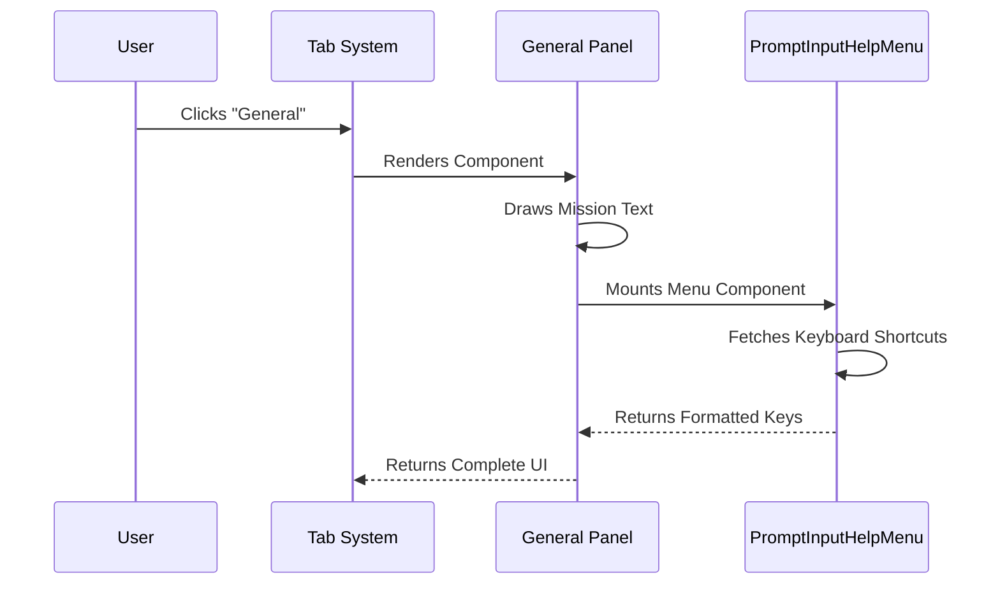

# Chapter 2: General Info Panel

Welcome back! In the previous chapter, [Help System Container](01_help_system_container.md), we built the "frame" of our house—the window manager that handles opening, sizing, and closing the help dialog.

Now, we need to furnish the first room.

When a user opens the help menu, we don't want to scare them with a massive list of 50 technical commands immediately. We want a friendly "Welcome Mat." This is the **General Info Panel**.

## What is the General Info Panel?

Think of the **General Info Panel** as the "Introduction" chapter of a book. It has two simple jobs:
1.  **Mission Statement:** Tell the user what this tool is (in plain English).
2.  **Global Shortcuts:** Show the universal keys (like navigation) that work everywhere.

### The Use Case

Imagine a new user, Alice, just installed the tool. She types `/help`.
*   **Bad Experience:** She sees a wall of text with complex flags like `--verbose` or `--dry-run`. She feels overwhelmed.
*   **Good Experience (Our Goal):** She sees a simple sentence: "Claude understands your codebase." Below that, she sees a small list of essential keys, like how to scroll or exit.

## Step-by-Step Implementation

We are building the component inside `General.tsx`. This component is very static—it doesn't need to calculate math or fetch data from a server. It just displays information.

We use a library called **Ink** (which is React for terminals) to build the layout.

### 1. The Layout Strategy

We need to stack items vertically:
1.  Text (Top)
2.  "Shortcuts" Header (Middle)
3.  The list of shortcuts (Bottom)

To do this, we use a `<Box>` with `flexDirection="column"`.

```typescript
// General.tsx
import { Box } from '../../ink.js';

export function General() {
  return (
    <Box flexDirection="column" paddingY={1} gap={1}>
      {/* Content goes here */}
    </Box>
  )
}
```

**Explanation:**
*   **Box:** This is like a `<div>` in HTML. It holds other things.
*   **flexDirection="column":** This tells the Box to stack its children on top of each other, not side-by-side.
*   **gap={1}:** Adds a blank line between items so they aren't squished together.

### 2. The Mission Statement

First, we add the friendly introductory text.

```typescript
<Box>
  <Text>
    Claude understands your codebase, makes edits with
    your permission, and executes commands — right
    from your terminal.
  </Text>
</Box>
```

**Explanation:**
*   **Text:** This component renders the string to the terminal screen. It handles wrapping text automatically if the window is too narrow.

### 3. The Shortcuts List

Next, we display the keyboard shortcuts. Instead of hard-coding "Press Up to move up," we use a reusable component called `PromptInputHelpMenu`.

Why reusable? Because we might want to show these shortcuts in other places, not just the Help window.

```typescript
import { PromptInputHelpMenu } from '../PromptInput/PromptInputHelpMenu.js';

// Inside the return statement...
<Box flexDirection="column">
  <Box>
    <Text bold={true}>Shortcuts</Text>
  </Box>
  <PromptInputHelpMenu gap={2} fixedWidth={true} />
</Box>
```

**Explanation:**
*   **Text bold={true}:** Makes the word "Shortcuts" stand out (usually brighter or thicker).
*   **PromptInputHelpMenu:** This is a "Black Box" component. We drop it in, and it automatically renders the list of active global keys (like Enter, Esc, Arrows).

## Internal Implementation

How does this component actually render to the screen? Here is the flow when the user clicks the "General" tab.



### The Full Code Assembly

When we put the pieces together in `General.tsx`, it looks like this. Note how simple it is because we delegated the hard work of listing keys to `PromptInputHelpMenu`.

```typescript
// General.tsx - The Complete Component
export function General() {
  return (
    <Box flexDirection="column" paddingY={1} gap={1}>
      {/* 1. The Mission Statement */}
      <Box>
        <Text>
          Claude understands your codebase...
        </Text>
      </Box>

      {/* 2. The Shortcuts Section */}
      <Box flexDirection="column">
        <Box><Text bold={true}>Shortcuts</Text></Box>
        <PromptInputHelpMenu gap={2} fixedWidth={true} />
      </Box>
    </Box>
  );
}
```

## Summary

The **General Info Panel** is the entry point of our help system. It prioritizes clarity over density.

We learned:
1.  **Layout:** Using `<Box flexDirection="column">` to stack items.
2.  **Text:** Using `<Text>` to display the mission statement.
3.  **Reusability:** Importing `PromptInputHelpMenu` to show shortcuts without rewriting the logic.

Now that we have greeted the user, they are ready to look at the actual commands available to them. But before we can render the commands, we need to figure out how to organize them.

[Next Chapter: Command Categorization Strategy](03_command_categorization_strategy.md)

---

Generated by [Code IQ](https://github.com/adityasoni99/Code-IQ)