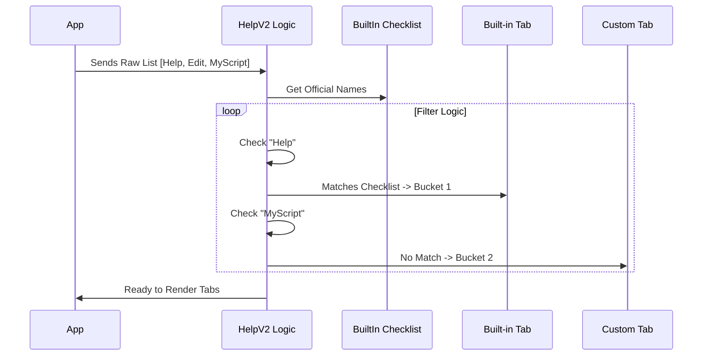

# Chapter 3: Command Categorization Strategy

Welcome back! 

In the previous chapter, [General Info Panel](02_general_info_panel.md), we created the static "Welcome" tab. It was simple because the text never changed.

Now things get interesting. We need to display the actual **Commands**. 

However, we have a problem. If a user has 20 built-in commands and 50 custom scripts, showing them all in one giant alphabetical list is overwhelming. It’s like a messy kitchen drawer where the spoons are mixed with the batteries and rubber bands.

In this chapter, we will build a **Command Categorization Strategy**. We will sort the raw data into logical "buckets" before we show it to the user.

## The Goal: Organized Buckets

We want to take a raw list of commands and split them into three specific tabs:

1.  **Commands (Built-in):** The core tools that come with the app.
2.  **Custom:** Scripts the user wrote themselves.
3.  **Internal (Ant-only):** Secret developer tools (only shown in specific modes).

### The Use Case

Imagine the application loads with the following raw list of commands:
*   `help` (Core feature)
*   `edit` (Core feature)
*   `my-backup-script` (User made)
*   `deploy-website` (User made)
*   `debug-core` (Internal only)

We need logic that automatically sorts `help` and `edit` into Tab 1, `my-backup-script` into Tab 2, and hides `debug-core` unless we are authorized to see it.

## Step-by-Step Implementation

We are working inside `HelpV2.tsx`. All of this logic happens *before* the `return (...)` statement. We are preparing our data.

### 1. The Reference Checklist

First, we need to know which commands are "Built-in." We don't guess; the system provides a list of known names.

```typescript
import { builtInCommandNames } from '../../commands.js';

// Get a Set (a checklist) of all official command names
const builtinNames = builtInCommandNames();
```

**Explanation:**
*   `builtInCommandNames()` gives us a list like `['help', 'edit', 'run']`.
*   We store this in a `Set`. A `Set` is great because checking `builtinNames.has('edit')` is very fast.

### 2. Bucket 1: Built-in Commands

Now we create our first bucket. We look at *every* command available and keep only the ones that match our checklist.

```typescript
// Filter the raw 'commands' prop
let builtinCommands = commands.filter(cmd => 
  // 1. Must be in the official checklist
  builtinNames.has(cmd.name) && 
  // 2. Must not be hidden (e.g., deprecated commands)
  !cmd.isHidden
);
```

**Explanation:**
*   `filter`: Loops through the list. If the logic returns `true`, the item goes in the bucket.
*   We strictly enforce `!cmd.isHidden` so we don't annoy the user with old or invisible tools.

### 3. Bucket 2: Custom Commands

How do we identify a custom command? Simple: It's anything that **isn't** on the official checklist.

```typescript
// The leftovers are Custom Commands
const customCommands = commands.filter(cmd => 
  // 1. MUST NOT be in the official checklist
  !builtinNames.has(cmd.name) && 
  // 2. Must not be hidden
  !cmd.isHidden
);
```

**Explanation:**
*   This is the exact opposite of the previous step. If `builtinNames.has` returns `false`, it means the user (or a plugin) created this command.

### 4. Bucket 3: Internal Tools (The "Ant" Mode)

Sometimes, developers need secret tools. We call this "Ant" mode (an internal code name). We verify if we are in this mode before creating this bucket.

```typescript
// Check if we are in 'ant' (internal) mode
if ("external" === 'ant') {
  // Create a list of internal-only tools
  const internalOnlyNames = new Set(INTERNAL_ONLY_COMMANDS.map(_ => _.name));
  
  // Logic to populate an 'antOnlyCommands' array goes here...
}
```

**Explanation:**
*   If we aren't in 'ant' mode, this code is skipped, and the user never knows these commands exist.

## The Logic Flow

Here is how the data moves through our sorting logic inside `HelpV2`:



## Creating the UI Objects

Now that we have our arrays (`builtinCommands` and `customCommands`), we need to turn them into **Tab** components.

We push these components into a standard array called `tabs`.

### 1. Adding the Default Tabs

We start with the General tab (from the previous chapter) and the Built-in commands.

```typescript
const tabs = [
  <Tab key="general" title="general">
    <General />
  </Tab>
];

// Add the Built-in Commands Tab
tabs.push(
  <Tab key="commands" title="commands">
     {/* We will discuss the <Commands /> component in Chapter 4 */}
     <Commands commands={builtinCommands} ... />
  </Tab>
);
```

### 2. Adding the Custom Tab

We add the custom tab next. Notice we pass the `customCommands` bucket we created earlier.

```typescript
tabs.push(
  <Tab key="custom" title="custom-commands">
     <Commands 
        commands={customCommands} 
        title="Browse custom commands:"
        emptyMessage="No custom commands found" 
     />
  </Tab>
);
```

**Explanation:**
*   We use the same `<Commands>` renderer for both tabs (we will build this in the next chapter).
*   We just pass it different data (`builtinCommands` vs `customCommands`).

## Internal Implementation Details

Let's look at the actual code in `HelpV2.tsx` to see how this comes together safely.

The sorting logic is wrapped inside a `React` component function. It runs every time the component renders, ensuring that if a new command is added while the help window is open, it gets sorted immediately.

```typescript
// HelpV2.tsx

export function HelpV2({ commands }: Props) {
  // 1. Get the Reference List
  const builtinNames = builtInCommandNames();

  // 2. Sort Built-ins
  let builtinCommands = commands.filter(
    cmd => builtinNames.has(cmd.name) && !cmd.isHidden
  );

  // 3. Sort Custom
  const customCommands = commands.filter(
    cmd => !builtinNames.has(cmd.name) && !cmd.isHidden
  );

  // 4. Build the Tab Array
  const tabs = [
    <Tab key="general" title="general"><General /></Tab>,
    <Tab key="commands" title="commands">
       <Commands commands={builtinCommands} ... />
    </Tab>,
    <Tab key="custom" title="custom-commands">
       <Commands commands={customCommands} ... />
    </Tab>
  ];
  
  // Render logic continues...
}
```

## Summary

In this chapter, we didn't worry about *how* to draw the list of commands to the screen. We focused entirely on **Organization**.

We learned:
1.  **The Checklist:** Using `builtInCommandNames()` to define what is "Standard."
2.  **Filtering:** Using `.filter()` to split one big list into specific "Buckets."
3.  **Tab Generation:** Creating a list of Tab components based on our filtered data.

Our data is now clean, sorted, and ready to be displayed. But we still need a way to actually *render* these lists in a way that looks good, supports scrolling, and handles keyboard navigation.

That brings us to the core engine of our help system.

[Next Chapter: Command Catalog Renderer](04_command_catalog_renderer.md)

---

Generated by [Code IQ](https://github.com/adityasoni99/Code-IQ)