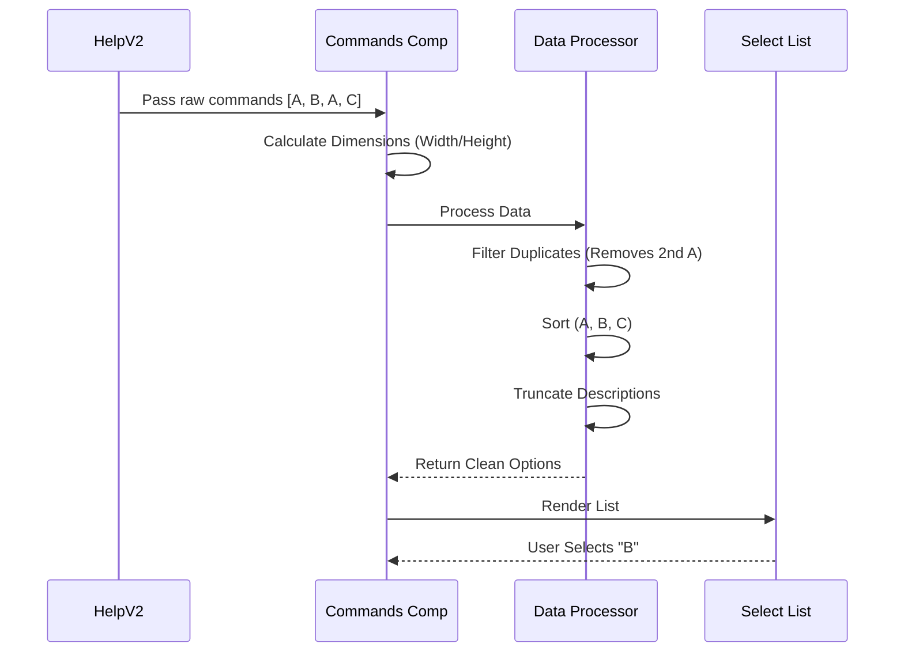

# Chapter 4: Command Catalog Renderer

Welcome back!

In the previous chapter, [Command Categorization Strategy](03_command_categorization_strategy.md), we acted like a librarian sorting books. We took a pile of commands and organized them into "buckets" (Built-in, Custom, Internal).

Now, we need to actually **display** those books on the shelf.

Simply printing a list of names isn't enough. What if the description is too long? What if the same command appears twice? What if the list is longer than the screen?

In this chapter, we will build the **Command Catalog Renderer** (`Commands.tsx`). This component acts like a "Smart Directory" that cleans up, formats, and displays our lists.

## The Mission: A Smart Directory

We need a component that takes a raw list of commands and transforms it into a beautiful, interactive menu.

### The Use Case
Imagine the user has a custom script named `deploy`.
1.  They defined `deploy` globally on their machine.
2.  They also defined `deploy` in their current project folder.

If we just listed everything, the user would see `deploy` twice. That is confusing!

**Our Component Responsibilities:**
1.  **Deduplicate:** If a name appears twice, only show it once.
2.  **Sort:** Alphabetize the list (A-Z).
3.  **Format:** Cut off (truncate) long descriptions so they fit on the screen.
4.  **Interact:** Allow the user to select a command to run it.

## Step-by-Step Implementation

We are working in `Commands.tsx`. Let's build this "Smart Directory" piece by piece.

### 1. Defining the Inputs (Props)

First, we define what this component needs to function. It needs the data (commands), the screen limits (height/columns), and a title.

```typescript
// Commands.tsx
type Props = {
  commands: Command[];    // The raw list
  maxHeight: number;      // How tall can we be?
  columns: number;        // How wide is the terminal?
  title: string;          // "General" or "Custom"?
  onCancel: () => void;   // What to do on "Esc"
  emptyMessage?: string;  // What if the list is empty?
};
```
**Explanation:**
*   `maxHeight` and `columns` are crucial. They tell us exactly how much screen real estate we own, so we don't draw outside the lines.

### 2. Calculating Layout Limits

Before we process the text, we need to know our physical limits.

```typescript
export function Commands({ commands, maxHeight, columns, ...props }: Props) {
  // Reserve 10 columns for padding/margins
  const maxWidth = Math.max(1, columns - 10);
  
  // Reserve 10 rows for headers/footers, split remaining by 2
  const visibleCount = Math.max(1, Math.floor((maxHeight - 10) / 2));
  
  // Logic continues...
}
```
**Explanation:**
*   **maxWidth:** We subtract 10 characters from the total width to ensure text doesn't touch the edge of the terminal window.
*   **visibleCount:** This determines how many items appear in the scrolling list at once. We calculate this dynamically based on the window height.

### 3. The Data Processor (Deduplicate & Sort)

This is the "Brain" of the component. We use `useMemo` to process the data only when it changes. This prevents the computer from doing heavy work on every single frame.

We need to remove duplicates using a `Set`.

```typescript
const options = useMemo(() => {
  const seen = new Set<string>(); // Keeps track of names we've seen

  return commands.filter(cmd => {
    // If we've seen "deploy" before, skip this one!
    if (seen.has(cmd.name)) return false;
    
    seen.add(cmd.name); // Mark "deploy" as seen
    return true;
  });
  // ... sorting continues in next block
}, [commands]);
```
**Explanation:**
*   **Set:** Think of a `Set` as a club guest list. We check the list before letting a command in. If `deploy` is already on the list, the second `deploy` is turned away.

### 4. Sorting and Formatting

Immediately after filtering, we sort the list alphabetically and format the text for the screen.

```typescript
  // ... continuining the chain from above
  .sort((a, b) => a.name.localeCompare(b.name)) // Sort A-Z
  .map(cmd => ({
    label: `/${cmd.name}`, // Add a slash for style
    value: cmd.name,
    // Truncate description if it's too wide
    description: truncate(cmd.description, maxWidth, true), 
  }));
```
**Explanation:**
*   `localeCompare`: The standard way to alphabetize text in JavaScript.
*   `truncate`: A utility function. If `maxWidth` is 50 chars, and the description is 100 chars, it cuts it off and adds "..." so the line doesn't break.

### 5. The Final Render

Now that our data is clean, sorted, and formatted, we pass it to the `<Select>` component. This is a pre-built UI component that handles the arrow keys and highlighting.

```typescript
return (
  <Box flexDirection="column" paddingY={1}>
    <Text>{title}</Text>
    <Box marginTop={1}>
      <Select 
        options={options} 
        visibleOptionCount={visibleCount} 
        onCancel={props.onCancel} 
        // ... other props
      />
    </Box>
  </Box>
);
```
**Explanation:**
*   We render a `Box` (container).
*   We print the `title` (e.g., "Custom Commands").
*   We give the processed `options` to the `Select` component.

## Internal Implementation Flow

How does the data flow from the parent component into the pixels on the screen?



## Why This Matters

Without this abstraction, every part of our app that lists commands would need to rewrite the logic for:
1.  Checking for duplicates.
2.  Sorting alphabetically.
3.  Calculating how many lines fit on the screen.

By creating the **Command Catalog Renderer**, we centralize all that messy logic. 

If we ever want to change how we handle duplicates (e.g., "Show both but label them differently"), we only have to change code in **one file**, and it updates everywhere.

## Summary

In this chapter, we built the visual engine for our help system.

We learned how to:
1.  **Calculate Constraints:** Using `columns` and `maxHeight` to keep our UI tidy.
2.  **Filter Data:** Using a `Set` to remove duplicate entries.
3.  **Format Data:** Truncating text to prevent ugly line wrapping.

We have a container (Chapter 1), a welcome screen (Chapter 2), a sorting strategy (Chapter 3), and now a renderer (Chapter 4).

However, terminal screens come in all shapes and sizes. What happens if the user resizes their window while the help menu is open? How do we ensure everything stays responsive?

[Next Chapter: Responsive Terminal Layout](05_responsive_terminal_layout.md)

---

Generated by [Code IQ](https://github.com/adityasoni99/Code-IQ)