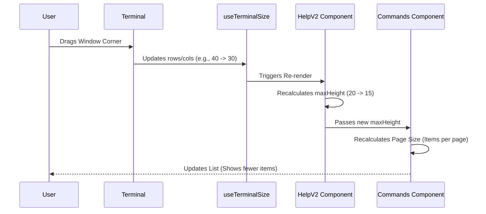

# Chapter 5: Responsive Terminal Layout

Welcome to the final chapter of our Help System tutorial!

In the previous chapter, [Command Catalog Renderer](04_command_catalog_renderer.md), we built a smart component that organizes and displays our commands. It knows *what* to display, but it doesn't know *how much space* it has.

Terminals are elastic. Users can maximize them on a 4K monitor or squish them into a tiny corner of a laptop screen. If our help window is hard-coded to be 50 rows tall, but the user's terminal is only 20 rows tall, the application will crash or look broken.

In this chapter, we will implement **Responsive Terminal Layout**. We will give our Help component the ability to measure its environment and adapt its shape instantly.

## The Problem: The Elastic Container

Websites use CSS Media Queries to adapt to mobile phones vs. desktops. Terminal apps need something similar.

### The Use Case

1.  **User A** has a massive terminal open. When they type `/help`, they want to see a long list of commands using 50% of the screen.
2.  **User B** creates a split-pane and has a tiny terminal. When they type `/help`, the list must shrink to fit, enabling a scrollbar instead of overflowing.
3.  **Context Matters:** Sometimes the Help window is a full-screen app. Other times, it's a "Modal" (a popup) inside another layout. It needs to behave differently in each case.

## Key Concepts

To solve this, we rely on two "Sensors" (Hooks):

1.  **The Tape Measure (`useTerminalSize`):** A hook that constantly reports the width (columns) and height (rows) of the terminal.
2.  **The Location Scout (`useIsInsideModal`):** A hook that tells the component, "Hey, you are currently running inside a floating window, so behave accordingly."

## Step-by-Step Implementation

We are working in the main container file, `HelpV2.tsx`. We need to calculate boundaries to pass down to our children.

### 1. Measuring the Screen

First, we need to know the raw dimensions of the user's terminal. We use the `useTerminalSize` hook.

```typescript
// HelpV2.tsx
import { useTerminalSize } from '../../hooks/useTerminalSize.js';

export function HelpV2({ onClose, commands }: Props) {
  // 1. Get current dimensions
  const { rows, columns } = useTerminalSize();
  
  // ...
}
```

**Explanation:**
*   `rows`: The height of the terminal (e.g., 40 lines).
*   `columns`: The width of the terminal (e.g., 120 characters).
*   If the user drags the corner of their window, this component automatically re-runs with new numbers.

### 2. Calculating the "Safe" Height

We rarely want a Help dialog to cover 100% of the screen. Users usually want to see the error message or code they were working on *behind* the help window.

We set a rule: **The Help window should never be taller than 50% of the screen.**

```typescript
// Calculate 50% of the screen height
const maxHeight = Math.floor(rows / 2);
```

**Explanation:**
*   If `rows` is 40, `maxHeight` becomes 20.
*   `Math.floor` ensures we don't end up with partial rows (like 20.5 lines), which is impossible in a terminal.

### 3. checking the Context (Modal vs. Full)

Sometimes, our Help component is placed inside a pre-existing "Modal" layout handled by a different part of the app. If that's the case, the *parent* decides the height, not us.

```typescript
import { useIsInsideModal } from '../../context/modalContext.js';

// Are we inside a managed modal?
const insideModal = useIsInsideModal();
```

**Explanation:**
*   `insideModal` is a boolean (`true` or `false`).
*   If `true`, we should relax our strict height rules and let the Flexbox layout handle the sizing.

### 4. Applying the Logic to the UI

Now we use a ternary operator (an `if/else` in one line) to decide what height to apply to our main container box.

```typescript
// If in a modal, let Flexbox handle it (undefined). 
// Otherwise, enforce our calculated limit.
const activeHeight = insideModal ? undefined : maxHeight;

return (
  <Box flexDirection="column" height={activeHeight}>
     {/* Content ... */}
  </Box>
);
```

**Explanation:**
*   **Box:** This is the outer frame of our window.
*   **height={undefined}:** In Ink (the library we use), this means "Grow as much as you need."
*   **height={20}:** This forces the box to be exactly 20 rows tall.

### 5. Passing Limits to Children

Remember the `Commands` component we built in [Chapter 4](04_command_catalog_renderer.md)? It needs to know these limits so it knows when to start truncating text or adding scrollbars.

```typescript
<Commands 
  commands={builtinCommands} 
  maxHeight={maxHeight} 
  columns={columns} 
  // ... other props
/>
```

**Explanation:**
*   Even though the *Container* (`HelpV2`) sets the outer frame, the *Content* (`Commands`) needs the math to calculate how many items to show in the list (`visibleOptionCount`).

## Internal Implementation: The Resize Flow

What actually happens when a user resizes their window?



### Code Deep Dive

Let's look at the actual code in `HelpV2.tsx` that ties this all together.

```typescript
// HelpV2.tsx

export function HelpV2(props) {
  // 1. The Sensors
  const { rows, columns } = useTerminalSize();
  const insideModal = useIsInsideModal();
  
  // 2. The Calculation
  const maxHeight = Math.floor(rows / 2);

  // ... (Tab logic from Chapter 3) ...

  // 3. The Decision
  // If we are in a modal, we don't set a fixed height.
  // If we are standalone, we cap it at maxHeight.
  const containerHeight = insideModal ? undefined : maxHeight;

  return (
    <Box flexDirection="column" height={containerHeight}>
       {/* The UI Elements */}
    </Box>
  );
}
```

This simple logic ensures that:
1.  **Small Screens:** The help menu shrinks. The inner `<Commands>` component detects the smaller `maxHeight` and reduces the number of visible items (e.g., showing 5 items instead of 10), allowing the user to scroll.
2.  **Large Screens:** The help menu expands, making use of the extra space to show more information at once.

## Summary

In this final chapter, we learned how to make our TUI (Terminal User Interface) **Responsive**.

We learned:
1.  **Measurement:** Using `useTerminalSize` to get the current window dimensions.
2.  **Calculation:** Deriving a safe `maxHeight` (50% of the screen) so we don't overwhelm the user.
3.  **Context Awareness:** Using `useIsInsideModal` to adapt our layout strategy based on where the component is rendered.
4.  **Prop Drilling:** Passing these measurements down to child components like `Commands` so they can render lists intelligently.

### Conclusion

Congratulations! You have walked through the entire architecture of the **HelpV2** system.

1.  We built a safe **Container** [Chapter 1](01_help_system_container.md).
2.  We created a welcoming **General Panel** [Chapter 2](02_general_info_panel.md).
3.  We designed a **Categorization Strategy** [Chapter 3](03_command_categorization_strategy.md).
4.  We built a smart **Catalog Renderer** [Chapter 4](04_command_catalog_renderer.md).
5.  And finally, we made it **Responsive** to the user's screen.

You now understand how to build a professional, robust, and user-friendly help interface for a terminal application. Happy coding!

---

Generated by [Code IQ](https://github.com/adityasoni99/Code-IQ)