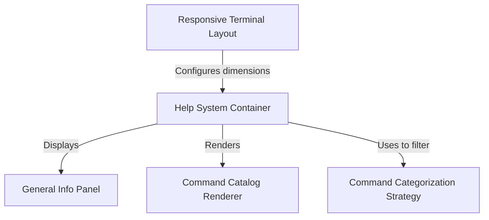

# Tutorial: HelpV2

The project implements an interactive **Help System** for a CLI tool that acts as a modal window manager. It organizes documentation into a **General** tab for high-level information and multiple **Command** tabs that list executable actions. The system automatically partitions these actions using a **categorization strategy** (e.g., Built-in vs. Custom) and employs a **responsive layout** mechanism to dynamically adapt the interface to the user's terminal size.

## Chapters

1. [Help System Container](01_help_system_container.md)
2. [General Info Panel](02_general_info_panel.md)
3. [Command Categorization Strategy](03_command_categorization_strategy.md)
4. [Command Catalog Renderer](04_command_catalog_renderer.md)
5. [Responsive Terminal Layout](05_responsive_terminal_layout.md)

---

Generated by [Code IQ](https://github.com/adityasoni99/Code-IQ)