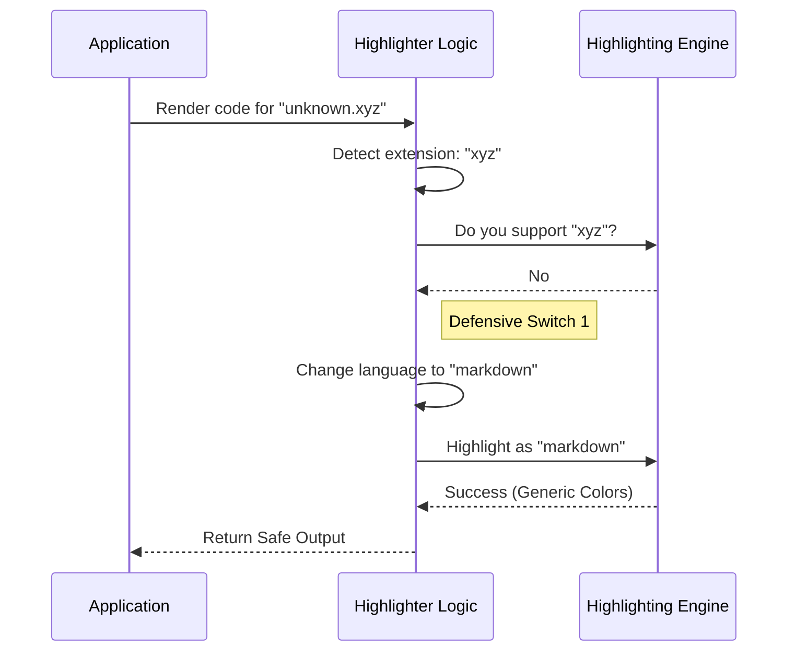

# Chapter 1: Defensive Language Fallback

Welcome to the **HighlightedCode** project! 

In this first chapter, we are going to look at the safety features of our code renderer. Before we worry about making things fast or pretty, we must ensure they are **robust**.

## The Problem: What if the Highlighter Crashes?

Imagine you are building a terminal application that displays code snippets. You want to syntax highlight a Python file. You ask your highlighting library to process it.

But what happens if:
1. The library doesn't know what "Python" is?
2. The code contains strange characters that cause the library to throw an error?

In a naive application, your entire program might crash. The screen goes black, and the user sees a stack trace. This is a bad user experience.

## The Solution: The "Spare Tire" Strategy

We use a strategy called **Defensive Language Fallback**. Think of it like a car with a spare tire.

*   **Main Tire (Specialized):** We try to use the specific language highlighter (e.g., Rust, TypeScript).
*   **Spare Tire (Fallback):** If the specialized highlighter fails, we immediately switch to a generic "Markdown" highlighter or plain text.

This ensures the car (your application) keeps moving, even if a tire blows out.

## The Use Case

Let's say a user tries to open a file named `script.unknown`.

1.  **Input:** A file path `script.unknown` and some code content.
2.  **Attempt:** The app tries to find a syntax definition for `.unknown`.
3.  **Fail:** It doesn't exist.
4.  **Fallback:** The app automatically switches to generic highlighting so the text is still readable, just less colorful.

## How to Use It

The main entry point for this logic is a component called `HighlightedCodeFallback`. You don't need to configure the safety net; it happens automatically.

Here is how you would use it in your code:

```tsx
// Example Usage
<HighlightedCodeFallback
  code="console.log('Hello World');"
  filePath="example.js"
  dim={false}
/>
```

When you render this, the component calculates the file extension (`js`) and attempts to highlight it. If anything goes wrong inside the highlighting engine, it catches the error and displays the code safely.

## Internal Implementation: How It Works

Let's look under the hood. When the component renders, it follows a strict decision tree to ensure it never crashes.

### Step-by-Step Flow

1.  **Check Config:** If `skipColoring` is true, return plain text immediately.
2.  **Detect Language:** Extract the extension from the `filePath` (e.g., `.js` -> `js`).
3.  **Verify Support:** Ask the highlighter: "Do you support 'js'?"
    *   *No:* Switch target language to `markdown`.
4.  **Attempt Highlight:** Try to highlight the code.
    *   *Success:* Return the colored string.
    *   *Error:* Catch the crash, switch to `markdown`, and try again.

### Visualizing the Logic

Here is a sequence diagram showing what happens when a language isn't supported or fails.



### The Code Implementation

Let's look at the actual logic inside `Fallback.tsx`.

*(Note: The code below is simplified to remove performance optimizations for clarity. We will cover those in [React Compiler Memoization](05_react_compiler_memoization.md).)*

#### 1. Language Detection
First, the component figures out what language to ask for based on the file path.

```typescript
// Inside HighlightedCodeFallback component
// filePath might be "src/utils.ts"
const extension = extname(filePath).slice(1); 
// extension becomes "ts"

// We pass this 'language' down to the worker component
return <Highlighted codeWithSpaces={code} language={extension} />;
```

#### 2. Checking for Support
Inside the `Highlighted` component, we check if the language exists before we even try to run the heavy code.

```typescript
let highlightLang = "markdown"; // Default to safety

if (language && hl.supportsLanguage(language)) {
  // If the highlighter knows this language, use it
  highlightLang = language;
} else {
  // Otherwise, log it and stick to markdown
  logForDebugging(`Language not supported: ${language}`);
}
```
*Logic:* By default, we assume we are using Markdown (the spare tire). We only switch to the specialized tire if `supportsLanguage` returns true.

#### 3. The Try/Catch Safety Net
Finally, even if the language is supported, the highlighting function itself might crash due to bad input. We wrap that in a `try/catch` block.

```typescript
try {
  // Attempt the main highlight
  return cachedHighlight(hl, codeWithSpaces, highlightLang);
} catch (e) {
  // IF IT CRASHES:
  logForDebugging(`Highlight error, falling back: ${e}`);
  
  // Use the spare tire (Markdown)
  return cachedHighlight(hl, codeWithSpaces, 'markdown');
}
```

This specific block is the core of **Defensive Language Fallback**. No matter what error `cachedHighlight` throws, the application catches it and renders the content as generic markdown.

## Summary

In this chapter, we learned:
1.  **Defensive Programming:** Always assume external libraries might fail.
2.  **The "Spare Tire":** We use "markdown" as a generic fallback when specific languages fail.
3.  **Robustness:** By checking for language support and using `try/catch` blocks, we ensure the user never sees a crash.

Now that we know how to handle errors safely, how do we actually load the highlighter without freezing the application?

Next, we will learn about **[Async Highlighter Loading](02_async_highlighter_loading.md)**.

---

Generated by [Code IQ](https://github.com/adityasoni99/Code-IQ)