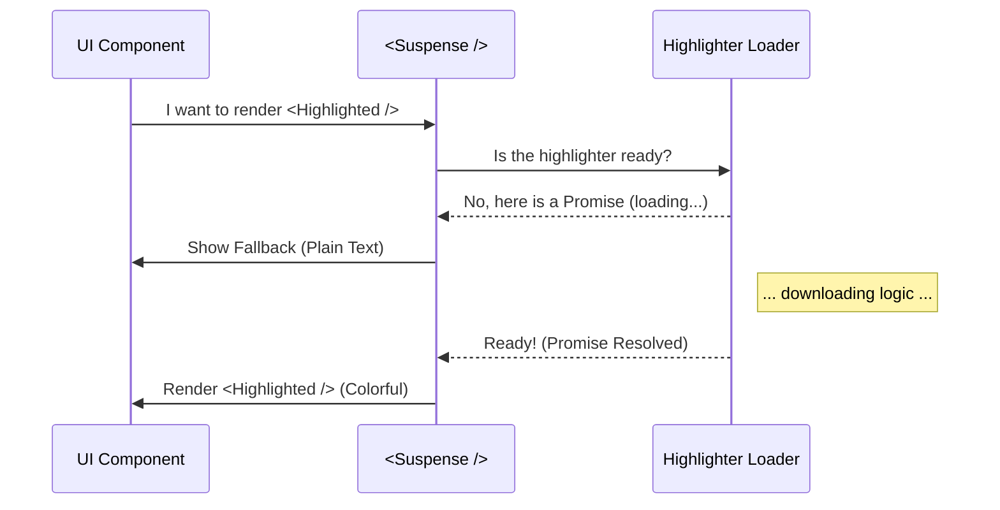

# Chapter 2: Async Highlighter Loading

In the previous chapter, **[Defensive Language Fallback](01_defensive_language_fallback.md)**, we ensured our application wouldn't crash if the syntax highlighter encountered an error. We built a robust "spare tire."

Now, we need to make sure the application is **fast**.

## The Problem: The Heavy Backpack

Syntax highlighting engines are heavy. They include definitions for hundreds of languages (Python, Java, Rust, SQL, etc.).

If we load this entire engine **before** we show anything on the screen, the user will stare at a blank terminal for several seconds. This is called "blocking the render." It feels like the app is frozen.

## The Solution: The Restaurant Analogy

To solve this, we use **Async Highlighter Loading**. Think of it like a busy restaurant:

1.  **You sit down (Initial Render):** You don't wait for the food to be cooked before you sit. You sit immediately.
2.  **The Menu (Fallback UI):** While the kitchen is working, you look at a menu or eat bread. This is the **Loading State**.
3.  **The Meal (Resolved UI):** Once the kitchen finishes, the waiter swaps the menu for your specific meal.

In our code:
*   **The Kitchen:** The background process loading the heavy highlighter.
*   **The Menu:** The plain, uncolored code (instant).
*   **The Meal:** The beautiful, colored code (appears when ready).

## Key Concepts

We use two modern React features to achieve this:

1.  **`Promise`:** A guarantee that a value (the highlighter) will arrive in the future.
2.  **`use` Hook:** A function that pauses a component until a Promise is ready.
3.  **`Suspense`:** A wrapper that defines what to show *while* the component is paused.

## Internal Implementation: How It Works

Let's visualize the flow when a user asks to render a file.

### Visual Flow



### The Code Implementation

Let's break down the implementation into three small parts.

#### 1. The Heavy Resource (The Kitchen)

We have a utility function `getCliHighlightPromise`. This function starts loading the highlighting library immediately but returns a **Promise**.

```typescript
// utils/cliHighlight.ts
let highlightPromise: Promise<Highlighter> | null = null;

export function getCliHighlightPromise() {
  if (!highlightPromise) {
    // Start loading the heavy library
    highlightPromise = loadHeavyLibrary();
  }
  return highlightPromise;
}
```
*Explanation:* We ensure we only load the library once (Singleton pattern). We return the "ticket" (Promise), not the library itself immediately.

#### 2. The Worker Component (The Meal)

Inside our `Highlighted` component, we use the `use` hook. This is where the magic happens.

```typescript
// Inside Highlighted component
function Highlighted({ code, language }) {
  // 1. Get the promise
  const promise = getCliHighlightPromise();

  // 2. PAUSE execution here until promise resolves!
  const hl = use(promise);

  // 3. Use the highlighter (only runs after loading finishes)
  return hl.highlight(code, { language });
}
```
*Explanation:* When React hits `use(promise)`, if the promise is pending, it **stops** rendering this component immediately and tells the parent, "I'm not ready."

#### 3. The Coordinator (The Waiter)

This is the parent component, `HighlightedCodeFallback`. It wraps the worker in a `<Suspense>` boundary.

```tsx
// Inside HighlightedCodeFallback component
export function HighlightedCodeFallback({ code, language }) {
  // Define the "Menu" (what to show while waiting)
  const plainText = <Ansi>{code}</Ansi>;

  return (
    <Suspense fallback={plainText}>
      {/* React tries to render this. If it pauses, 
          it shows the fallback above. */}
      <Highlighted code={code} language={language} />
    </Suspense>
  );
}
```
*Explanation:*
1.  React tries to render `<Highlighted />`.
2.  `<Highlighted />` says "I'm paused via `use`".
3.  `<Suspense>` catches that signal and renders `fallback={plainText}` instead.
4.  Once the library loads, React automatically re-renders `<Highlighted />` with colors.

## Example Usage

You don't need to do anything special to trigger this. Just using the component works:

```tsx
// Your Application
<HighlightedCodeFallback 
  code="const x = 1;" 
  filePath="test.ts" 
/>
```

**What the user sees:**
1.  **Millisecond 0:** The text `const x = 1;` appears in white (Plain Text).
2.  **Millisecond 50:** The text flashes and becomes colorful (Syntax Highlighted).

The application remains responsive the entire time.

## Summary

In this chapter, we learned:
1.  **Non-Blocking UI:** We shouldn't make users wait for heavy tools to load.
2.  **React `use`:** A hook that lets us wait for async data inside a component.
3.  **React `Suspense`:** A boundary that handles the "Loading..." state for us automatically.

We now have a system that is **Robust** (Chapter 1) and **Fast** (Chapter 2). But how exactly do we draw these colors to a command-line interface instead of a web browser?

Next, we will look at **[Ink Terminal Rendering](03_ink_terminal_rendering.md)**.

---

Generated by [Code IQ](https://github.com/adityasoni99/Code-IQ)