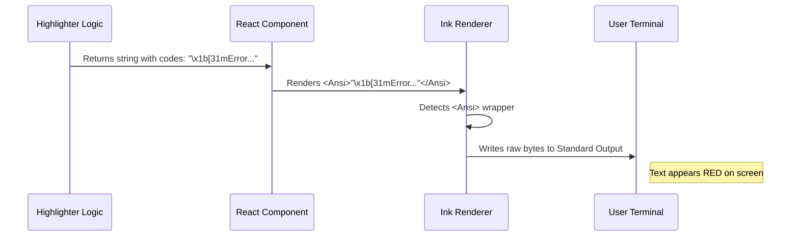

# Chapter 3: Ink Terminal Rendering

Welcome back! 

In the previous chapter, **[Async Highlighter Loading](02_async_highlighter_loading.md)**, we solved the problem of "blocking" the application. We learned how to load heavy tools in the background without freezing the screen.

Now, we have a different challenge. We have our syntax highlighter loaded, and it is ready to generate colorful code. But... **how do we actually paint those colors onto a black terminal screen?**

## The Problem: React is for Browsers

React was originally built for the web.
*   In a browser, you use tags like `<div>`, `<span>`, and `<h1 style={{ color: 'red' }}>`.
*   A terminal (like Command Prompt or Terminal.app) does not understand `<div>`. If you send it HTML, it will just print the raw text `<div>`.

A terminal is like an old-school typewriter. It only understands text and very specific commands called **ANSI Escape Codes**.

### What are ANSI Codes?
They are weird-looking sequences of characters that tell the terminal to change modes.
*   `\x1b[31m` -> "Switch pen to Red"
*   `\x1b[0m` -> "Reset pen to normal"

If we want to show colored code, we need a translator to turn our React logic into these raw typewriter keystrokes.

## The Solution: Ink

We use a library called **Ink**. Ink is "React for the Command Line."

It provides special components that look like React but render to the terminal:
*   `<Text>`: Replaces `<span>` or `<p>`.
*   `<Ansi>`: A special component that says, "This string already contains magic color codes. Please pass them through to the user."

Think of **Ink** as the translator between the Web Developer (you) and the Typewriter (the terminal).

## The Use Case

Let's say our highlighter successfully processes this code:
`const x = 1;`

The highlighter returns a string that looks like this internally:
`"\x1b[35mconst\x1b[39m \x1b[34mx\x1b[39m = \x1b[33m1\x1b[39m;"`

If we just printed this as a standard React string, React might try to "escape" the characters for safety, and the user would see the messy codes. We need to tell the renderer: **"Render this string exactly as it is, interpreting the colors."**

## Internal Implementation: How It Works

Let's look at how the data flows from our highlighter component to the user's eye.

### Visual Flow



### The Code Implementation

Let's look at `Fallback.tsx` again. There are two places where we perform this translation.

#### 1. Rendering the Highlighted Result

Inside the `Highlighted` component, once we have the highlighted string (let's call it `out`), we simply wrap it.

```tsx
// Inside Highlighted component
// 'out' contains the string with ANSI color codes
return <Ansi>{out}</Ansi>;
```
*Explanation:* The `<Ansi>` component acts as a pass-through. It tells Ink, "Don't touch the weird characters in here; they are for the terminal."

#### 2. Handling "Dim" Text

Sometimes, we want to show code but make it look grayed out (for example, if it's a file that is ignored). We use the `<Text>` component for this.

```tsx
// Inside HighlightedCodeFallback component
if (skipColoring) {
  // If we shouldn't color syntax, maybe we still want to dim it?
  return (
    <Text dimColor={dim}>
      <Ansi>{codeWithSpaces}</Ansi>
    </Text>
  );
}
```

*Explanation:*
1.  We wrap the content in `<Text>`.
2.  We pass the prop `dimColor={true}`.
3.  Ink translates this prop into the ANSI code `\x1b[2m` (which means "dim").
4.  The `<Ansi>` child ensures any existing formatting inside isn't broken.

#### 3. Combining Components

The final structure often looks like a sandwich:

```tsx
<Text dimColor={dim}>
  <Suspense fallback={plainText}>
     {/* This component returns <Ansi>...</Ansi> */}
    <Highlighted code={code} language={language} />
  </Suspense>
</Text>
```

This composition is powerful. The outer `<Text>` handles global styling (like dimming), while the inner `<Highlighted>` component handles the specific syntax colors. Ink merges these instructions together intelligently.

## Summary

In this chapter, we learned:
1.  **Terminals are not Browsers:** They need ANSI codes, not HTML tags.
2.  **Ink is the Translator:** It converts React components into terminal output.
3.  **`<Ansi>` Component:** The specific tool we use to render pre-colored text strings safely.

At this point, we have a robust system (Chapter 1), it loads asynchronously (Chapter 2), and it renders beautifully to the terminal (Chapter 3).

However, syntax highlighting is mathematically expensive. If a user scrolls through a list of 100 files, and then scrolls back up, do we really want to re-calculate the colors for files we've already seen?

To solve this, we need to remember our work. Next, we will learn about the **[Global Highlight Cache](04_global_highlight_cache.md)**.

---

Generated by [Code IQ](https://github.com/adityasoni99/Code-IQ)