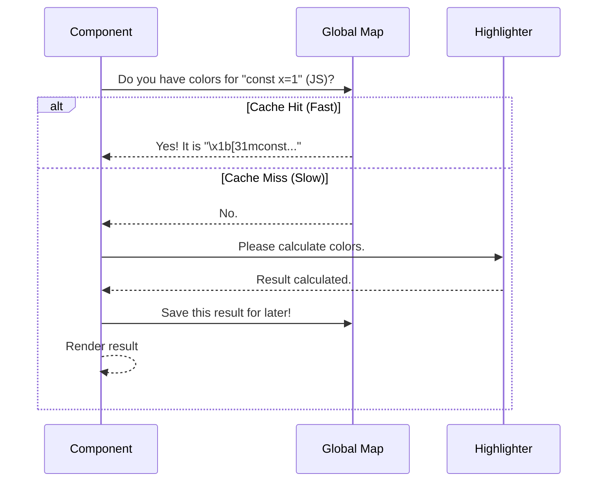

# Chapter 4: Global Highlight Cache

Welcome to the fourth chapter of our **HighlightedCode** tutorial!

In the previous chapter, **[Ink Terminal Rendering](03_ink_terminal_rendering.md)**, we mastered the art of painting colored text onto the terminal screen using **Ink** and **ANSI codes**. We now have a component that is safe, loads asynchronously, and renders beautifully.

However, there is one final hurdle: **Performance**.

## The Problem: The "Scroll" Lag

Syntax highlighting is computationally expensive. To colorize code, the library must:
1.  Read every character.
2.  Match complex Regular Expressions.
3.  Tokenize the string.
4.  Wrap parts in ANSI codes.

Imagine a user viewing a list of 50 files in your CLI tool. They scroll down to the bottom, and then scroll back up to the top.

Without optimization, when they scroll back up, the computer says: *"Oh, I need to render File #1 again. Let me re-calculate all the math to find the colors."*

This causes **scroll lag**. The terminal feels sticky and unresponsive because the CPU is wasting time solving problems it has already solved.

## The Solution: The "Cheat Sheet"

We solve this with a **Global Highlight Cache**.

Think of it like a student taking a math test.
*   **Without Cache:** The student works out `123 * 456` on scratch paper every time they see it. It takes 30 seconds.
*   **With Cache:** The student writes the answer on a "Cheat Sheet." The next time they see `123 * 456`, they just look at the sheet. It takes 1 second.

In our program, we use a global `Map` (our cheat sheet) to remember the colored version of code strings.

## How It Works

The concept is simple:
1.  **Input:** We have `code` (string) and `language` (string).
2.  **Check:** Have we seen this exact combination before?
3.  **Hit:** If yes, return the stored colorful string immediately.
4.  **Miss:** If no, calculate the colors, store them, and *then* return.

### Visualizing the Logic

Here is the decision process every time a component tries to render:



## Internal Implementation

Let's build this logic step-by-step. We implement this in our `Fallback.tsx` file, outside of any component so it stays alive even if components unmount.

### 1. The Storage Container

First, we need the memory storage. We use a JavaScript `Map`.

```typescript
// Define a maximum size to prevent memory leaks
const HL_CACHE_MAX = 500;

// The Global Cache (The Cheat Sheet)
const hlCache = new Map<string, string>();
```

*Explanation:* `hlCache` is a simple key-value store. We set a limit (`HL_CACHE_MAX`) because if we run the app for a long time, we don't want to use up all the user's RAM storing millions of strings.

### 2. The Unique Key

To look up an item, we need a unique ID. If we just use the code as the key, we might have issues if the same code is highlighted in two different languages.

We create a unique "Fingerprint" by hashing the language and code together.

```typescript
// Inside cachedHighlight function
// Create a unique ID for this specific code + language combo
const key = hashPair(language, code);
```

*Note:* `hashPair` is a helper that turns two strings into a single unique string.

### 3. The "Cache Hit" (Fast Path)

Before doing any work, we check the map.

```typescript
const hit = hlCache.get(key);

if (hit !== undefined) {
  // FOUND IT!
  // Refresh the entry (make it "new" again)
  hlCache.delete(key);
  hlCache.set(key, hit);
  
  return hit;
}
```

*Explanation:* If we find the result, we return it immediately. The `delete` and `set` trick is a simple way to say "this item was just used," which helps us decide what to delete later if the cache gets full.

### 4. The "Cache Miss" and Eviction

If we didn't find it, we must do the hard work. But before we save the new result, we need to make sure we have room.

```typescript
// 1. Do the heavy calculation
const out = hl.highlight(code, { language });

// 2. Check if the bag is full
if (hlCache.size >= HL_CACHE_MAX) {
  // Get the oldest item (the first one added)
  const first = hlCache.keys().next().value;
  
  // Delete it to make space
  if (first !== undefined) hlCache.delete(first);
}

// 3. Save the new result
hlCache.set(key, out);

return out;
```

*Explanation:* This acts like a "One In, One Out" policy. If our cache limit is 500 items, and we try to add the 501st item, we throw away the oldest unused item to make room. This keeps memory usage flat.

## Using the Cache

Now we simply replace our direct call to the highlighter with our wrapper function.

**Before (Slow):**
```typescript
// Inside Highlighted Component
return hl.highlight(code, { language });
```

**After (Fast):**
```typescript
// Inside Highlighted Component
// We pass the highlighter instance (hl) to the cache function
return cachedHighlight(hl, code, language);
```

## Why This Matters for Terminals

In a web browser, the browser engine handles a lot of scrolling optimization for you. In a terminal (using Ink), every time the output changes or the window resizes, the text is re-generated.

By implementing this **Global Highlight Cache**, we ensure that:
1.  **Scrolling is smooth:** Previously viewed code renders instantly (0ms).
2.  **CPU is saved:** Your laptop fan won't spin up just because you are viewing a log file.
3.  **Memory is safe:** We strictly limit how much we remember.

## Summary

In this chapter, we learned:
1.  **The Cost of Highlighting:** It involves heavy math and text processing.
2.  **Caching:** Storing the result of an expensive operation to reuse it later.
3.  **Eviction Policy:** Automatically deleting old data to prevent memory leaks.

We have built a high-performance system! But... within the React components themselves, we are still creating objects and function calls every time we render. Can we optimize how React itself behaves?

Next, we will learn about **[React Compiler Memoization](05_react_compiler_memoization.md)**.

---

Generated by [Code IQ](https://github.com/adityasoni99/Code-IQ)