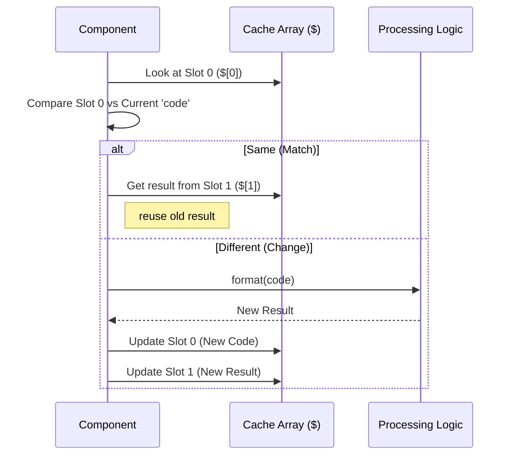

# Chapter 5: React Compiler Memoization

Welcome to the final chapter of the **HighlightedCode** tutorial!

In the previous chapter, **[Global Highlight Cache](04_global_highlight_cache.md)**, we optimized the heavy mathematics of syntax highlighting. We ensured that if we calculated the colors for a file once, we never had to do the math again.

However, there is still one layer of "waste" left. Even if the math is cached, React still has to run the component function, create new objects, and generate new Virtual DOM elements every time something updates.

In this chapter, we explore **React Compiler Memoization**.

## The Problem: The Over-Enthusiastic Builder

Imagine a factory worker building toy cars.
1.  **Standard React:** Every time the conveyor belt moves, the worker grabs a new frame, new wheels, and new paint, and builds the car from scratch—even if the car looks exactly the same as the last one.
2.  **The Waste:** This creates a lot of garbage (memory usage) and takes time (CPU cycles), even if the result is identical.

In our terminal application, creating new objects and JSX elements (`<div />`, `<Ansi />`) costs money (CPU resources). We want to stop rebuilding things that haven't changed.

## The Solution: The Detailed Checklist

We use the **React Compiler**. This is a tool that transforms our code automatically.

It gives the factory worker a **Checklist (The Cache Array `$`**) and a set of **Rules**.
1.  **Check:** "Is the wheel type (`$[0]`) the same as before?"
2.  **Action:**
    *   *Yes:* Reuse the old wheel from the bin.
    *   *No:* Go get a new wheel and update the list.

This is called **Fine-Grained Reactivity**. We don't just cache the final result; we cache every tiny step along the way.

## Key Concepts

There are two strange-looking symbols you will see in the code. These are generated by the compiler.

### 1. The Cache Hook (`_c`)
This stands for "Cache." It asks React to reserve a specific number of "memory slots" for this component.

```typescript
const $ = _c(20); // "Give me 20 memory slots for this component"
```

### 2. The Storage Array (`$`)
This is the array of memory slots.
*   `$[0]`: Stores a dependency (like a variable `code`).
*   `$[1]`: Stores the result (like the formatted string).

Instead of standard `useMemo`, which developers write manually, the compiler automates this logic for *everything*—even creating JSX elements.

## Internal Implementation: How It Works

Let's visualize a component deciding whether to reformat a string.

### Visual Flow



### The Code Implementation

Let's look at the generated code in `Fallback.tsx`. It might look intimidating at first because it is machine-generated, but it is actually very simple logic repeated over and over.

#### 1. Setting up the Memory
At the very top of `HighlightedCodeFallback`, we initialize the cache.

```typescript
// Inside HighlightedCodeFallback
import { c as _c } from "react/compiler-runtime";

export function HighlightedCodeFallback(t0) {
  // Reserve 20 slots of memory for this component
  const $ = _c(20);
  
  const { code, filePath } = t0;
  // ...
}
```

#### 2. Memoizing a Calculation
We want to convert tabs to spaces. But we only want to do this if the `code` string actually changed.

```typescript
let t3; // Temporary variable for the result

// If the code in Slot 0 is NOT the same as the current code...
if ($[0] !== code) {
  // 1. Do the work
  t3 = convertLeadingTabsToSpaces(code);
  
  // 2. Save the inputs and outputs for next time
  $[0] = code;
  $[1] = t3;
} else {
  // If inputs are the same, just read the saved result
  t3 = $[1];
}
```
*Explanation:* This is exactly what `useMemo` does, but "unrolled" into raw `if` statements for maximum speed.

#### 3. Memoizing JSX Elements
This is where the React Compiler shines. It even caches the UI elements themselves!

```typescript
let t5;

// Check if 'codeWithSpaces' ($[9]) changed
if ($[9] !== codeWithSpaces) {
  // If it changed, create a new JSX element
  t5 = <Ansi>{codeWithSpaces}</Ansi>;
  
  // Save it
  $[9] = codeWithSpaces;
  $[10] = t5;
} else {
  // Reuse the existing JSX element instance
  t5 = $[10];
}
```

*Explanation:* Standard React re-creates `<Ansi>...</Ansi>` object every render. This code reuses the *exact same object* in memory if the text hasn't changed. This relieves pressure on the Garbage Collector.

#### 4. The Final Assembly
Finally, the component combines these cached parts.

```typescript
let t6;

// Check if either input changed
if ($[11] !== codeWithSpaces || $[12] !== language) {
  // Re-create the Child Component
  t6 = <Highlighted codeWithSpaces={codeWithSpaces} language={language} />;
  
  // Update cache
  $[11] = codeWithSpaces;
  $[12] = language;
  $[13] = t6;
} else {
  t6 = $[13];
}
```

## Why Not Just Use `useMemo`?

You might ask: *"Why don't we just write `useMemo` manually?"*

1.  **Clutter:** Wrapping every variable and JSX element in `useMemo` makes code hard to read.
2.  **Mistakes:** Humans often forget dependencies in the dependency array `[]`. The compiler never forgets.
3.  **Granularity:** The compiler can optimize things that are hard to optimize manually, like the creation of simple objects or specific JSX children.

## Summary of the Project

Congratulations! You have completed the **HighlightedCode** tutorial. 

Let's review the journey we took to build the ultimate code renderer:

1.  **[Defensive Language Fallback](01_defensive_language_fallback.md):** We built a safety net so the app never crashes on unknown languages.
2.  **[Async Highlighter Loading](02_async_highlighter_loading.md):** We moved the heavy lifting to the background to keep the UI responsive.
3.  **[Ink Terminal Rendering](03_ink_terminal_rendering.md):** We learned to translate React components into ANSI codes for the terminal.
4.  **[Global Highlight Cache](04_global_highlight_cache.md):** We solved the "Math" bottleneck by remembering color calculations globally.
5.  **React Compiler Memoization (This Chapter):** We solved the "Render" bottleneck by remembering the specific objects and elements locally.

By combining these layers, we have created a component that is **Safe, Fast, Efficient, and Beautiful**.

You are now ready to dig into the codebase and start building your own high-performance terminal tools!

---

Generated by [Code IQ](https://github.com/adityasoni99/Code-IQ)