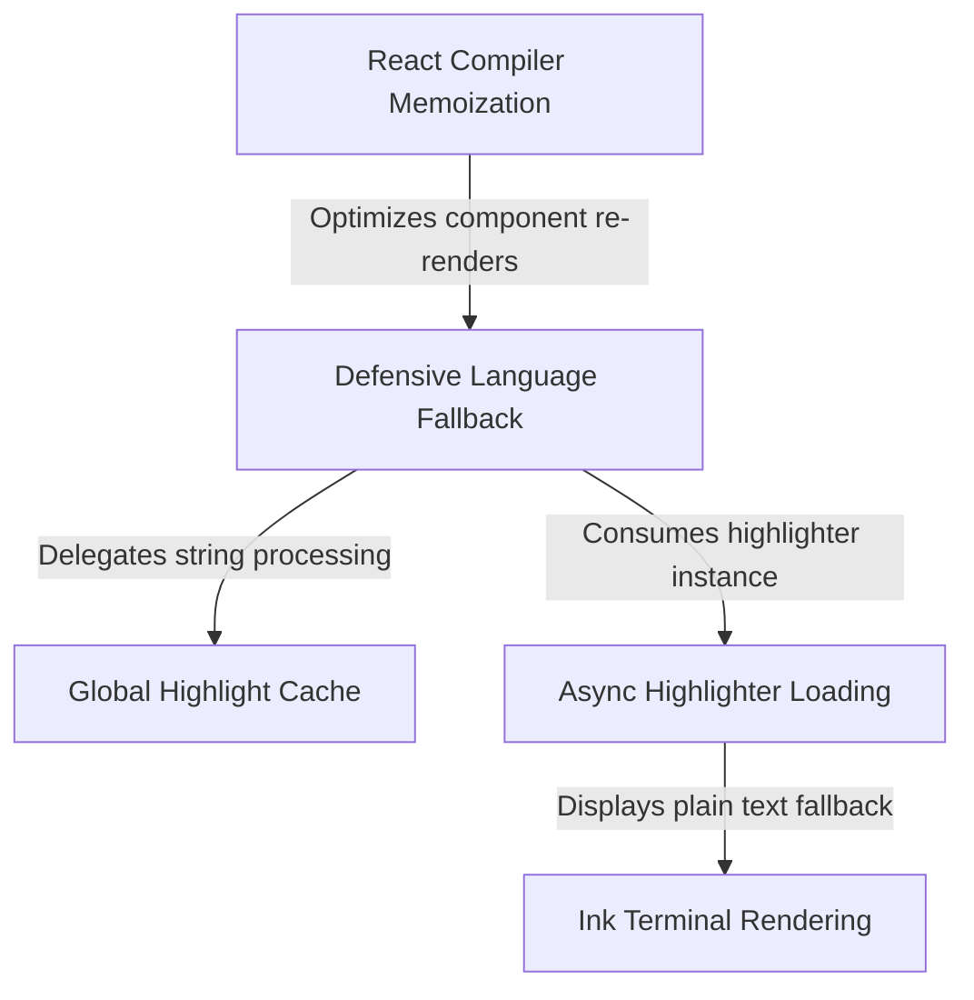

# Tutorial: HighlightedCode

This project creates a **fault-tolerant syntax highlighter** for terminal applications. It ensures the UI remains responsive by using **asynchronous loading** to fetch the highlighting engine in the background, while a **defensive fallback strategy** guarantees that text is always displayed—downgrading to *Markdown* or plain text—if the highlighter fails or the language is unsupported.

## Chapters

1. [Defensive Language Fallback](01_defensive_language_fallback.md)
2. [Async Highlighter Loading](02_async_highlighter_loading.md)
3. [Ink Terminal Rendering](03_ink_terminal_rendering.md)
4. [Global Highlight Cache](04_global_highlight_cache.md)
5. [React Compiler Memoization](05_react_compiler_memoization.md)

---

Generated by [Code IQ](https://github.com/adityasoni99/Code-IQ)