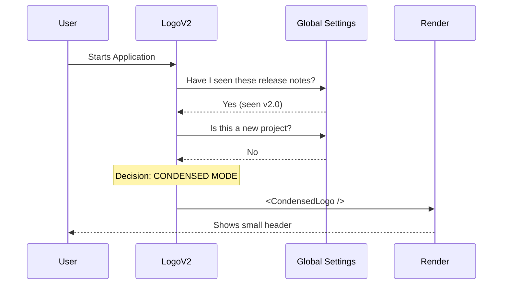

# Chapter 1: Adaptive Logo Orchestrator

Welcome to the **LogoV2** project! If you've ever opened a command-line tool, you know the startup screen is the first thing you see.

In this first chapter, we are going to build the **Adaptive Logo Orchestrator**. Think of this as the "Receptionist" of our application. Its job is to decide whether to greet the user with a grand, cinematic welcome or a quick, subtle nod, depending on the situation.

## Why do we need this?

Imagine you are using a tool for the very first time. You want to see:
1.  A cool logo (to know you are in the right place).
2.  What's new in this version.
3.  Tips on how to get started.

Now, imagine you use that tool **50 times a day**. If you saw that giant wall of text every single time, it would get annoying, right? You just want to see the prompt and get to work.

**The Adaptive Logo Orchestrator solves this.** It automatically switches between a **"Full Experience"** and a **"Condensed Mode"**.

## Key Concepts

Before we look at the code, let's understand the two modes:

1.  **Full Experience:**
    *   Displays a large animated ASCII logo (covered in the [Character Animation Engine](02_character_animation_engine.md)).
    *   Shows a "Feed" of recent activity or release notes (covered in the [Feed Component System](03_feed_component_system.md)).
    *   Used for: New users, new updates, or demo environments.

2.  **Condensed Mode:**
    *   Displays a simple, one-line header.
    *   Shows minimal version info.
    *   Used for: Experienced users who have already seen the latest news.

## How to Use It

The Orchestrator is a React component called `LogoV2`. You don't need to pass it complex arguments; it figures out what to do by reading the global configuration and the terminal size.

### The Decision Logic

The core logic asks three questions:
1.  **Is there news?** (Has the user seen the current version's release notes?)
2.  **Is this a new project?** (Does the user need onboarding?)
3.  **Is the user forcing it?** (Is there an environment variable forcing the full logo?)

If the answer to all of these is **NO**, we show the Condensed Mode.

```typescript
// From LogoV2.tsx
// logic simplified for readability

const isCondensedMode =
  !hasReleaseNotes &&       // No new release notes?
  !showOnboarding &&        // Not a new project?
  !forceFullLogo;           // Not forced by ENV var?
```

*   **Explanation:** `isCondensedMode` becomes `true` only if everything is "quiet" (no news, no onboarding needed).

## Code Walkthrough

Let's look at how the `LogoV2` component orchestrates this.

### Step 1: Gathering Intelligence
First, the component hooks into the system to get the data it needs.

```typescript
export function LogoV2() {
  const { columns } = useTerminalSize(); // How wide is the window?
  const config = getGlobalConfig();      // User settings
  
  // Check if we have new release notes to show
  const { hasReleaseNotes } = checkForReleaseNotesSync(
    config.lastReleaseNotesSeen
  );
  
  // ... check for condensed mode ...
```

*   **Explanation:** We grab the terminal width and the user's config. We specifically check `lastReleaseNotesSeen` to see if the user is up-to-date.

### Step 2: The Condensed "Early Return"
If the orchestrator decides we are in **Condensed Mode**, it returns early. It renders the smaller header and stops there.

```typescript
  if (isCondensedMode) {
    return (
      <>
        <CondensedLogo />
        <VoiceModeNotice />
        {/* Other small notices */}
      </>
    );
  }
```

*   **Explanation:** This is the "Receptionist" giving the quick nod. We render `<CondensedLogo />` (a minimal component) and exit the function. This prevents the large ASCII art from loading.

### Step 3: The Full Layout
If we didn't return early, it means we need the **Full Experience**. This layout is responsive. It splits the screen into two columns: the Logo on the left, and the Feed on the right.

```typescript
  // If we are here, we are in FULL mode
  return (
    <Box flexDirection="row" gap={1}>
        {/* Left Column: The Big Logo */}
        <Box width={leftWidth}>
           <Clawd /> 
        </Box>

        {/* Right Column: Information Feeds */}
        <FeedColumn feeds={[
             createRecentActivityFeed(activities),
             createWhatsNewFeed(changelog)
        ]} />
    </Box>
  );
```

*   **Explanation:**
    *   `<Clawd />`: This is the large character component. We will learn how this moves in the [Character Animation Engine](02_character_animation_engine.md).
    *   `<FeedColumn />`: This lists items like "Recent Activity". We will build this in the [Feed Component System](03_feed_component_system.md).

## Internal Implementation

To help you visualize how the Orchestrator works, here is a sequence diagram of the decision process.



### Handling Apple Terminal
There is a specific edge case in the code for `Apple_Terminal`. The file `WelcomeV2.tsx` handles a specialized welcome message if the user is on a standard Mac terminal, often because of color/font rendering differences.

```typescript
// From WelcomeV2.tsx
export function WelcomeV2() {
  const [theme] = useTheme();

  if (env.terminal === "Apple_Terminal") {
    // Return a specific layout optimized for Apple Terminal
    return <AppleTerminalWelcomeV2 theme={theme} ... />;
  }
  
  // ... standard logic ...
}
```

## Summary

The **Adaptive Logo Orchestrator** is the logic layer that respects the user's time.

1.  It checks the **context** (Is there news? Is it a new project?).
2.  It chooses a **layout** (Full vs. Condensed).
3.  It manages the **screen real estate** (splitting columns if the window is wide enough).

Now that we have our layout decided, let's zoom in on the "Full Experience". What is that large ASCII character on the left side, and how do we make it look alive?

[Next Chapter: Character Animation Engine](02_character_animation_engine.md)

---

Generated by [Code IQ](https://github.com/adityasoni99/Code-IQ)