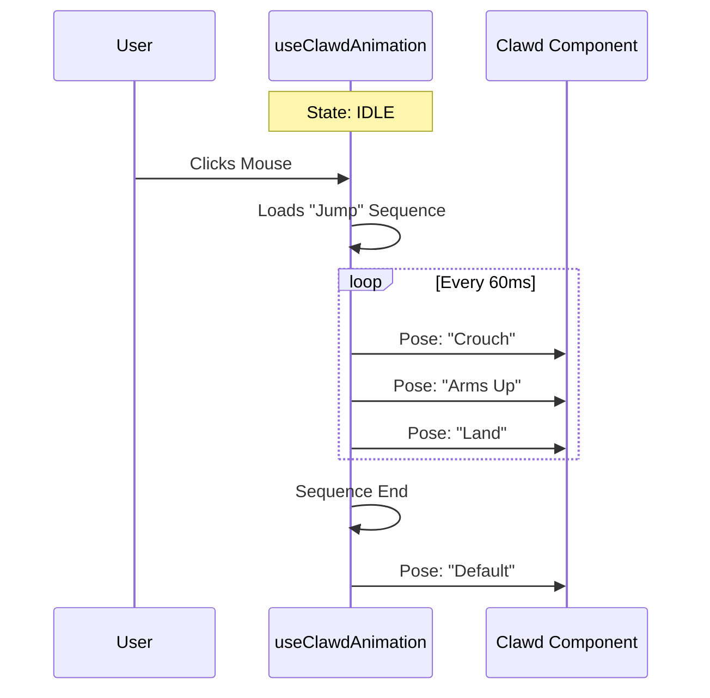

# Chapter 2: Character Animation Engine

In the previous [Adaptive Logo Orchestrator](01_adaptive_logo_orchestrator.md) chapter, we built the "Receptionist" that decides *when* to show the full welcome screen.

Now, we need to build the star of the show: **Clawd**.

Clawd isn't just a static picture; he blinks, looks around, and jumps when you click him. In this chapter, we will build the **Character Animation Engine**. This is the machinery that turns static text into a living "flipbook" animation.

## The Problem: Making Text "Alive"

In a standard command-line tool, text sits still. To make a mascot feel alive, we face two challenges:
1.  **Motion:** How do we make ASCII characters move smoothly without flickering?
2.  **Consistency:** How do we make sure it looks good on different terminals (like the notoriously tricky Apple Terminal)?

## The Solution: The Flipbook Analogy

Think of traditional animation or a sticky-note flipbook. You don't actually move the drawing; you replace the entire drawing with a slightly different one, very quickly.

Our Animation Engine does exactly this:
1.  **Poses:** We define specific "costumes" (text arrangements) for Clawd (e.g., "Arms Down", "Arms Up").
2.  **Frames:** We create a timeline saying "Show costume A, then costume B."
3.  **The Loop:** A timer rapidly switches the costumes to create the illusion of movement.

## Core Concept: The "Pose"

At the bottom level, we have the "Body" component (`Clawd.tsx`). It doesn't know how to dance; it just knows how to wear a costume.

We define these costumes in a simple object called `POSES`.

```typescript
// From Clawd.tsx
// Simplified for clarity

const POSES = {
  default: {
    r1E: '▛███▜', // Eyes looking forward
    r2L: '▝▜',    // Left arm down
  },
  'arms-up': {
    r1E: '▛███▜', // Eyes looking forward
    r1L: '▗▟',    // Left arm UP!
  }
};
```

*   **Explanation:** A "Pose" is just a set of strings. When we switch from `default` to `arms-up`, the characters defining the arms change, but the eyes stay the same.

## How to Use It

Using the engine is surprisingly simple. You don't need to manually tell Clawd to move frame-by-frame. You just drop the `<AnimatedClawd />` component into your UI.

```typescript
// Example usage in a parent component
import { AnimatedClawd } from './AnimatedClawd';

export function WelcomeScreen() {
  return (
    <Box borderStyle="round">
      <AnimatedClawd /> 
    </Box>
  );
}
```

*   **What happens:** Clawd appears. He stands still (Idle). If you click him (in a supported terminal), he performs a jump animation automatically.

## Internal Implementation

How does the engine know which pose to show? Let's look under the hood.

### The "Director" (State Machine)

The logic lives in a custom React hook called `useClawdAnimation`. This hook acts as the "Director" of the movie. It manages a timer and a list of frames.

Here is the flow of a "Jump" animation:



### Step 1: Defining the Timeline

We don't just randomly switch poses. We define a **Sequence**. A sequence is an array of frames. We use a helper function `hold` to say "keep this pose for X amount of time."

```typescript
// From AnimatedClawd.tsx

// 1. Crouch for 2 frames
// 2. Spring up (arms-up) for 3 frames
// 3. Land (default)
const JUMP_WAVE = [
  ...hold('default', 1, 2), 
  ...hold('arms-up', 0, 3), 
  ...hold('default', 0, 1)
];
```

*   **Explanation:** `hold('arms-up', 0, 3)` means "Stay in the 'arms-up' pose, with 0 vertical offset, for 3 frames."

### Step 2: The Loop (The Heartbeat)

The engine needs a heartbeat to advance the frames. We use `setTimeout` inside a `useEffect` hook.

```typescript
// From AnimatedClawd.tsx (Simplified)

useEffect(() => {
  // If we aren't animating, do nothing
  if (frameIndex === -1) return;

  // Move to the next frame after 60ms
  const timer = setTimeout(() => {
    setFrameIndex(i => i + 1);
  }, 60);

  return () => clearTimeout(timer);
}, [frameIndex]);
```

*   **Explanation:**
    1.  If `frameIndex` is `-1`, Clawd is resting.
    2.  If `frameIndex` is `0` or higher, the timer starts.
    3.  Every 60ms, `frameIndex` increases by 1, triggering a re-render with the next pose.

### Step 3: Handling Apple Terminal

Not all terminals are created equal. The Apple Terminal (standard on Mac) has unusual line-height spacing that creates gaps in our block characters (█), ruining the illusion of a solid body.

The `Clawd` component detects this environment variable and swaps the rendering strategy entirely.

```typescript
// From Clawd.tsx
export function Clawd({ pose }) {
  // Check specifically for Apple's terminal
  if (env.terminal === "Apple_Terminal") {
    // Return a simplified, gap-proof version
    return <AppleTerminalClawd pose={pose} />;
  }

  // Otherwise, return the detailed ASCII art
  const p = POSES[pose];
  return <Text>{p.r1L}{p.r1E}{p.r1R}</Text>;
}
```

*   **Why this matters:** A good CLI tool must adapt to the user's environment. Instead of looking broken on Mac, Clawd looks slightly different but still clean.

## Summary

The **Character Animation Engine** brings personality to the application using three simple steps:
1.  **Poses:** Defining static "costumes" in text.
2.  **Sequences:** Creating playlists of these costumes.
3.  **Looping:** Using a timer to cycle through them.

Now that we have a living, breathing mascot on the left side of our screen, we need to fill the right side with useful information.

Next, we will build the system that fetches and displays updates.

[Next Chapter: Feed Component System](03_feed_component_system.md)

---

Generated by [Code IQ](https://github.com/adityasoni99/Code-IQ)