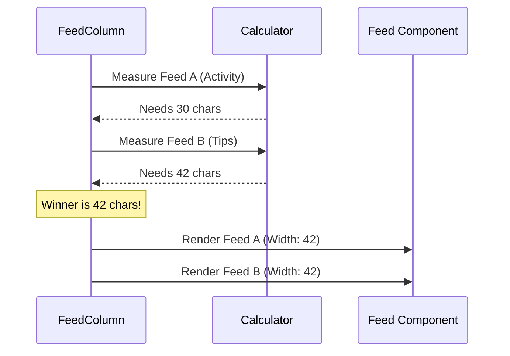

# Chapter 3: Feed Component System

In the previous [Character Animation Engine](02_character_animation_engine.md) chapter, we brought our mascot, Clawd, to life. Now, our welcome screen has a personality!

However, a mascot alone isn't enough. We need to show the user useful information—like what they were working on last, tips for using the tool, or new updates.

In this chapter, we will build the **Feed Component System**. Think of this as the "Bulletin Board" next to the receptionist. It organizes messy lists of data into clean, uniform "cards" or widgets.

## The Problem: Messy Lists

Displaying text in a terminal is tricky.
1.  **Variable Widths:** One list item might be short ("Fix bug"), while another is huge ("Refactor the entire authentication system...").
2.  **Alignment:** If we display a timestamp (e.g., "2h ago"), we want it aligned perfectly across all items.
3.  **Space Constraints:** If the user's window is narrow, long text will break the layout.

The **Feed Component System** solves this by acting as a "layout manager." It calculates exactly how much space is needed and cuts off (truncates) text that is too long.

## Key Concepts

The system is built around three main ideas:

1.  **Feed Config:** A simple object describing *what* to show (Title, Lines, Footer).
2.  **Feed Component:** The UI widget that renders one card.
3.  **Feed Column:** The container that stacks multiple widgets and ensures they are all the same width.

### Anatomy of a Feed Widget

A single "Feed" looks like this:

```text
Recent Activity          <-- Title
2h ago  Fix bug          <-- Line (Timestamp + Text)
4h ago  Update docs      <-- Line
/resume for more         <-- Footer
```

## How to Use It

To create a new section on the dashboard, you don't write complex UI code. You just create a function that returns a **Configuration Object**.

Let's look at `feedConfigs.tsx`. Here is how we create the "Recent Activity" feed.

### Step 1: define the Data Structure
We transform raw log data into a list of standardized lines.

```typescript
// From feedConfigs.tsx
export function createRecentActivityFeed(activities) {
  // Map raw data to "FeedLine" objects
  const lines = activities.map(log => {
    return {
      text: log.summary,         // "Fix bug in login"
      timestamp: '2h ago'        // Calculated time
    };
  });

  return {
    title: 'Recent activity',    // The Header
    lines: lines,                // The content
    footer: '/resume for more'   // The bottom hint
  };
}
```
*   **Explanation:** We don't worry about padding or colors here. We just return data. This separation makes it easy to add new feeds later.

### Step 2: Render the Column
In our main parent component, we use `<FeedColumn />`. We pass it an array of these configurations.

```typescript
// Inside LogoV2.tsx (Conceptual)

<FeedColumn 
  feeds={[
    createRecentActivityFeed(logs),
    createProjectOnboardingFeed(steps)
  ]} 
  maxWidth={50} // Don't let it get wider than 50 chars
/>
```

*   **Explanation:** The `FeedColumn` takes care of the rest. It stacks "Activity" on top of "Onboarding" and aligns them perfectly.

## Internal Implementation

How does the system know how wide to draw the box? It uses a two-step process: **Measure** then **Render**.

### The "Math" Before the Magic

Before drawing a single pixel, the system runs a calculation to find the "Ideal Width."



### 1. Calculating Width (`Feed.tsx`)
The function `calculateFeedWidth` looks at every piece of text to find the widest point.

```typescript
// From Feed.tsx (Simplified)
export function calculateFeedWidth(config) {
  let maxWidth = stringWidth(config.title);

  // Check every line in the list
  for (const line of config.lines) {
    // Calculate: Text Length + Timestamp Length + Gap
    const lineWidth = stringWidth(line.text) + 
                      stringWidth(line.timestamp) + 2;
    
    // Keep the largest number found
    maxWidth = Math.max(maxWidth, lineWidth);
  }

  return maxWidth;
}
```
*   **Explanation:** We use a helper `stringWidth` (which handles special characters correctly). We compare the title, every line, and the footer. The largest number wins.

### 2. The Feed Column Manager (`FeedColumn.tsx`)
This component acts as the manager. It ensures uniformity. If the "Tips" section is wide, the "Activity" section above it stretches to match, creating a clean vertical look.

```typescript
// From FeedColumn.tsx (Simplified)
export function FeedColumn({ feeds, maxWidth }) {
  // 1. Ask everyone how wide they want to be
  const widths = feeds.map(calculateFeedWidth);
  
  // 2. Find the widest feed
  const maxOfAll = Math.max(...widths);
  
  // 3. Cap it at the screen limit
  const actualWidth = Math.min(maxOfAll, maxWidth);

  // 4. Render all feeds with the SAME width
  return (
    <Box flexDirection="column">
      {feeds.map((feed, index) => (
         <Feed config={feed} actualWidth={actualWidth} />
      ))}
    </Box>
  );
}
```
*   **Explanation:** `actualWidth` is passed down to every child. This forces them to align.

### 3. Rendering the Lines (`Feed.tsx`)
Finally, the `Feed` component renders the text. This is where we handle **truncation** (cutting off text with `...`) if it exceeds the calculated width.

```typescript
// From Feed.tsx (Inside the render loop)
return (
  <Text>
    {/* 1. Render Timestamp (Gray color) */}
    <Text dimColor>
       {line.timestamp.padEnd(maxTimestampWidth)}
    </Text>
    
    {/* 2. Gap */}
    <Text> </Text>

    {/* 3. Render Main Text (Cut off if too long) */}
    <Text>
      {truncate(line.text, availableWidth)}
    </Text>
  </Text>
);
```
*   **Explanation:** `truncate` ensures that if a user has a very small terminal window, the text won't wrap securely to the next line and break the layout. It will just show `Fix bug in...`.

## Advanced Feature: Custom Content

Sometimes, a simple list of text isn't enough. For example, we might want to show a graphical reward or "Guest Passes."

The `FeedConfig` supports a special property called `customContent`.

```typescript
// From feedConfigs.tsx (Guest Passes)
export function createGuestPassesFeed() {
  return {
    title: '3 guest passes',
    lines: [], // No text lines
    // Inject custom React components directly
    customContent: {
      content: (
        <Box marginY={1}>
           <Text color="claude">[✻] [✻] [✻]</Text>
        </Box>
      ),
      width: 48
    }
  };
}
```
*   **Why this is cool:** The `Feed` component checks if `customContent` exists. If it does, it ignores the `lines` array and renders your custom Box instead. This allows the system to remain modular but flexible.

## Summary

The **Feed Component System** provides a structured way to display data.
1.  We convert raw data into **Configuration Objects**.
2.  The **Manager** (`FeedColumn`) calculates the perfect width to keep everything aligned.
3.  The **Renderer** (`Feed`) handles colors, padding, and cutting off long text.

Now our welcome screen looks professional: moving character on the left, organized data on the right.

But what if we want to show a special notice *only* if a user hasn't configured something yet? We need conditional logic.

[Next Chapter: Conditional Feature Notices](04_conditional_feature_notices.md)

---

Generated by [Code IQ](https://github.com/adityasoni99/Code-IQ)