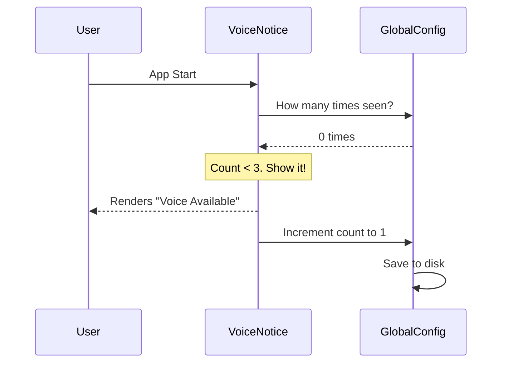

# Chapter 4: Conditional Feature Notices

In the previous [Feed Component System](03_feed_component_system.md) chapter, we learned how to display lists of data.

But sometimes, we need to show something specific: a **feature announcement**.
*   "Voice Mode is now available!"
*   "Channels have been enabled."
*   "Emergency: Service downtime expected."

We *could* put all this logic in our main parent component, but that would create a mess of `if/else` statements. Instead, we use **Conditional Feature Notices**.

## The Problem: The "Switchboard" Mess

Imagine if the main `LogoV2` component had to know the rules for *every* feature:

```typescript
// BAD EXAMPLE: The parent knows too much
function LogoV2() {
  return (
    <Box>
       {/* Logic cluttering the layout */}
       {user.hasVoice && user.seenVoice < 3 && <VoiceBanner />}
       {config.channelsEnabled && !config.policyBlocked && <ChannelsBanner />}
       {/* ... 10 more checks ... */}
    </Box>
  )
}
```

This is hard to read and hard to maintain.

## The Solution: Smart Components

We solve this by moving the logic **inside** the component. The component asks itself: *"Should I exist?"*

If the answer is **No**, the component returns `null` (rendering nothing). The parent doesn't need to know *why* it's hidden; it just attempts to render it.

```typescript
// GOOD EXAMPLE: The parent is clean
function LogoV2() {
  return (
    <Box>
       <VoiceModeNotice />
       <ChannelsNotice />
    </Box>
  )
}
```

## Key Concepts

To build a Conditional Feature Notice, we follow three steps:

1.  **Environment Check:** Is the feature flag enabled? (e.g., Is Voice Mode rolled out?)
2.  **State Check:** Is the user allowed to see it? (e.g., Are they logged in?)
3.  **Impression Check:** Have they seen it too many times already? (Don't be annoying).

## Code Walkthrough

Let's look at `VoiceModeNotice.tsx` to see this pattern in action.

### Step 1: The "Early Return"

The most important part of these components is the **Early Return**. If a condition isn't met, we stop immediately.

```typescript
// From VoiceModeNotice.tsx
export function VoiceModeNotice() {
  // 1. Feature Flag Check
  const isFeatureOn = feature('VOICE_MODE'); 
  
  if (!isFeatureOn) {
    return null; // Render nothing!
  }

  return <VoiceModeNoticeInner />;
}
```
*   **Explanation:** The main parent renders `<VoiceModeNotice />`. If the feature flag `VOICE_MODE` is off, the component effectively disappears.

### Step 2: Complex Logic Inside

Sometimes, simply checking a flag isn't enough. We might need to check multiple things. Let's look inside `VoiceModeNoticeInner`.

```typescript
// From VoiceModeNotice.tsx (Simplified)
function VoiceModeNoticeInner() {
  // Check settings, config, and counts all at once
  const [shouldShow] = useState(() => {
    return (
      isVoiceModeEnabled() &&           // Is it working?
      !settings.voiceEnabled &&         // Is it not yet turned on?
      seenCount < MAX_SHOW_COUNT        // Have we annoyed them yet?
    );
  });

  if (!shouldShow) return null;

  return <Box><Text>Voice mode available!</Text></Box>;
}
```
*   **Explanation:** We bundle all our rules into one boolean `shouldShow`. If any rule fails (e.g., the user has already enabled voice), the notice hides itself.

### Step 3: Handling Different States (Channels)

Sometimes a notice isn't just "On" or "Off". It might need to show a warning.
The `ChannelsNotice.tsx` component handles three different scenarios:
1.  **Disabled:** Show an error.
2.  **No Auth:** Tell the user to login.
3.  **Policy Blocked:** Tell the user their company blocked it.

```typescript
// From ChannelsNotice.tsx (Simplified)
export function ChannelsNotice() {
  const { disabled, noAuth, policyBlocked } = useChannelState();

  if (disabled) {
    return <Text color="error">Channels are not available</Text>;
  }

  if (noAuth) {
    return <Text dimColor>Requires authentication</Text>;
  }

  // ... if everything is fine, show nothing or a success message ...
  return null; 
}
```

## Internal Implementation

How does the component decide when to stop showing itself (e.g., "Show this 3 times")?

It uses a combination of **Reading** the global config and **Writing** back to it.



### The Impression Counter

Here is the actual code pattern used to count views, found in `VoiceModeNotice.tsx`.

```typescript
// From VoiceModeNotice.tsx
useEffect(() => {
  if (!show) return; // Don't count if we didn't show it

  // Update the global config file
  saveGlobalConfig(prev => {
    return {
      ...prev,
      voiceNoticeSeenCount: (prev.voiceNoticeSeenCount ?? 0) + 1
    };
  });
}, [show]);
```
*   **Explanation:**
    1.  We use `useEffect` to run code *after* the component renders.
    2.  We call `saveGlobalConfig`.
    3.  We take the previous count and add `+1`.
    4.  Next time the app starts, the logic in **Step 2** will read this new number.

## Dynamic Content (Emergency Tips)

Not all logic is hard-coded. Sometimes we need to fetch a message from a server (like a remote configuration).

The `EmergencyTip.tsx` component uses a "Dynamic Config" service.

```typescript
// From EmergencyTip.tsx
function getTipOfFeed() {
  // Fetch from GrowthBook (feature flagging service)
  return getDynamicConfig('tengu-top-of-feed-tip', DEFAULT_TIP);
}

export function EmergencyTip() {
  const tip = useMemo(getTipOfFeed, []);
  
  // If the tip string is empty, hide the component
  if (!tip.text) return null;

  return <Text color={tip.color}>{tip.text}</Text>;
}
```
*   **Explanation:** This allows the team to change the message *without* releasing a new version of the code. The component still follows the pattern: if there is no data, render `null`.

## Summary

**Conditional Feature Notices** keep our layout clean by offloading the "brain work" to the components themselves.

1.  The **Parent** blindly renders the component.
2.  The **Component** checks environment variables, settings, and feature flags.
3.  The **Component** returns `null` (invisible) if conditions aren't met.
4.  The **Component** updates usage counters to ensure it doesn't nag the user forever.

Speaking of "nagging the user," counting how many times we've shown a notice is a pattern we use frequently. In the next chapter, we will formalize this into a reusable system.

[Next Chapter: Upsell Impression Management](05_upsell_impression_management.md)

---

Generated by [Code IQ](https://github.com/adityasoni99/Code-IQ)