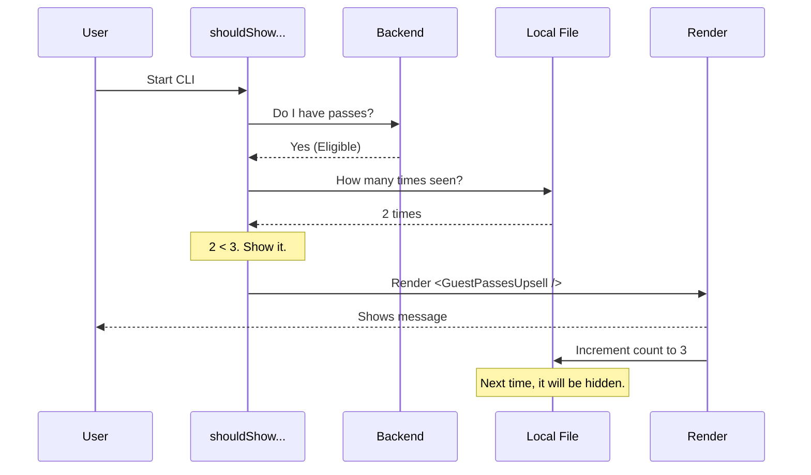

# Chapter 5: Upsell Impression Management

In the previous [Conditional Feature Notices](04_conditional_feature_notices.md) chapter, we learned how to show or hide components based on simple rules.

However, promotional content—like "Refer a Friend" or "You have extra credits"—requires a smarter approach. We can't just show it once and never again (the user might miss it), but we also can't show it *every single time* (or the user will hate us).

In this final chapter, we will build the **Upsell Impression Management** system. This system acts like a "Polite Marketer": it knows when to speak up, when to stay quiet, and when to try again because the situation has changed.

## The Problem: The "Nagging" CLI

Imagine you open your terminal to run a quick command.
**CLI:** "Hey! Invite a friend to get free credits!"
**You:** *Ignore.*

Ten minutes later, you run another command.
**CLI:** "Hey! Invite a friend to get free credits!"

If this happens 50 times a day, you will stop using the tool. We need a system that enforces a **Max Impression Cap** (e.g., "Show this maximum 3 times").

## Key Concepts

1.  **Eligibility (Backend):** Is it *technically* possible to show this? (e.g., Does the user actually have invites to give?)
2.  **Impression Counting (Local State):** How many times has the user stared at this message?
3.  **The Cap:** The magic number (usually 3) where we stop showing the message.
4.  **The Reset:** If the user gets *new* invites, we should reset the counter and show it again.

## Use Case: Guest Passes

We will use the code from `GuestPassesUpsell.tsx` as our example. This component encourages users to share "Guest Passes" with friends.

### Step 1: The "Should Show" Logic

The core of this pattern is a boolean function that decides visibility. It combines backend data with local history.

```typescript
// From GuestPassesUpsell.tsx
function shouldShowGuestPassesUpsell(): boolean {
  // 1. Backend Check: Do we have passes?
  const { eligible } = checkCachedPassesEligibility();
  if (!eligible) return false;

  // 2. Interaction Check: Did user already click the link?
  const config = getGlobalConfig();
  if (config.hasVisitedPasses) return false;

  // ... (limit check comes next)
}
```

*   **Explanation:** First, we ask the API "Does this user have passes?" If no, we stop. Then we check our local config: "Did the user already visit the `/passes` page?" If yes, we assume they know about it and stop bothering them.

### Step 2: The Impression Cap

If the user is eligible and hasn't clicked the link yet, we check the "Nag Meter" (the impression count).

```typescript
// From GuestPassesUpsell.tsx
// ... inside shouldShowGuestPassesUpsell ...

  // 3. The Cap: Have we shown this 3 times?
  const seenCount = config.passesUpsellSeenCount ?? 0;
  
  if (seenCount >= 3) {
      return false; // Don't show it anymore
  }

  return true; // Safe to show!
}
```

*   **Explanation:** We read `passesUpsellSeenCount` from our global configuration file. If it is 3 or higher, we return `false`. The component will simply not render.

### Step 3: Incrementing the Count

When we *do* decide to show the component, we must record it. This usually happens in a `useEffect` hook or right after the component mounts.

```typescript
// From GuestPassesUpsell.tsx
export function incrementGuestPassesSeenCount(): void {
  saveGlobalConfig(prev => {
    // Take the old count and add 1
    const newCount = (prev.passesUpsellSeenCount ?? 0) + 1;
    
    return {
      ...prev,
      passesUpsellSeenCount: newCount
    };
  });
}
```

*   **Explanation:** We update the persistent configuration file on the user's disk. Next time they run the CLI, `seenCount` will be higher.

## Internal Implementation

Let's visualize the flow of data when the CLI starts up.



### The "Smart Reset" Logic

What happens if the user uses all their passes, and then a month later, they earn **new** passes?

If we blocked the message forever because `seenCount` is 3, they would never know about the new passes! We need logic to detect a "positive change" and reset the counter.

```typescript
// From GuestPassesUpsell.tsx
function resetIfPassesRefreshed(): void {
  const remaining = getCachedRemainingPasses();
  const lastSeen = config.passesLastSeenRemaining ?? 0;

  // If we have MORE passes now than last time...
  if (remaining > lastSeen) {
    saveGlobalConfig(prev => ({
      ...prev,
      passesUpsellSeenCount: 0, // RESET THE COUNT!
      passesLastSeenRemaining: remaining
    }));
  }
}
```

*   **Explanation:** This runs silently in the background. It compares the current number of passes to the last known number. If the number went *up*, it resets `passesUpsellSeenCount` to 0, giving the user a fresh set of 3 impressions.

## Applying the Pattern: Overage Credits

The same pattern is used for "Overage Credits" (extra budget for API usage). Look at how similar the logic is in `OverageCreditUpsell.tsx`:

```typescript
// From OverageCreditUpsell.tsx
export function shouldShowOverageCreditUpsell(): boolean {
  // 1. Backend Eligibility
  if (!isEligibleForOverageCreditGrant()) return false;

  const config = getGlobalConfig();
  
  // 2. Cap Check (Max 3)
  if ((config.overageCreditUpsellSeenCount ?? 0) >= 3) {
      return false;
  }
  
  return true;
}
```

*   **Why this matters:** By reusing this pattern, we ensure the CLI feels consistent. No matter what the promotion is, it follows the "Rule of 3."

## Conclusion

Congratulations! You have completed the **LogoV2** tutorial series.

You have built a sophisticated command-line onboarding experience:
1.  **[Adaptive Logo Orchestrator](01_adaptive_logo_orchestrator.md):** Decides *when* to show the full welcome screen.
2.  **[Character Animation Engine](02_character_animation_engine.md):** Brings the mascot, Clawd, to life.
3.  **[Feed Component System](03_feed_component_system.md):** Organizes messy logs into a clean dashboard.
4.  **[Conditional Feature Notices](04_conditional_feature_notices.md):** Handles static feature announcements.
5.  **Upsell Impression Management:** Manages promotional content politely.

By combining these systems, you ensure that new users get a warm welcome, while power users get a fast, distraction-free tool—and nobody gets annoyed by spammy notifications.

---

Generated by [Code IQ](https://github.com/adityasoni99/Code-IQ)