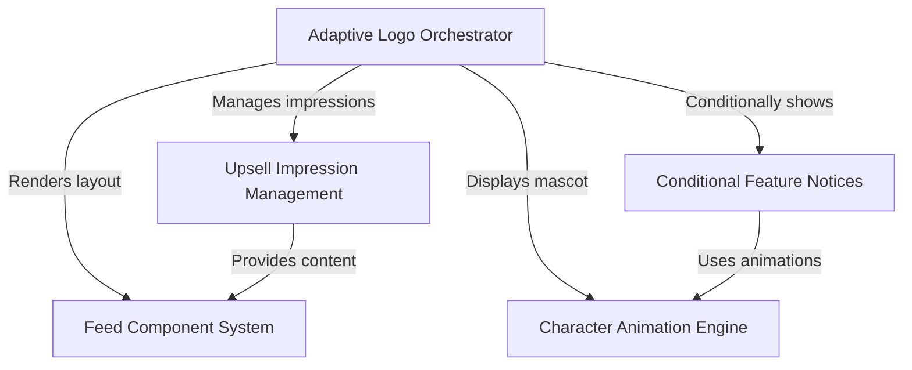

# Tutorial: LogoV2

This project implements a dynamic **terminal dashboard** that serves as the application's startup screen. It uses an **adaptive orchestrator** to toggle between full and condensed layouts, integrating an **animated ASCII mascot**, modular **content feeds**, and state-managed **notifications** to guide users through features and **upsells** without intrusion.

## Chapters

1. [Adaptive Logo Orchestrator](01_adaptive_logo_orchestrator.md)
2. [Character Animation Engine](02_character_animation_engine.md)
3. [Feed Component System](03_feed_component_system.md)
4. [Conditional Feature Notices](04_conditional_feature_notices.md)
5. [Upsell Impression Management](05_upsell_impression_management.md)

---

Generated by [Code IQ](https://github.com/adityasoni99/Code-IQ)