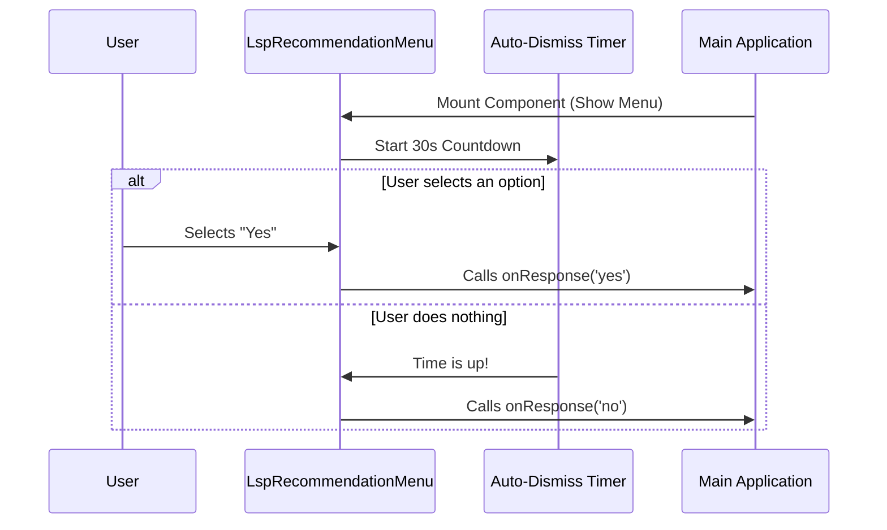

# Chapter 1: LspRecommendationMenu Component

Welcome to the `LspRecommendation` project! In this first chapter, we are going to look at the heart of our application: the **LspRecommendationMenu**.

## 1. The Problem: How to Ask for Permission?

Imagine you are building a smart code editor tool. When a user opens a file (like a `.ts` TypeScript file), you realize they don't have the language tools (LSP) installed to help them write code faster.

You want to help them, but you don't want to be rude and install things without asking. You need a way to:
1.  **Inform** the user why they need this tool.
2.  **Ask** them if they want to install it.
3.  **Accept** their answer (Yes, No, Never).

The **LspRecommendationMenu** is the React component that acts as this polite assistant.

## 2. High-Level Use Case

Let's say a user, Alice, opens `script.py`. Our system detects she is editing Python but lacks the Python LSP.

We want to show a screen that looks roughly like this:

> **LSP Plugin Recommendation**
> Plugin: Python-LSP
> Triggered by: .py files
>
> **Would you like to install this LSP plugin?**
> [ Yes ]  [ No ]  [ Never ]

If Alice doesn't answer within 30 seconds, the menu should automatically close so it doesn't block her workflow.

## 3. Using the Component

This component is built using **React** and **Ink** (a library for building user interfaces in the terminal).

To use this menu, you simply "render" it like an HTML tag, passing in the details of the tool you want to recommend.

### Example Code

Here is how you would use the component in your code to ask about a TypeScript plugin:

```tsx
<LspRecommendationMenu
  pluginName="TypeScript-LSP"
  fileExtension=".ts"
  pluginDescription="Provides auto-complete for TS files"
  onResponse={(answer) => {
    console.log("User chose:", answer);
  }}
/>
```

**What happens here?**
1.  **`pluginName`**: The name of the tool we want to install.
2.  **`fileExtension`**: Why we are asking (because the user opened a `.ts` file).
3.  **`onResponse`**: A function that runs when the user makes a choice.

## 4. How It Works: A Visual Walkthrough

Before looking at the code, let's visualize the "lifecycle" of this menu component using a diagram. This shows what happens from the moment the menu appears until it vanishes.



## 5. Implementation Deep Dive

Let's break down the implementation of `LspRecommendationMenu.tsx` into small, manageable pieces.

### Part A: The Props

First, we define what information this component accepts.

```typescript
type Props = {
  pluginName: string;
  pluginDescription?: string; // The '?' means this is optional
  fileExtension: string;
  // This function handles the user's answer
  onResponse: (response: 'yes' | 'no' | 'never' | 'disable') => void;
};
```
*   **Concept:** **Props** are like arguments to a function. They allow the parent application to customize the menu text.

### Part B: The Visual Layout

The component returns a structure that determines how it looks in the terminal. We wrap everything in a `PermissionDialog`.

```tsx
return (
  <PermissionDialog title="LSP Plugin Recommendation">
    <Box flexDirection="column" paddingX={2} paddingY={1}>
      <Box marginBottom={1}>
        <Text dimColor>LSP provides code intelligence...</Text>
      </Box>
      {/* More text details go here... */}
    </Box>
  </PermissionDialog>
);
```
*   **Note:** We use a `PermissionDialog` component here. We will explore how that wrapper works in [Terminal UI Layout](02_terminal_ui_layout.md).
*   **Analogy:** The `PermissionDialog` is like the frame of a painting, and the code inside is the canvas where we paint our text.

### Part C: Displaying Options

We need to present the user with choices. We create an array of options and pass them to a `Select` component.

```tsx
const options = [
  {
    label: <Text>Yes, install <Text bold>{pluginName}</Text></Text>,
    value: 'yes'
  },
  { label: 'No, not now', value: 'no' },
  // ... other options like 'never' or 'disable'
];
```

*   **Explanation:** Each option has a `label` (what the user sees) and a `value` (what the code sees).
*   To learn more about how these options are structured, check out [Menu Option Configuration](03_menu_option_configuration.md).

### Part D: Handling the Selection

When a user selects an option, we need to translate that into an action.

```typescript
function onSelect(value: string): void {
  switch (value) {
    case 'yes':
      onResponse('yes');
      break;
    case 'no':
      onResponse('no');
      break;
    // ... handles other cases
  }
}
```

*   **Explanation:** This helper function receives the internal `value` (like "yes") and calls the `onResponse` prop we defined earlier.
*   We dive deeper into this logic in [User Response Handling](04_user_response_handling.md).

### Part E: The Auto-Dismiss Timer

Finally, we don't want this menu to hang around forever. We use a React "Effect" to set a timer.

```typescript
const AUTO_DISMISS_MS = 30_000; // 30 seconds

React.useEffect(() => {
  // Start a timer that defaults to 'no' if time runs out
  const timeoutId = setTimeout(
    ref => ref.current('no'), 
    AUTO_DISMISS_MS, 
    onResponseRef
  );
  return () => clearTimeout(timeoutId); // Cleanup
}, []);
```

*   **Explanation:** When the component loads, it starts a 30-second countdown. If the countdown finishes, it automatically answers "no".
*   For a detailed explanation of this timer logic, see [Auto-Dismissal Timer](05_auto_dismissal_timer.md).

## Conclusion

The **LspRecommendationMenu** is the friendly face of our application. It combines layout, user input, and timing logic into a single package.

You learned:
1.  How to pass data (`Props`) into the menu.
2.  How the menu visually organizes information.
3.  How it waits for a user decision or a timeout.

Now that we understand the component as a whole, let's zoom in on exactly how we organize the visual elements on the screen.

[Next Chapter: Terminal UI Layout](02_terminal_ui_layout.md)

---

Generated by [Code IQ](https://github.com/adityasoni99/Code-IQ)