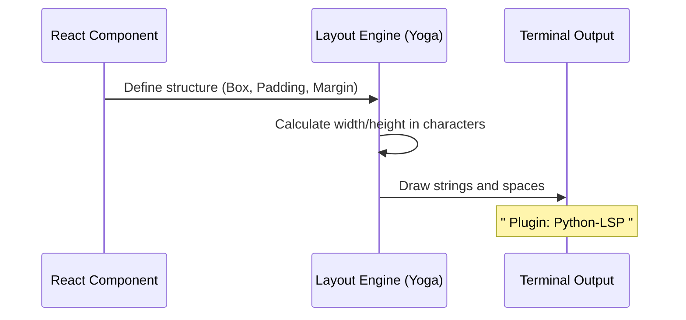

# Chapter 2: Terminal UI Layout

Welcome back! In the previous chapter, [LspRecommendationMenu Component](01_lsprecommendationmenu_component.md), we looked at the high-level logic of our recommendation menu.

Now, we are going to focus on the **visuals**. How do we take a bunch of text and buttons and organize them neatly in a black-and-white terminal window?

## 1. The Problem: Text Dumping vs. Layout

If you have ever used `console.log()` in JavaScript, you know that it just prints text line-by-line.

**Without Layout:**
```text
LSP Recommendation
Plugin: Python-LSP
Triggered by: .py
Do you want to install?
[Yes] [No]
```
This looks cramped and hard to read.

**With Layout:**
We want to add breathing room (margins), organize related items together (grouping), and emphasize labels (styling).

**Analogy:** Think of the Terminal UI Layout like organizing a bookshelf. Instead of throwing all the books in a pile on the floor, you place them on shelves (rows), strictly ordered, with space in between them so you can see the titles clearly.

## 2. The Solution: Ink Components

To build this structure, we use a library called **Ink**. It gives us two main building blocks that work just like HTML tags:

1.  **`<Box>`**: The invisible container. It acts like an HTML `<div>`. We use this to create rows, columns, and add spacing (padding/margins).
2.  **`<Text>`**: The visible content. It acts like an HTML `<span>` or `<p>`. This is where we put the actual words.

## 3. Visualizing the Hierarchy

Before writing code, let's look at the structure of our menu. We treat the terminal screen like a series of nested boxes.

```mermaid
graph TD
    Dialog[PermissionDialog (The Frame)]
    MainBox[Main Column Box]
    
    Row1[Row: Description]
    Row2[Row: Plugin Name]
    Row3[Row: Trigger Info]
    Row4[Row: Question]
    Row5[Row: Select Menu]

    Dialog --> MainBox
    MainBox --> Row1
    MainBox --> Row2
    MainBox --> Row3
    MainBox --> Row4
    MainBox --> Row5
```

## 4. Building the Layout Step-by-Step

Let's look at how `LspRecommendationMenu.tsx` constructs this interface.

### Step A: The Container (The Bookshelf)

We start with a main container inside our dialog. We want all our items to stack vertically (top to bottom).

```tsx
<PermissionDialog title="LSP Plugin Recommendation">
  {/* The Main Container */}
  <Box flexDirection="column" paddingX={2} paddingY={1}>
    {/* All content goes here */}
  </Box>
</PermissionDialog>
```

*   **`flexDirection="column"`**: This tells the Box to stack its children on top of each other (like a list).
*   **`paddingX={2}`**: Adds 2 spaces of "breathing room" on the left and right.
*   **`paddingY={1}`**: Adds 1 line of empty space at the top and bottom.

### Step B: Informational Rows

Now we add "shelves" to our bookshelf. Each piece of information gets its own `<Box>`.

```tsx
<Box>
  <Text dimColor>Plugin:</Text>
  <Text> {pluginName}</Text>
</Box>
```

*   **`dimColor`**: This makes the label ("Plugin:") appear grey or faded. This is a great design trick to make the actual data (`pluginName`) stand out more.
*   **Result:** `Plugin: TypeScript-LSP`

### Step C: Conditional Rows

Sometimes, we have a description for the plugin, but sometimes we don't. React allows us to only render a Box if data exists.

```tsx
{pluginDescription && (
  <Box>
    <Text dimColor>{pluginDescription}</Text>
  </Box>
)}
```

*   **Explanation:** If `pluginDescription` is empty, this entire Box is skipped. If it exists, it renders a new line with the description.

### Step D: Spacing and Separation

To separate the "facts" from the "question," we use margins.

```tsx
<Box marginTop={1}>
  <Text>Would you like to install this LSP plugin?</Text>
</Box>
```

*   **`marginTop={1}`**: This pushes this text down by one empty line, creating a visual break between the plugin details and the question.

### Step E: The Interactive Area

Finally, at the bottom of our stack, we place the interactive menu.

```tsx
<Box>
  <Select 
    options={options} 
    onChange={onSelect} 
    onCancel={() => onResponse('no')} 
  />
</Box>
```

*   We wrap the `Select` component in a Box to ensure it sits neatly at the bottom of our column.
*   We will cover how this `Select` works in detail in [Menu Option Configuration](03_menu_option_configuration.md).

## 5. Under the Hood: Rendering to Terminal

How does `Box` and `Text` turn into a visual interface in your command line?

The Ink library calculates layout very similarly to how a web browser renders a website, but instead of pixels, it uses character cells.



1.  **Define:** You write `<Box paddingX={2}>`.
2.  **Calculate:** Ink uses a layout engine (Yoga) to figure out that the content needs to be shifted 2 spaces to the right.
3.  **Draw:** Ink outputs a string that includes 2 empty spaces before your text starts.

## Conclusion

In this chapter, we learned how to organize our terminal UI.
*   We used **`<Box>`** to create structure, rows, and columns.
*   We used **`<Text>`** to display and style content (like making labels `dimColor`).
*   We used **Padding and Margin** to create clean, readable space.

Now that we have a beautiful layout, we need to populate that bottom section with actual choices for the user.

[Next Chapter: Menu Option Configuration](03_menu_option_configuration.md)

---

Generated by [Code IQ](https://github.com/adityasoni99/Code-IQ)