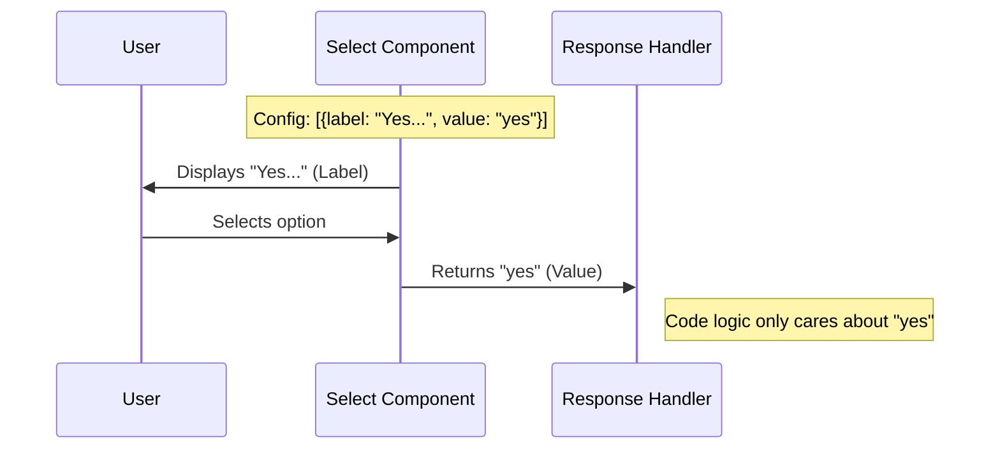

# Chapter 3: Menu Option Configuration

Welcome back! In the previous chapter, [Terminal UI Layout](02_terminal_ui_layout.md), we built the visual structure of our menu, arranging text into neat rows and columns.

However, a menu isn't useful if you can't click anything! In this chapter, we will focus on **Menu Option Configuration**. We will define exactly what choices the user has and how to bridge the gap between what the **User sees** and what the **Code understands**.

## 1. The Problem: Labels vs. Values

Imagine you are at a restaurant.
*   **Menu says:** "Grandma's Special Lasagna" (This is the **Label**).
*   **Kitchen ticket says:** "Item #42" (This is the **Value**).

We need a similar system for our LSP Recommendation Menu.
1.  **The User** needs to see friendly text, sometimes with formatting (bolding), like "Yes, install **Python-LSP**".
2.  **The Code** needs a simple, reliable ID to work with, like `'yes'` or `'no'`.

If we didn't separate these, our code would have to check for specific sentences like `if (response === "Yes, install Python-LSP")`. If we later fixed a typo in the text, our code would break!

## 2. High-Level Use Case

We want to present the user with four specific actions regarding the recommended tool:

1.  **Yes:** Install the tool.
2.  **No:** Don't install it right now.
3.  **Never:** Don't ask about this specific tool again.
4.  **Disable:** Stop asking about *any* tools globally.

We need to create a data structure that maps these friendly descriptions to four simple string values: `'yes'`, `'no'`, `'never'`, and `'disable'`.

## 3. The Option Object

To solve this, we use a simple JavaScript object for each choice. It looks like this:

```typescript
type Option = {
  label: string | ReactNode; // What the user sees
  value: string;             // What the code receives
};
```

### Simple Text Options

For simple choices, the label is just a string.

```typescript
const noOption = {
  label: 'No, not now',
  value: 'no'
};
```

### Rich Text Options

Sometimes we want to highlight specific words. Because we are using **Ink** (see [Terminal UI Layout](02_terminal_ui_layout.md)), our label isn't limited to plain text. We can use JSX!

```tsx
const yesOption = {
  label: (
    <Text>
      Yes, install <Text bold>{pluginName}</Text>
    </Text>
  ),
  value: 'yes'
};
```
*   **Concept:** Here, we insert the variable `pluginName` (e.g., "Python-LSP") and wrap it in `<Text bold>`. The user sees a highlighted name, but the internal value remains the simple string `'yes'`.

## 4. Visualizing the Data Flow

Before we write the final code, let's look at how the `Select` component uses this configuration.



## 5. Implementation Deep Dive

Now, let's look at how this is implemented in `LspRecommendationMenu.tsx`.

### Step A: Defining the Array

We create an array called `options`. This acts as the configuration list for our menu.

```tsx
const options = [
  {
    label: <Text>Yes, install <Text bold>{pluginName}</Text></Text>,
    value: 'yes'
  },
  {
    label: 'No, not now',
    value: 'no'
  },
  // ... continued below
];
```

*   **Explanation:** We start with the positive and negative choices. Note that the first label is a React component (for bold text), and the second is a simple string.

### Step B: Adding Advanced Options

We continue the array with the "Never" and "Disable" options.

```tsx
// ... inside the options array
  {
    label: <Text>Never for <Text bold>{pluginName}</Text></Text>,
    value: 'never'
  },
  {
    label: 'Disable all LSP recommendations',
    value: 'disable'
  }
];
```

*   **Explanation:** Similar to the "Yes" option, the "Never" option dynamically inserts the plugin name so the user knows exactly what they are muting.

### Step C: Passing Config to the Component

Finally, we pass this array to the `Select` component inside our JSX.

```tsx
<Box>
  <Select 
    options={options} 
    onChange={onSelect} 
    onCancel={() => onResponse('no')} 
  />
</Box>
```

*   **`options={options}`**: This feeds our configuration into the visual menu.
*   **`onChange={onSelect}`**: This tells the component what to do when a user chooses an item.
*   **`onCancel`**: This handles what happens if the user presses `Esc` (we treat it as a "no").

## 6. How the Select Component Works (Conceptually)

While we are importing `Select` from a custom file, it is important to understand what it does with your configuration:

1.  It loops through your `options` array.
2.  It renders the `label` for each item on a new line.
3.  It adds a pointer (`>`) or highlight color to the currently selected item.
4.  When `Enter` is pressed, it looks at the **currently selected index**, grabs the corresponding `value` from your array, and sends it to the `onChange` function.

## Conclusion

In this chapter, we learned how to configure the choices in our menu.

*   We separated **Labels** (User Interface) from **Values** (Logic).
*   We used **Rich Text** in labels to make the UI friendlier.
*   We structured these options into an array to pass to the `Select` component.

Now that the menu is displayed and configured with options, we need to handle what happens when the user actually makes a choice. How do we process that `'yes'` or `'no'` string?

[Next Chapter: User Response Handling](04_user_response_handling.md)

---

Generated by [Code IQ](https://github.com/adityasoni99/Code-IQ)