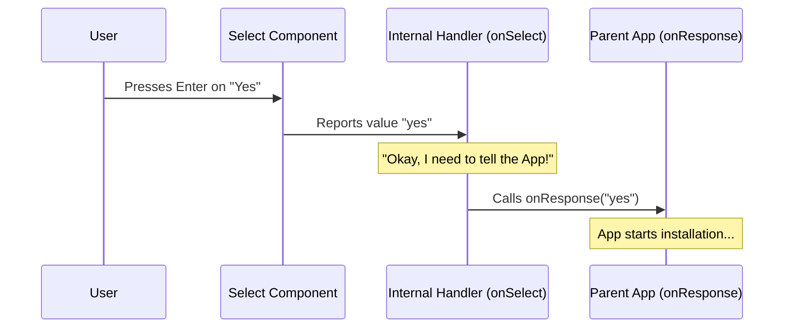

# Chapter 4: User Response Handling

Welcome back! In the previous chapter, [Menu Option Configuration](03_menu_option_configuration.md), we created a list of options (labels and values) for our menu.

However, a menu isn't very useful if clicking an option doesn't actually *do* anything. Just like a vending machine needs internal wiring to drop a snack when you press "A1", our component needs logic to tell the main application what the user decided.

In this chapter, we will explore **User Response Handling**. We will learn how to capture the user's choice and send it back to the application using a "Callback Function."

## 1. The Problem: The "Silent" Menu

Right now, if a user selects "Yes, install Python-LSP", the `Select` component knows about it, but your main application (the code that actually installs plugins) is completely unaware.

We need a communication line. We need a way for the **Child** (the menu) to speak to the **Parent** (the application).

**The Analogy: The Restaurant Order**
1.  **The Menu (Child):** Shows options (Steak, Salad, Pasta).
2.  **The Customer (User):** Points to "Steak".
3.  **The Waiter (Handler):** Writes down "Steak" and runs to the kitchen.
4.  **The Kitchen (Parent App):** Actually cooks the steak.

In this chapter, we are building the **Waiter**.

## 2. The Solution: The `onResponse` Callback

In React and JavaScript, when a child needs to talk to a parent, we pass a function *down* to the child. The child calls this function when something happens. This is called a **Callback**.

In our specific case, we defined this in our `Props` (see [LspRecommendationMenu Component](01_lsprecommendationmenu_component.md)):

```typescript
type Props = {
  // ... other props
  onResponse: (response: 'yes' | 'no' | 'never' | 'disable') => void;
};
```

This acts like a dedicated phone line. The application holds one end, and the menu holds the other.

## 3. Visualizing the Flow

Let's trace the journey of a user's click.



## 4. Implementation: The Switchboard

In our code, we don't pass the `onResponse` phone line directly to the user interface. We put a small "manager" in between called `onSelect`. This allows us to double-check the value or add extra logic if needed before bothering the parent application.

### Step A: The Internal Handler

We define a function inside our component called `onSelect`.

```typescript
function onSelect(value: string): void {
  switch (value) {
    case 'yes':
      onResponse('yes');
      break;
    case 'no':
      onResponse('no');
      break;
    // ... more cases below
  }
}
```
*   **Input:** It receives the `value` string from the configuration we built in [Menu Option Configuration](03_menu_option_configuration.md).
*   **Logic:** It uses a `switch` statement to check which button was pressed.
*   **Action:** It calls `onResponse(...)` with the specific command.

### Step B: Handling "Never" and "Disable"

We continue the switch statement to handle the more permanent negative choices.

```typescript
    case 'never':
      onResponse('never'); // Don't ask for THIS plugin again
      break;
    case 'disable':
      onResponse('disable'); // Don't ask for ANY plugins
      break;
  }
}
```

### Step C: Connecting to the UI

Finally, we connect this handler to our `Select` component.

```tsx
<Select 
  options={options} 
  onChange={onSelect} 
  onCancel={() => onResponse('no')} 
/>
```

We actually handle **two** types of user interactions here:
1.  **`onChange`**: The user actively selected an item and pressed Enter. We send this to our `onSelect` switchboard.
2.  **`onCancel`**: The user pressed `Esc`. We treat this immediately as a temporary "no".

## 5. Why use a Switch Statement?

You might look at the code above and think: *Wait, if `value` is 'yes', and we just send 'yes', why do we need the switch statement? Why not just pass the value directly?*

```typescript
// Why not do this?
const onSelect = (val) => onResponse(val);
```

**Reason 1: Type Safety**
TypeScript is strict. The `Select` component might technically return *any* string. But our `onResponse` function **only** accepts exactly `'yes' | 'no' | 'never' | 'disable'`. The switch statement acts as a security guard, ensuring only valid commands are sent to the app.

**Reason 2: Future Proofing**
Imagine if later we decide that selecting "Disable" should also log a metric or print a goodbye message. By having a dedicated `case 'disable':`, we have a specific place to add that code without breaking the "Yes" logic.

## 6. How the Application Uses It

To fully understand this, let's look at how a developer uses this component from the "outside."

```tsx
// This is inside the Parent Application
<LspRecommendationMenu
  pluginName="Python-LSP"
  fileExtension=".py"
  onResponse={(userChoice) => {
    // This code runs AFTER the user chooses!
    if (userChoice === 'yes') {
      installPlugin('Python-LSP');
    } else if (userChoice === 'disable') {
      saveSetting('disable_recommendations', true);
    }
  }}
/>
```

This completes the circle. The specific strings (`'yes'`, `'disable'`) that we programmed into our options and passed through our handler eventually trigger real functions like `installPlugin`.

## Conclusion

In this chapter, we learned how to make our menu interactive.

*   We learned that **Callbacks** (`onResponse`) are how children talk to parents.
*   We built an **Internal Handler** (`onSelect`) to act as a switchboard for user choices.
*   We handled the **Cancel** event (Esc key) to safely default to "no".

But what happens if the user ignores us completely? What if they open a file and walk away to get coffee? We don't want the menu blocking their screen forever.

In the final chapter, we will implement a timer to automatically close the menu.

[Next Chapter: Auto-Dismissal Timer](05_auto_dismissal_timer.md)

---

Generated by [Code IQ](https://github.com/adityasoni99/Code-IQ)