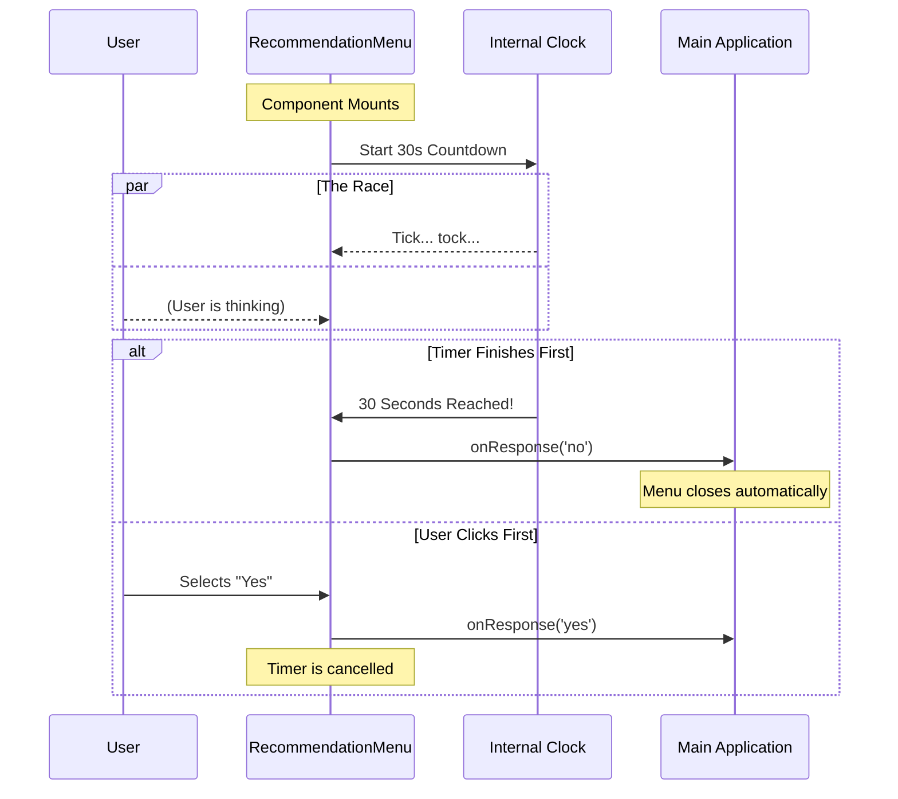

# Chapter 5: Auto-Dismissal Timer

Welcome to the final chapter of our tutorial! 

In the previous chapter, [User Response Handling](04_user_response_handling.md), we learned how to listen for the user's manual input (clicking "Yes" or "No").

But what if the user **doesn't** click anything? What if they open a file via the terminal, realize they forgot their coffee, and walk away? We don't want our menu to block their terminal screen forever.

In this chapter, we will implement an **Auto-Dismissal Timer**.

## 1. The Problem: The "Zombie" Dialog

Terminal tools are often used in automated workflows or quick tasks. If our `LspRecommendationMenu` pops up and waits infinitely for an answer, it becomes a "blocking" process.

**The Scenario:**
1.  Alice runs a command to open `script.py`.
2.  Our Menu appears: "Install Python LSP?"
3.  Alice gets distracted and switches windows.
4.  The terminal hangs there, waiting for input that never comes.

We need a mechanism to say: *"If you haven't decided in 30 seconds, I'm going to assume the answer is No and get out of your way."*

## 2. The Solution: The 30-Second Timeout

We will use a standard timer that starts ticking the moment the component appears on the screen.

**Analogy:** Think of this like the "Are you still watching?" prompt on streaming services. If you don't press a button on the remote, it eventually turns off to save resources.

## 3. Visualizing the Race

This logic creates a "race" between the User and the Timer. Whoever acts first determines the outcome.



## 4. Implementation Details

Let's build this feature in `LspRecommendationMenu.tsx` using React hooks.

### Step A: Defining the Limit

First, we define how long we should wait. We use a constant at the top of our file to avoid "magic numbers" (unexplained numbers) in our code.

```typescript
const AUTO_DISMISS_MS = 30_000; // 30 seconds in milliseconds
```

### Step B: The "Sticky Note" (Refs)

This part is a little tricky. In React, we want our timer to call the `onResponse` function. However, we want to make sure the timer calls the *current* version of that function, even if the component updates.

We use a `useRef` hook. Think of a `Ref` like a **Sticky Note** on a whiteboard.
1.  The Timer is told: "When time is up, read the instructions on the Sticky Note."
2.  React updates the writing on the Sticky Note whenever needed.

```typescript
// Keep a reference to the latest onResponse function
const onResponseRef = React.useRef(onResponse);
onResponseRef.current = onResponse;
```

*   **Concept:** `onResponseRef` is a container that always holds the freshest version of our callback function.

### Step C: Setting the Timer (`useEffect`)

We use the `useEffect` hook to start the timer when the component mounts (loads).

```typescript
React.useEffect(() => {
  // Start the timer
  const timeoutId = setTimeout(
    (ref) => ref.current('no'), // The Action: Call 'no'
    AUTO_DISMISS_MS,            // The Delay: 30 seconds
    onResponseRef               // The Argument passed to the action
  );

  // ... cleanup logic (see next step)
}, []);
```

*   **`setTimeout`**: This is a standard JavaScript function. It waits for `AUTO_DISMISS_MS` and then runs the code in the first argument.
*   **`[]`**: The empty array at the end means "Only run this setup ONCE, when the component first appears."

### Step D: Cleaning Up

What if the user is fast? If the user clicks "Yes" after 5 seconds, the component closes. But the timer is still ticking in the background! We need to defuse the bomb so it doesn't explode after the component is gone.

We return a **cleanup function** from our effect.

```typescript
  // This runs when the component unmounts (closes)
  return () => clearTimeout(timeoutId);
}, []);
```

*   **`clearTimeout`**: This cancels the pending timer. It stops the countdown immediately.

## 5. Putting it Together

Here is the complete block of logic inside our component:

```typescript
export function LspRecommendationMenu({ onResponse, ...props }: Props) {
  // 1. Setup the Ref
  const onResponseRef = React.useRef(onResponse);
  onResponseRef.current = onResponse;

  // 2. Setup the Timer
  React.useEffect(() => {
    const timeoutId = setTimeout(
      ref => ref.current('no'), 
      AUTO_DISMISS_MS, 
      onResponseRef
    );
    
    // 3. Setup Cleanup
    return () => clearTimeout(timeoutId);
  }, []);

  // ... rest of the component
}
```

## 6. How it Solves the Use Case

Let's look at the result of adding this code:

1.  **User Opens File:** The menu appears.
2.  **User Walks Away:** The menu waits patiently for 30 seconds.
3.  **Time's Up:** `setTimeout` triggers. It executes `onResponse('no')`.
4.  **Result:** The application receives the "no" signal. It assumes the user is busy, closes the menu, and returns control to the terminal. The workflow is unblocked!

## Conclusion

Congratulations! You have completed the **LspRecommendation** project tutorial.

Over these five chapters, we have built a sophisticated CLI (Command Line Interface) component that:
1.  **Educates** the user about a missing tool ([Chapter 1](01_lsprecommendationmenu_component.md)).
2.  **Organizes** information beautifully using Layouts ([Chapter 2](02_terminal_ui_layout.md)).
3.  **Configures** complex options easily ([Chapter 3](03_menu_option_configuration.md)).
4.  **Communicates** user choices back to the app ([Chapter 4](04_user_response_handling.md)).
5.  **Respects** the user's time by auto-dismissing (Current Chapter).

You now have a reusable, polite, and robust component ready to help users configure their environment!

---

Generated by [Code IQ](https://github.com/adityasoni99/Code-IQ)