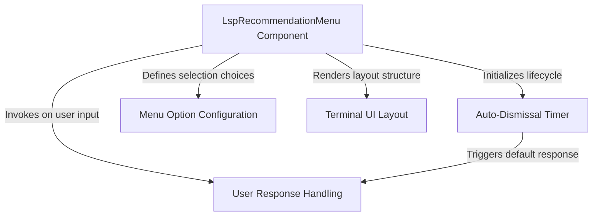

# Tutorial: LspRecommendation

This project implements a **terminal-based dialog** that suggests *LSP plugins* to the user based on the file type they are editing. It presents a menu with installation choices and features an **auto-dismiss timer** that automatically declines the recommendation if the user does not interact within 30 seconds to prevent blocking the workflow.

## Chapters

1. [LspRecommendationMenu Component](01_lsprecommendationmenu_component.md)
2. [Terminal UI Layout](02_terminal_ui_layout.md)
3. [Menu Option Configuration](03_menu_option_configuration.md)
4. [User Response Handling](04_user_response_handling.md)
5. [Auto-Dismissal Timer](05_auto_dismissal_timer.md)

---

Generated by [Code IQ](https://github.com/adityasoni99/Code-IQ)