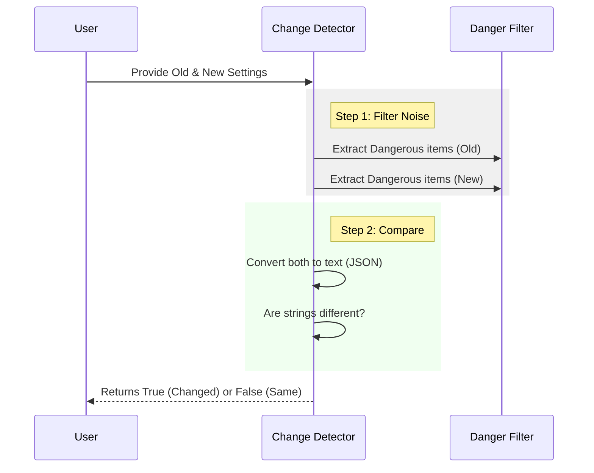

# Chapter 1: Configuration Change Detection

Welcome to the **ManagedSettingsSecurityDialog** project! This tutorial series will guide you through building a smart security system for application settings.

## Motivation: The "Alert Fatigue" Problem

Imagine you have a security guard at your office.
1.  **Scenario A:** Every single time you walk through the door, the guard stops you, checks your ID, asks for your signature, and calls your boss. This happens 50 times a day.
2.  **Scenario B:** The guard remembers you. He only stops you if you are carrying a suspicious package you didn't have yesterday.

**Scenario A** causes **Alert Fatigue**. You stop paying attention because the prompt is annoying and repetitive. You just want to click "Yes" to make it go away.

**Scenario B** is **Configuration Change Detection**. We want our code to behave like the smart guard. We only want to interrupt the user if the security risk has actually *changed* since the last time they approved it.

### Central Use Case
A developer is running a local server.
1.  They configure it with a specific API Key (a dangerous setting).
2.  They run the app. **System:** "This uses an API Key. Approve?" -> **User:** "Yes."
3.  They restart the app 10 times without changing settings. **System:** (Silent).
4.  They change the API Key to a malicious script. **System:** "Settings changed! Approve?"

---

## How to Use: Detecting Changes

The core of this logic lives in `utils.ts`. The main function we care about is `hasDangerousSettingsChanged`.

This function compares two snapshots of settings:
1.  **Old Settings:** The settings the user approved last time.
2.  **New Settings:** The settings trying to run right now.

### Example 1: The First Run
When a user runs the app for the first time, there are no "Old Settings."

```typescript
import { hasDangerousSettingsChanged } from './utils.ts'

// First run: oldSettings is null
const oldSettings = null
const newSettings = { env: { MY_SECRET: '123' } }

const shouldPrompt = hasDangerousSettingsChanged(oldSettings, newSettings)

console.log(shouldPrompt) 
// Output: true (We must ask for permission!)
```

### Example 2: The "Routine" Run
The user restarts the app. The settings are exactly the same as what was previously saved.

```typescript
// Second run: old and new are identical
const oldSettings = { env: { MY_SECRET: '123' } }
const newSettings = { env: { MY_SECRET: '123' } }

const shouldPrompt = hasDangerousSettingsChanged(oldSettings, newSettings)

console.log(shouldPrompt)
// Output: false (No risk change. Don't annoy the user.)
```

### Example 3: The "Tampered" Run
Someone modifies a dangerous environment variable.

```typescript
// Third run: new settings have a different secret
const oldSettings = { env: { MY_SECRET: '123' } }
const newSettings = { env: { MY_SECRET: 'EVIL_SCRIPT' } }

const shouldPrompt = hasDangerousSettingsChanged(oldSettings, newSettings)

console.log(shouldPrompt)
// Output: true (Something changed! Alert the user!)
```

---

## Internal Implementation: How it Works

Before looking at the code, let's visualize the decision process. The system doesn't look at *every* setting (like font size or background color). It only filters for "Dangerous" items.

### The Logic Flow



### 1. Extracting the Danger
We don't care if the user changed `theme: "dark"` to `theme: "light"`. That isn't a security risk. We use `extractDangerousSettings` to strip away the safe stuff.

In `utils.ts`, we look for three specific threats:
1.  **Shell Settings:** Arguments passed to the command line.
2.  **Hooks:** Custom scripts that run automatically.
3.  **Env Vars:** But only the "unsafe" ones!

We will cover exactly *which* variables are safe in [Environment Variable Filtering](04_environment_variable_filtering.md).

```typescript
// utils.ts (simplified)
export function extractDangerousSettings(settings) {
  if (!settings) return { shellSettings: {}, envVars: {}, hasHooks: false }

  // Only keep dangerous env vars (logic checks against a SAFE list)
  // ... iteration logic ...

  return {
    shellSettings, // e.g., { "shell": "/bin/bash" }
    envVars,       // e.g., { "API_KEY": "xyz" }
    hasHooks       // boolean
  }
}
```

### 2. The Comparison
Once we have the two clean lists of dangerous items, we need to compare them. The easiest way to compare complex objects in JavaScript is to turn them into a text string (JSON) and compare the strings.

```typescript
// utils.ts
export function hasDangerousSettingsChanged(oldSettings, newSettings) {
  // 1. Get the simplified lists of threats
  const oldDangerous = extractDangerousSettings(oldSettings)
  const newDangerous = extractDangerousSettings(newSettings)

  // 2. If the new settings have ZERO threats, we are safe.
  if (!hasDangerousSettings(newDangerous)) {
    return false
  }

  // ... (comparison logic continued below) ...
```

If the new settings *do* have threats, we compare them against the old ones:

```typescript
  // ... (continued from above)

  // 3. Convert both threat lists to strings
  const oldJson = jsonStringify(oldDangerous)
  const newJson = jsonStringify(newDangerous)

  // 4. If the strings don't match, something changed.
  return oldJson !== newJson
}
```

## Summary

In this chapter, we learned how to solve **Alert Fatigue**.
1.  We assume settings are safe if they match what the user previously approved.
2.  We ignore harmless changes (like UI themes).
3.  We trigger an alert only when **Dangerous Settings** differ from the approved state.

But what exactly qualifies as "Dangerous"? And how do we present this to the user without confusing them?

In the next chapter, we will learn how to categorize these threats so the user understands *why* they are being stopped.

[Next Chapter: Security Risk Assessment](02_security_risk_assessment.md)

---

Generated by [Code IQ](https://github.com/adityasoni99/Code-IQ)