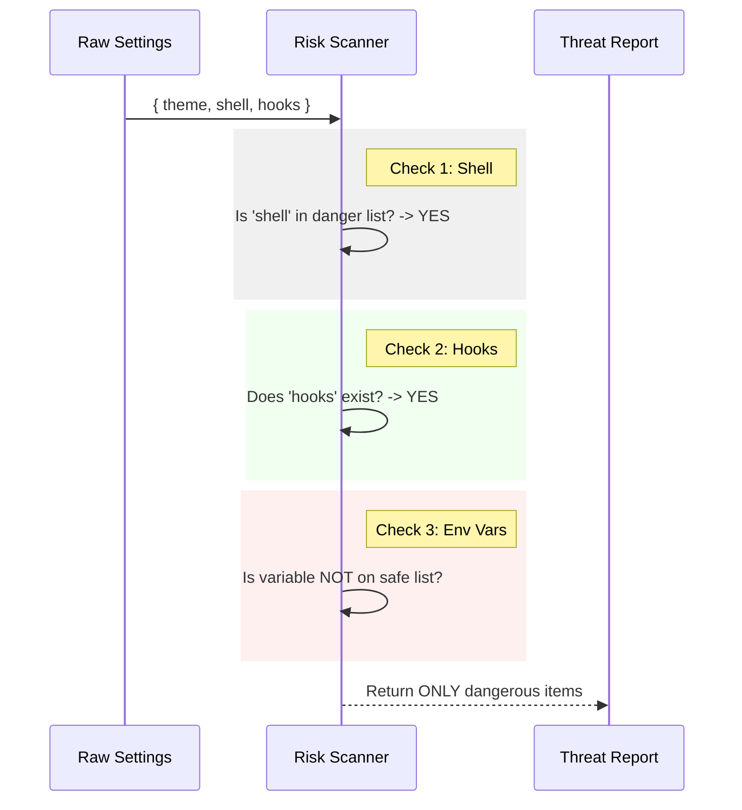

# Chapter 2: Security Risk Assessment

Welcome back! In the previous chapter, [Configuration Change Detection](01_configuration_change_detection.md), we learned how to stop the "Alert Fatigue" problem by checking *if* settings have changed.

But knowing that "something changed" isn't enough.

## Motivation: The Airport Security Checkpoint

Imagine you are going through airport security.
1.  **Scenario A:** You are carrying a paperback book. The scanner sees it, realizes it is harmless, and lets you pass without stopping you.
2.  **Scenario B:** You are carrying a Swiss Army Knife. The scanner detects metal, realizes it is a potential threat, and pulls you aside for a check.

In our application, we need to build this specific scanner.
*   **Harmless Settings:** Font size, theme colors, window position. We should **never** bother the user about these.
*   **Dangerous Settings:** Shell commands, API keys, arbitrary code hooks. We **must** alert the user about these.

### Central Use Case
A user updates their configuration file with two changes:
1.  They change the `theme` from "Light" to "Dark".
2.  They add a `shell` command to execute a script.

**Goal:** We need a function that ignores the `theme` but captures the `shell` command so we can warn the user.

---

## How to Use: Scanning for Threats

The scanner logic is encapsulated in a function called `extractDangerousSettings`. It acts as a filter: you pour *all* settings into the top, and only the *dangerous* ones drip out the bottom.

### The Categories of Danger
Our scanner looks for three specific types of threats:

1.  **Shell Settings:** Direct commands sent to the computer's terminal (e.g., executing a binary).
2.  **Hooks:** Scripts configured to run automatically when certain events happen (like `onStart`).
3.  **Environment Variables:** Sensitive data like API keys or tokens. (Note: Some variables are safe, which we will cover in [Environment Variable Filtering](04_environment_variable_filtering.md)).

### Example: Running the Scanner

Here is how you use the scanner in your code. Notice how the harmless setting disappears in the result.

```typescript
import { extractDangerousSettings } from './utils.ts'

// The user's full configuration
const allSettings = {
  theme: 'Dark Mode',        // Harmless
  shell: '/bin/zsh',         // DANGEROUS!
  env: { API_KEY: 'secret' } // DANGEROUS!
}

// Run the scan
const threats = extractDangerousSettings(allSettings)
```

**The Output (`threats`):**
```json
{
  "shellSettings": { "shell": "/bin/zsh" },
  "envVars": { "API_KEY": "secret" },
  "hasHooks": false,
  "hooks": undefined
}
```
*Notice that `theme` is completely gone. The scanner successfully filtered the noise.*

---

## Internal Implementation: How it Works

Let's look under the hood to see how the scanner decides what is dangerous.

### The Logic Flow

The scanner takes the raw JSON object and runs it through three specific checks.



### Code Walkthrough (`utils.ts`)

The implementation of `extractDangerousSettings` is designed to be defensive. It assumes everything is safe *unless* it falls into a dangerous category.

#### 1. Checking Shell Settings
We rely on a predefined list of constants (`DANGEROUS_SHELL_SETTINGS`) to know which keys to look for.

```typescript
// utils.ts (Part 1: Shell)
// We look for specific keys like 'shell', 'shellArgs', etc.
const shellSettings = {}

for (const key of DANGEROUS_SHELL_SETTINGS) {
  const value = settings[key]
  // If the user set a value, we capture it as dangerous
  if (typeof value === 'string' && value.length > 0) {
    shellSettings[key] = value
  }
}
```

#### 2. Checking Hooks
Hooks are arbitrary code execution. If the user defines *any* hook, we consider the configuration potentially risky.

```typescript
// utils.ts (Part 2: Hooks)
// Simply checking if the object exists and isn't empty
const hasHooks =
  settings.hooks !== undefined &&
  settings.hooks !== null &&
  Object.keys(settings.hooks).length > 0
```

#### 3. Checking Environment Variables
This loop iterates over environment variables. It uses a "Block List" approach by default—if a variable is **not** explicitly known to be safe, it is flagged as dangerous.

```typescript
// utils.ts (Part 3: Env Vars)
for (const [key, value] of Object.entries(settings.env)) {
  // If it's NOT in the Safe List, capture it!
  if (!SAFE_ENV_VARS.has(key.toUpperCase())) {
    envVars[key] = value
  }
}
```
*We will detail exactly how `SAFE_ENV_VARS` works in [Environment Variable Filtering](04_environment_variable_filtering.md).*

---

## Making it Readable for Humans

The output of `extractDangerousSettings` is a JavaScript object. This is great for code, but bad for showing to a user in a popup box.

We have a helper function `formatDangerousSettingsList` that converts the threat object into a simple list of strings (names only).

```typescript
import { formatDangerousSettingsList } from './utils.ts'

// Using the 'threats' object from our previous example
const readableList = formatDangerousSettingsList(threats)

console.log(readableList)
// Output: ["shell", "API_KEY"]
```

This simple array allows the UI to say: *"Warning: The following settings changed: **shell**, **API_KEY**."*

---

## Summary

In this chapter, we built the "Security Scanner" for our application.

1.  We learned that we must separate **Harmless** settings (UI preferences) from **Dangerous** settings (System access).
2.  We used `extractDangerousSettings` to filter out the noise.
3.  We identified the three main threats: **Shell Commands**, **Hooks**, and **Unsafe Env Vars**.

Now that we know *when* changes happen (Chapter 1) and *what* the risks are (Chapter 2), we need to ask the user for permission.

In the next chapter, we will build the UI component that presents these findings to the user.

[Next Chapter: Security Consent Dialog](03_security_consent_dialog.md)

---

Generated by [Code IQ](https://github.com/adityasoni99/Code-IQ)