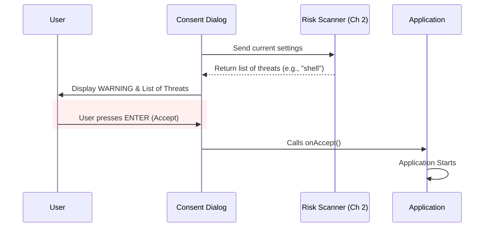

# Chapter 3: Security Consent Dialog

Welcome back! 

In the previous chapter, [Security Risk Assessment](02_security_risk_assessment.md), we learned how to scan a configuration file and extract a list of specific threats (like Shell commands or API keys).

Now that we have identified the danger, we need to do something about it.

## Motivation: The "Run as Administrator" Prompt

Imagine you are installing a new program on your computer. Suddenly, the screen goes dim, and a box pops up: 
> *"Do you want to allow this app to make changes to your device?"*

You cannot click anything else. You cannot type in other windows. You must answer **Yes** or **No** before proceeding.

This is a **Security Consent Dialog**. 
*   **Without it:** The malicious program could silently install a virus.
*   **With it:** You (the human) are forced to pause and verify the action.

### Central Use Case
1.  The system has detected that the `shell` setting was changed to execute a script (from Chapter 1 & 2).
2.  The application pauses its startup sequence.
3.  It renders a bright red box in the terminal listing the risks.
4.  It waits for the user to press **Enter** (Accept) or **Esc** (Reject).

---

## How to Use: The Gatekeeper Component

In our project, this logic is contained in a React component called `ManagedSettingsSecurityDialog`. This component acts as a gatekeeper. It doesn't run the logic itself; it just asks for permission to proceed.

It takes three main inputs:
1.  **Settings:** The configuration file containing the potential risks.
2.  **OnAccept:** What to do if the user says "Yes" (usually, start the app).
3.  **OnReject:** What to do if the user says "No" (usually, exit the app).

### Example Usage

Here is how the main application uses this dialog. Notice strictly how it handles the "Yes" and "No" scenarios.

```tsx
// MainApp.tsx (Simplified)
import { ManagedSettingsSecurityDialog } from './ManagedSettingsSecurityDialog'

function App() {
  // If the user approves, we run the sensitive code
  const handleAccept = () => startApplication()

  // If the user rejects, we kill the process
  const handleReject = () => process.exit(0)

  return (
    <ManagedSettingsSecurityDialog 
      settings={userSettings}
      onAccept={handleAccept}
      onReject={handleReject}
    />
  )
}
```

---

## Internal Implementation: How it Works

Let's look at the lifecycle of this dialog. It combines the logic from Chapter 2 with a user interface.

### The Interaction Flow



### Code Walkthrough (`ManagedSettingsSecurityDialog.tsx`)

Let's break down the component into small, understandable pieces.

#### 1. preparing the Data
First, the component needs to know *what* to warn the user about. It uses the tools we built in [Security Risk Assessment](02_security_risk_assessment.md).

```tsx
// Inside ManagedSettingsSecurityDialog function
export function ManagedSettingsSecurityDialog({ settings, onAccept, onReject }) {
  
  // 1. Get the raw object of dangerous items
  const dangerous = extractDangerousSettings(settings)

  // 2. Convert it to a readable list (e.g., ["shell", "API_KEY"])
  const settingsList = formatDangerousSettingsList(dangerous)
  
  // ... rest of component
}
```
*Note: We don't need to write new logic here. We reuse the `extractDangerousSettings` function we analyzed in the previous chapter.*

#### 2. Handling Key Presses
We need to listen for keyboard input. We use a helper hook called `useKeybinding`. This ensures that if the user hits specific keys, the correct action fires.

```tsx
  // ... inside component

  // If the user presses the specific "No" keybinding
  useKeybinding('confirm:no', onReject, { context: 'Confirmation' })

  // Helper to handle the selection menu logic
  const onChange = (value) => {
    if (value === 'exit') {
      onReject() // Stop!
    } else {
      onAccept() // Go!
    }
  }
```

#### 3. Rendering the Warning List
This is the visual part. We iterate over the text list we created in Step 1 and display each item. This ensures the user knows exactly *why* they are being stopped.

```tsx
  // ... inside the JSX return logic
  <Box flexDirection="column">
    <Text dimColor>Settings requiring approval:</Text>
    
    {/* Loop through the list of risks */}
    {settingsList.map((item, index) => (
      <Box key={index} paddingLeft={2}>
        <Text>· {item}</Text>
      </Box>
    ))}
  </Box>
```
*If `settingsList` contains `["shell", "env"]`, this code will print two bullet points on the screen.*

#### 4. The Final Selection Menu
Finally, we present the choices. We use a `Select` component (a standard dropdown/list selector) to force a binary choice.

```tsx
  // ... inside the JSX return logic
  <Select 
    options={[
      { label: 'Yes, I trust these settings', value: 'accept' },
      { label: 'No, exit Claude Code', value: 'exit' }
    ]}
    onChange={onChange} // Calls the helper from Step 2
    onCancel={() => onChange('exit')}
  />
```
*This is the "Gate". The user must physically select "Yes" to trigger the `onAccept` function.*

---

## Summary

In this chapter, we built the **User Interface** for our security system.

1.  We learned that detecting a risk is useless unless we **block execution** and inform the user.
2.  We used `ManagedSettingsSecurityDialog` to visualize the threats found in Chapter 2.
3.  We implemented a "Gatekeeper" pattern: the app receives a simple `onAccept` or `onReject` signal from this dialog.

However, you might have noticed something in the previous chapters. We constantly talk about "Dangerous Environment Variables." But surely, some variables (like `PORT=3000`) are safe?

How do we decide which variables are safe enough to hide from this dialog, and which ones are dangerous enough to show?

In the final chapter, we will build the filter for environment variables.

[Next Chapter: Environment Variable Filtering](04_environment_variable_filtering.md)

---

Generated by [Code IQ](https://github.com/adityasoni99/Code-IQ)