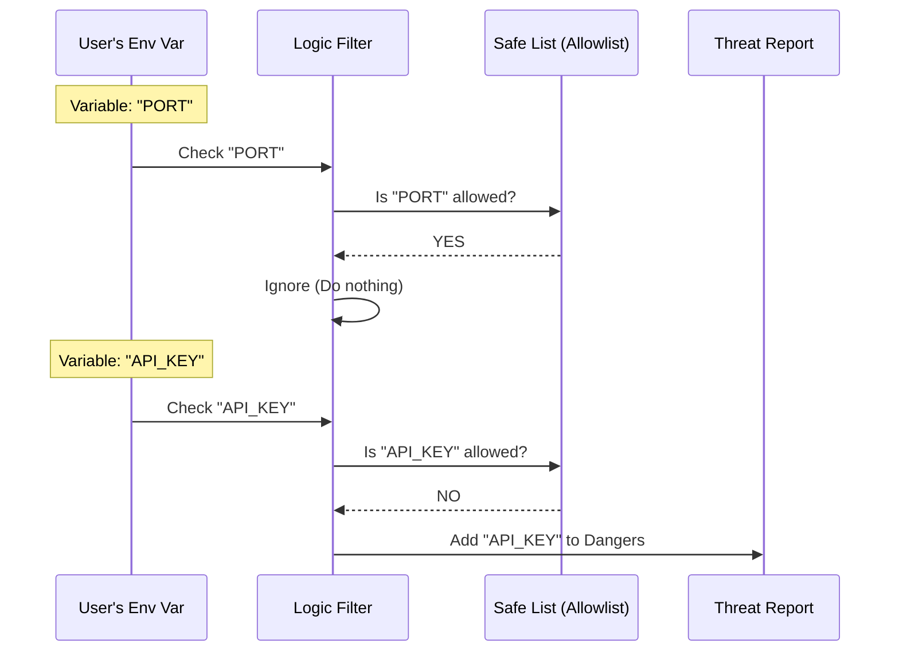

# Chapter 4: Environment Variable Filtering

Welcome to the final chapter of the **ManagedSettingsSecurityDialog** tutorial series!

In the previous chapter, [Security Consent Dialog](03_security_consent_dialog.md), we built the interface that stops the user and asks for permission when risks are detected.

However, we left one major question unanswered: **How do we decide which Environment Variables are dangerous?**

## Motivation: The VIP Guest List

Imagine you are a security guard at an exclusive party. You have two ways to decide who gets in:

1.  **The "Blocklist" Approach:** You let everyone in *except* people you know are criminals.
    *   *Problem:* If a new criminal (who you don't know yet) shows up, you accidentally let them in. This is risky.
2.  **The "Allowlist" Approach:** You have a clipboard with a specific list of names. You only let in people who are on that list. Everyone else is stopped.
    *   *Benefit:* Even if a stranger is actually nice, you stop them just to be safe. This is **Secure by Default**.

We use the **Allowlist Approach** (Scenario 2). We assume *every* environment variable is a security threat unless we explicitly know it is safe.

### Central Use Case

A developer configures their application with two environment variables:
1.  `PORT=3000` (Used to tell the server where to listen).
2.  `STRIPE_SECRET_KEY=sk_test_123` (Access to financial data).

**The Goal:**
*   The system should see `PORT` and say: "This is on the Safe List. Ignore it."
*   The system should see `STRIPE_SECRET_KEY`, check the list, find it missing, and say: "I don't know this one. **Flag it as Dangerous.**"

---

## Key Concept: The `SAFE_ENV_VARS` List

The core of this logic relies on a constant called `SAFE_ENV_VARS`. This is a strict list of strings that are guaranteed to be harmless configuration options (like setting a timezone or a log level).

If a variable is **not** on this list, it is automatically considered "Dangerous" and will trigger the [Security Consent Dialog](03_security_consent_dialog.md).

### Example: How the Logic Thinks

Let's trace how the code evaluates inputs.

```typescript
// The VIP List
const SAFE_ENV_VARS = new Set(['PORT', 'NODE_ENV', 'TZ'])

// Input 1: "PORT"
// Is "PORT" in the set? YES. -> Outcome: SAFE.

// Input 2: "API_KEY"
// Is "API_KEY" in the set? NO. -> Outcome: DANGEROUS!
```

---

## How to Use: The Filtering Process

This filtering happens inside the `extractDangerousSettings` function we introduced in [Security Risk Assessment](02_security_risk_assessment.md).

You don't usually call the filter directly; it runs automatically when scanning settings. However, understanding the input and output is crucial.

### Example Input/Output

```typescript
// utils.ts logic simulation

const userEnvVars = {
  "NODE_ENV": "development", // Common, safe setting
  "AWS_ACCESS_KEY": "12345"  // Sensitive credential
}

// Result of filtering:
// 1. NODE_ENV is found in SAFE_ENV_VARS -> Discarded.
// 2. AWS_ACCESS_KEY is NOT found -> Kept.

console.log(dangerousEnvVars)
// Output: { "AWS_ACCESS_KEY": "12345" }
```

By filtering out the safe stuff, we ensure the user only sees a warning for things that actually matter.

---

## Internal Implementation: Under the Hood

Let's visualize the flow of data when the scanner encounters environment variables.

### The Decision Diagram



### Code Walkthrough

The actual implementation is located in `utils.ts`. It iterates through every environment variable the user provided and compares it against the imported `SAFE_ENV_VARS`.

#### 1. The Safe List
While not shown in the snippet below, `SAFE_ENV_VARS` is imported from a constants file. It is a JavaScript `Set` because `Sets` are very fast to check (O(1) complexity).

#### 2. The Filter Loop
Here is the simplified logic block within `extractDangerousSettings`:

```typescript
// utils.ts

// Loop through every variable the user defined
for (const [key, value] of Object.entries(settings.env)) {
  
  // 1. Check if the variable is safe (Allowlist check)
  // We use .toUpperCase() to ensure case-insensitivity
  const isSafe = SAFE_ENV_VARS.has(key.toUpperCase())

  // 2. If it is NOT safe, add it to the danger list
  if (!isSafe) {
    envVars[key] = value
  }
}
```

*Explanation:* 
1.  We loop through `settings.env`.
2.  We ask `SAFE_ENV_VARS.has(key)`. 
3.  The `!` (bang) operator in `!isSafe` means "If it is **NOT** safe."
4.  If it's not safe, we add it to the `envVars` object, which eventually gets passed to the [Security Consent Dialog](03_security_consent_dialog.md).

### Why use a Deny-Default?
You might ask: *"Why don't we just make a list of bad variables like `API_KEY` and block those?"*

Because developers are creative. They might name a secret variable `MY_SUPER_SECRET_CODE`. If we used a "Blocklist," we would miss that. By using an "Allowlist," `MY_SUPER_SECRET_CODE` is blocked automatically because we've never seen it before.

---

## Conclusion

Congratulations! You have completed the **ManagedSettingsSecurityDialog** tutorial series.

Let's recap what we built:

1.  **[Configuration Change Detection](01_configuration_change_detection.md):** We learned to stop "Alert Fatigue" by only alerting when settings actually change.
2.  **[Security Risk Assessment](02_security_risk_assessment.md):** We built a scanner to separate harmless settings (UI themes) from dangerous ones (Shell commands).
3.  **[Security Consent Dialog](03_security_consent_dialog.md):** We created a UI "Gatekeeper" to force the user to accept or reject those risks.
4.  **Environment Variable Filtering (This Chapter):** We refined our scanner using an "Allowlist" to ensure unknown variables are treated as risks by default.

You now have a robust, user-friendly security system that protects the application without annoying the user unnecessarily. Happy coding!

---

Generated by [Code IQ](https://github.com/adityasoni99/Code-IQ)