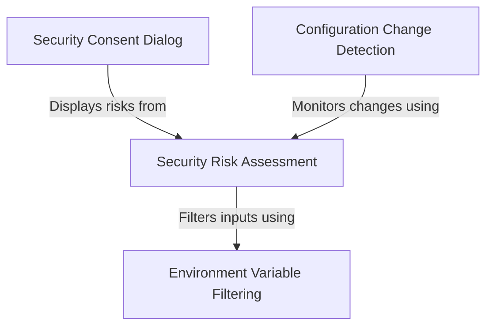

# Tutorial: ManagedSettingsSecurityDialog

This project acts as a **security gatekeeper** for sensitive system configurations. It uses a scanner to identify *risky settings* (like shell commands or unsafe environment variables) and compares them against previous states to avoid unnecessary alerts. When actual security threats are detected, it blocks execution with a **consent dialog**, forcing the user to explicitly review and approve the changes.

## Chapters

1. [Configuration Change Detection](01_configuration_change_detection.md)
2. [Security Risk Assessment](02_security_risk_assessment.md)
3. [Security Consent Dialog](03_security_consent_dialog.md)
4. [Environment Variable Filtering](04_environment_variable_filtering.md)

---

Generated by [Code IQ](https://github.com/adityasoni99/Code-IQ)