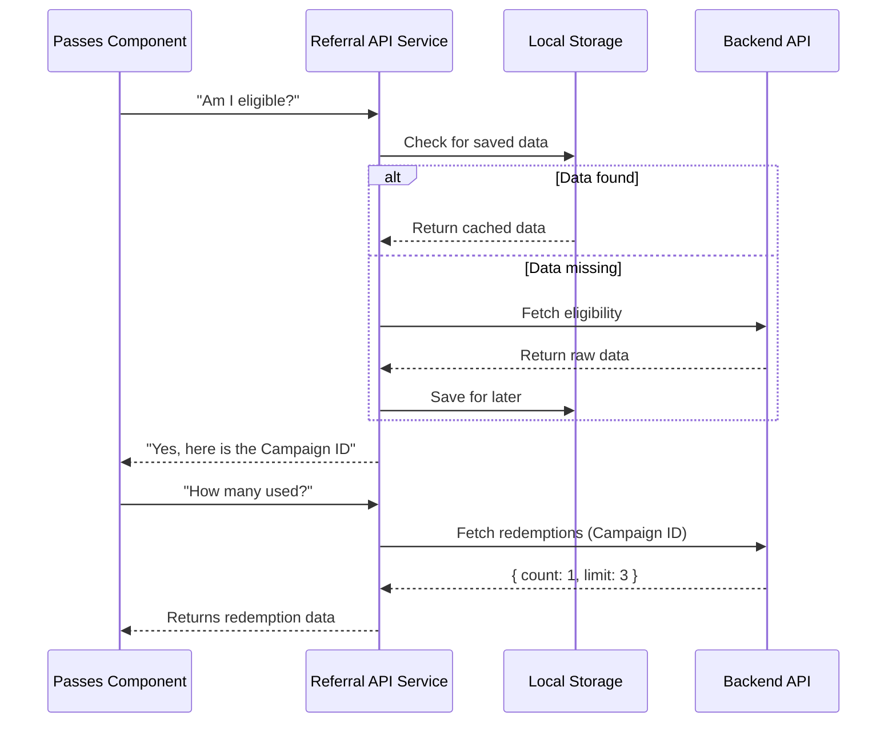

# Chapter 1: Referral API Service

Welcome to the **Passes** project tutorial! In this first chapter, we are going to look at the foundation of our feature: the **Referral API Service**.

## The Problem: Taming the Data
Imagine you are building a feature where users can share "Guest Passes" with friends. To make this work, your application needs to answer three questions:
1. **Eligibility:** Is this user allowed to share passes?
2. **Campaign:** What specific promotion (e.g., "Free Week") are we running?
3. **Redemptions:** How many passes has the user already given away?

If we put all this logic directly into our UI code, it becomes a mess. The UI shouldn't care about *how* to connect to the internet or *how* to cache data. It just wants the answers.

## The Solution: The Service Layer
The **Referral API Service** acts as a **Data Broker**. Think of it like a waiter in a restaurant.
*   **You (The UI)** sit at the table and ask for "3 Passes."
*   **The Waiter (The Service)** goes to the kitchen, checks ingredients, talks to the chef, and brings you the result.
*   **The Kitchen (The Backend)** handles the raw ingredients.

You don't need to know how the stove works; you just rely on the waiter.

## Key Concepts

### 1. Decoupling
We separate the "View" (what users see) from the "Data" (what users know). This means if the API changes later, we only fix the Service, not the UI.

### 2. Caching
Asking the server for data takes time. Our service tries to remember the answer to "Is this user eligible?" so it doesn't have to ask the server repeatedly. This makes the app feel instant.

### 3. Data Aggregation
The server might return complex raw data. Our service simplifies this into exactly what the UI needs: a simple list of passes.

---

## How to Use the Service

Let's look at how we use this service in our code. We will be looking at `Passes.tsx`.

### Step 1: Importing the Tools
First, we import the helper functions from our service file.

```typescript
// Importing the service functions
import { 
  fetchReferralRedemptions, 
  getCachedOrFetchPassesEligibility 
} from '../../services/api/referral.js';
```
*   `fetchReferralRedemptions`: Asks "How many tickets are used?"
*   `getCachedOrFetchPassesEligibility`: Asks "Can this user play?" (checks cache first).

### Step 2: Checking Eligibility
In our component, we use an asynchronous function to ask the service for data.

```typescript
async function loadPassesData() {
  // Ask the service: Is this user eligible?
  const eligibilityData = await getCachedOrFetchPassesEligibility();

  if (!eligibilityData || !eligibilityData.eligible) {
    setIsAvailable(false);
    return; // Stop if they aren't eligible
  }
  // ... continue logic
}
```
**Explanation:** We `await` the answer. If the service says "No" (`!eligible`), we stop immediately. The UI doesn't know *how* the service checked (cache or network), and it doesn't care.

### Step 3: Getting the Campaign
If the user is eligible, the service gives us details about the "Campaign" (the specific marketing event).

```typescript
// extract campaign ID, defaulting to a standard one if missing
const campaign = eligibilityData.referral_code_details?.campaign 
  ?? 'claude_code_guest_pass';
```
**Explanation:** We need this `campaign` ID to ask the next question: "How many redemptions for *this specific* campaign?"

### Step 4: Fetching Redemptions
Now the service goes back to the server to count used tickets.

```typescript
let redemptionsData: ReferralRedemptionsResponse;

try {
  // Ask service for usage counts for this campaign
  redemptionsData = await fetchReferralRedemptions(campaign);
} catch (err) {
  // If the network fails, we handle it gracefully
  setIsAvailable(false); 
  return;
}
```
**Explanation:** This is the second trip to the kitchen. The service fetches the specific numbers we need to draw the UI.

---

## Under the Hood: Internal Implementation

What happens inside these functions? Let's visualize the flow using a diagram.



### Transforming Data for the UI
The most helpful thing the Service does is prepare data for the UI. The API might return complex objects, but the UI simply wants a list of tickets to render.

Here is how the UI takes the Service data and transforms it into a simple state:

```typescript
// Create an array of pass statuses
const statuses: PassStatus[] = [];

// Loop through the limit (e.g., 3 tickets)
for (let i = 0; i < maxRedemptions; i++) {
  statuses.push({
    passNumber: i + 1,
    isAvailable: !redemptions[i] // Available if not in the redeemed list
  });
}
```

**Output:**
This logic results in a clean array that looks like this:
```json
[
  { "passNumber": 1, "isAvailable": false }, // Redeemed
  { "passNumber": 2, "isAvailable": true },  // Ready to use
  { "passNumber": 3, "isAvailable": true }   // Ready to use
]
```

This clean array is exactly what we need to render the tickets on the screen!

## Conclusion

By using the **Referral API Service**, we have kept our UI code clean. The component `Passes.tsx` focuses on *logic flow* (if eligible -> get counts -> show tickets), while the Service handles the *heavy lifting* (network calls, caching, error handling).

Now that we have our data ready, we need a beautiful way to display it to the user.

[Next Chapter: Design System (Pane)](02_design_system__pane_.md)

---

Generated by [Code IQ](https://github.com/adityasoni99/Code-IQ)