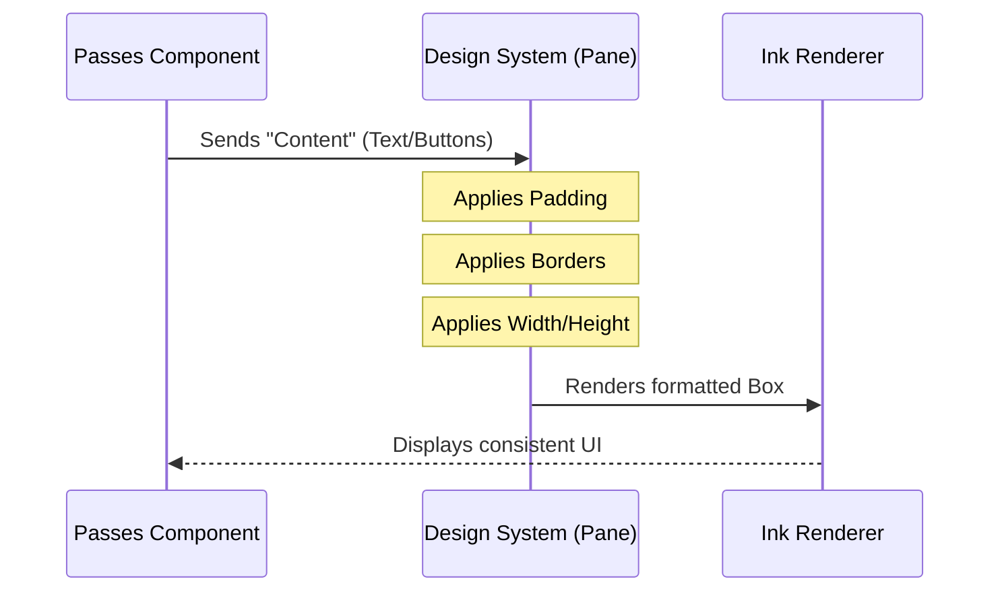

# Chapter 2: Design System (Pane)

Welcome back! In the previous chapter, [Referral API Service](01_referral_api_service.md), we built the logic to fetch our data (eligibility, campaign details, and redemption counts).

Now that we have the raw data, we need to display it. However, we don't just want to dump text onto the terminal screen. We want our CLI tool to look professional, consistent, and beautiful.

Enter the **Design System**, starting with its most fundamental component: the **Pane**.

## The Problem: The "Blank Canvas" Anxiety

Building a CLI User Interface (UI) using a library like **Ink** (React for CLIs) gives you a blank canvas. This creates two problems:
1.  **Inconsistency:** If you build five different screens, you might accidentally give them different margins or borders.
2.  **Repetition:** You don't want to type `borderStyle="round" padding={1}` in every single file.

## The Solution: The Pane

The **Pane** acts as a standardized **Container**.

Think of the **Pane** like a pre-printed **Letterhead** or a **Picture Frame**.
*   **The Content:** This is what you wrote in Chapter 1 (the text, the ticket numbers).
*   **The Pane:** This is the frame around the content. It ensures that whether you are showing an error message, a loading screen, or the main dashboard, the "edges" of the app always look the same.

## How to Use the Pane

Using the Pane is incredibly simple because it relies on a React concept called "wrapping."

### Step 1: Import the Component
In our file `Passes.tsx`, we import the design system component.

```typescript
// Importing the standardized container
import { Pane } from '../design-system/Pane.js';
```

### Step 2: Wrap Your Content
When our component renders, we don't return a raw `Box` or `Text`. We return a `Pane` that contains our specific UI.

Let's look at the **Loading State** from `Passes.tsx`:

```typescript
if (loading) {
  // We wrap our specific loading text inside the Pane
  return (
    <Pane>
      <Box flexDirection="column" gap={1}>
        <Text dimColor>Loading guest pass information…</Text>
        {/* ... helper text ... */}
      </Box>
    </Pane>
  );
}
```

**What is happening here?**
We hand our "Loading..." text to the `Pane`. The `Pane` takes that text, puts a nice border around it, ensures it is centered or padded correctly, and then puts it on the screen.

### Step 3: Consistency Across States
Notice that even if the user is **not eligible**, we still use the exact same `Pane` wrapper.

```typescript
if (!isAvailable) {
  return (
    <Pane>
      <Box flexDirection="column" gap={1}>
        <Text>Guest passes are not currently available.</Text>
        {/* ... helper text ... */}
      </Box>
    </Pane>
  );
}
```

By using `<Pane>` for both the "Loading" screen and the "Error" screen, the user doesn't see the layout jump around. The structure remains solid; only the text inside changes.

---

## Under the Hood: Internal Implementation

How does the Pane actually work? It creates a standardized "box" model for our application.

### The Flow of Rendering
Here is what happens when React renders your component:



### The Implementation Code
While the `Pane` code is hidden in the design system files, we can recreate a simplified version of what it does to understand it. It is essentially a configuration wrapper around an Ink `Box`.

```typescript
// A simplified look inside Pane.tsx
import { Box } from 'ink';

export const Pane = ({ children }: { children: React.ReactNode }) => {
  return (
    <Box 
      borderStyle="round" // Gives the rounded corners
      borderColor="gray"  // Standardized color
      padding={1}         // Breathing room inside the border
      flexDirection="column"
    >
      {children}
    </Box>
  );
};
```

**Key Concepts Explained:**
1.  **`children`**: This is a special React prop. It represents whatever you put *inside* the `<Pane>...</Pane>` tags in your main file.
2.  **`borderStyle="round"`**: This draws the actual line around your content.
3.  **`padding={1}`**: This ensures your text doesn't touch the border line.

## Why This Matters for "Passes"
In the `Passes.tsx` file you provided, the `Pane` is the glue holding the view together.

Without the Pane, the ASCII art tickets and the "Terms apply" link would float in empty space. With the Pane, they are grouped into a distinct "window" that overlays the user's terminal, making it feel like a polished software application rather than a script.

## Conclusion

The **Pane** is the foundation of our visual layer. It handles the "macro" layout—the borders and the spacing of the window itself.

However, a frame is nothing without a painting inside it. In `Passes.tsx`, we saw components like `<Link>` and colored `<Text>`. To understand how to style the *content* inside the Pane, we need to look at our library of smaller components.

[Next Chapter: CLI UI Components](03_cli_ui_components.md)

---

Generated by [Code IQ](https://github.com/adityasoni99/Code-IQ)