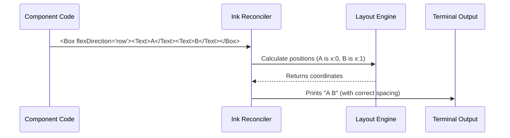

# Chapter 3: CLI UI Components

Welcome to the third chapter of our **Passes** project tutorial!

In the previous chapter, [Design System (Pane)](02_design_system__pane_.md), we created a consistent container (the "frame") for our application. However, a frame is boring if it's empty.

Now, we need to fill that frame with content. We need to arrange text in columns, display colorful headers, render ASCII art tickets, and add clickable links.

## The Problem: Terminal Text is Rigid
Historically, writing to the terminal meant printing lines of text one after another.
*   Want text in red? You need messy codes like `\x1b[31m`.
*   Want two items side-by-side? You have to calculate spaces manually (e.g., "Print 10 spaces, then the next word").

This is hard to maintain and breaks easily if the screen size changes.

## The Solution: A UI Toolkit
We use a set of **CLI UI Components** powered by a library called **Ink**. This allows us to build terminal apps exactly like we build websites using HTML and CSS.

We will focus on three core components:
1.  **`Box`**: The layout engine (like an HTML `<div>`).
2.  **`Text`**: The typography engine (like `<span>` or `<p>`).
3.  **`Link`**: Interactivity (like `<a>`).

---

## The Toolkit Explained

### 1. The `Box` (Layout)
The `Box` is an invisible container used to group items. It uses **Flexbox** logic.
*   **`flexDirection="column"`**: Items stack vertically (top to bottom).
*   **`flexDirection="row"`**: Items sit side-by-side (left to right).
*   **`gap={1}`**: Adds a distinct space between items automatically.

### 2. The `Text` (Style)
The `Text` component handles how words look.
*   **`color="red"`**: Changes font color.
*   **`dimColor`**: Makes text grey/faint (good for secondary info).
*   **`italic`**, **`bold`**: Standard text styling.

### 3. The `Link` (Interaction)
Modern terminals allow you to click text! The `Link` component wraps text and opens a URL in your default browser when clicked (or creates a copyable link).

---

## Building the Passes UI

Let's see how we use these components in `Passes.tsx` to build our Guest Passes screen.

### Step 1: Structural Layout
We want our content to flow from top to bottom inside our Pane.

```typescript
// Inside Passes.tsx
return (
  <Pane>
    {/* The Main Container */}
    <Box flexDirection="column" gap={1}>
       {/* All our content goes here */}
    </Box>
  </Pane>
);
```
**Explanation:** We create a vertical column. The `gap={1}` ensures that our header, our tickets, and our footer don't squish together; they will have one line of space between them.

### Step 2: Styled Typography
First, we add the header showing how many passes are left.

```typescript
<Text color="permission">
  Guest passes · {availableCount} left
</Text>
```
**Explanation:** We use a custom color named `"permission"` (defined in our theme) to highlight this important text. `availableCount` is a variable we calculated in Chapter 1.

### Step 3: Complex Layouts (The Tickets)
This is the trickiest part. We want to display 3 ASCII art tickets side-by-side.

To do this, we nest Boxes:
1.  **Outer Box:** A "Row" to hold the tickets horizontally.
2.  **Inner Box:** A "Column" for *each* ticket (to stack the top, middle, and bottom of the ticket art).

```typescript
<Box flexDirection="row" marginLeft={2}>
  {/* We map through our data to render 3 tickets */}
  {sortedPasses.slice(0, 3).map(pass => renderTicket(pass))}
</Box>
```
**Explanation:** `flexDirection="row"` places the tickets next to each other. `marginLeft={2}` indents them slightly so they look centered.

### Step 4: Drawing the Ticket (ASCII Art)
Let's look at the `renderTicket` function. A ticket is just 3 lines of text stacked vertically.

```typescript
const renderTicket = (pass: PassStatus) => {
  return (
    <Box key={pass.passNumber} flexDirection="column" marginRight={1}>
      <Text>{'┌──────────┐'}</Text>
      <Text>{' ) CC ✱ ┊ ( '}</Text>
      <Text>{'└──────────┘'}</Text>
    </Box>
  );
};
```
**Explanation:**
*   We use a `Box` (Column) to stack the three strings.
*   `marginRight={1}` ensures there is a space between this ticket and the next one in the row.
*   The result looks like a cohesive card.

### Step 5: Adding the Link
Finally, we add the disclaimer text at the bottom.

```typescript
<Text dimColor>
  Share a free week of Claude Code. 
  <Link url="https://support.claude.com/...">
    Terms apply.
  </Link>
</Text>
```
**Explanation:** We nest the `<Link>` *inside* the `<Text>`. This makes "Terms apply" clickable (or visually distinct) within the sentence.

---

## Under the Hood: Rendering to Terminal

How does `<Box>` turn into something the terminal understands? React usually renders to the DOM (HTML), but here we are rendering to a **String**.

Here is the flow of data:



### The Invisible Math
The magic happens in the **Layout Engine** (called Yoga).
1.  You say: "I want a row with a gap of 1."
2.  The engine calculates: "Item A is 1 character wide. The gap is 1 character. Item B starts at character index 3."
3.  It generates a long string containing text and spacing characters to matching that calculation.

## Internal Implementation Details

While `Ink` handles the heavy lifting, our project wraps these components to ensure they match our brand.

For example, when we used `<Text color="permission">`, `Ink` doesn't know what "permission" means. Our internal setup maps that name to a specific hex code or ANSI color.

```typescript
// Conceptual example of how Text might handle colors
if (props.color === 'permission') {
   // Apply a specific green/purple hue
   applyAnsiColor('\x1b[38;5;123m'); 
}
```

This abstraction allows us to change the "permission" color in one place, and every `<Text>` component in the app updates automatically.

## Conclusion

By using **CLI UI Components** like `Box`, `Text`, and `Link`, we have turned a complex formatting problem into a simple stacking game.

We have:
1.  Fetched data (Chapter 1).
2.  Created a container frame (Chapter 2).
3.  Laid out the content nicely (Chapter 3).

The UI looks great, but it's currently static. We mentioned pressing "Esc" or "Enter" in the text, but we haven't actually told the code how to listen for those keys.

[Next Chapter: Keybinding Management](04_keybinding_management.md)

---

Generated by [Code IQ](https://github.com/adityasoni99/Code-IQ)