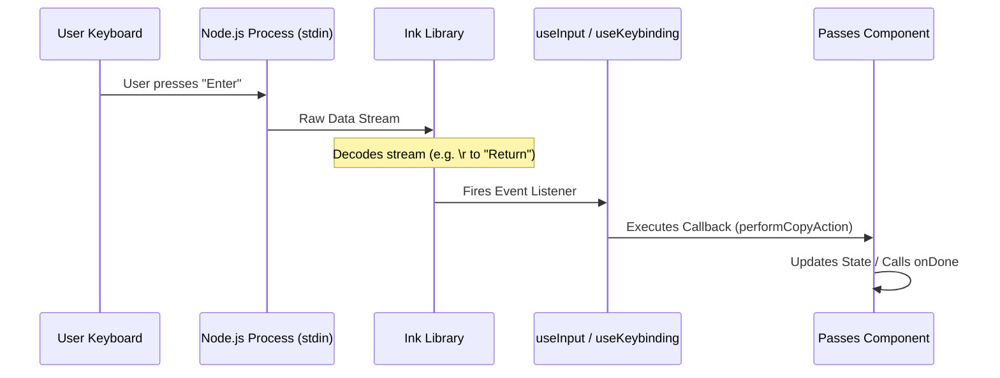

# Chapter 4: Keybinding Management

Welcome back! In the previous chapter, [CLI UI Components](03_cli_ui_components.md), we built a beautiful visual interface with tickets and links.

However, right now, our application is like a painting of a remote control: it looks great, but if you press the buttons, nothing happens. If a user runs the `Passes` command, they might get stuck on the screen with no way to close it!

In this chapter, we will implement **Keybinding Management**. We will wire up the keyboard so users can interact with our app—specifically, pressing `Enter` to copy a link and `Esc` (or `Ctrl+C`) to exit safely.

## The Problem: The "Trapped User"

In a web browser, you have a "Back" button and an "X" to close the tab. In a CLI (Command Line Interface), there are no buttons. You are responsible for listening to the user's keyboard.

If you don't explicitly tell your code to listen for "Escape" or "Ctrl+C", the user will have to kill their terminal window to stop your program. We need a way to:
1.  Listen to the **Standard Input** (keyboard).
2.  Decide what function to run based on the key pressed.

## The Solution: Input Hooks

We use a set of **React Hooks** designed for terminals. Think of these hooks as **Switchboard Operators**. They sit in the background, waiting for a signal (a key press), and when they hear one, they patch the call through to the correct function.

We will look at three specific tools:
1.  **`useExitOnCtrlCDWithKeybindings`**: The "Emergency Exit" handler.
2.  **`useKeybinding`**: For mapping specific actions (like "Cancel") to keys.
3.  **`useInput`**: For listening to raw keystrokes (like "Enter").

---

## Implementing Keybindings

Let's look at `Passes.tsx` to see how we make our component interactive.

### 1. The Safety Net (Global Exit)
First, we need to ensure the user can always quit. We use a custom hook that listens for standard exit signals (`Ctrl+C` to interrupt, `Ctrl+D` to send EOF).

```typescript
// Define what happens when the user tries to exit
const exitState = useExitOnCtrlCDWithKeybindings(() => 
  onDone('Guest passes dialog dismissed', {
    display: 'system'
  })
);
```

**What is happening here?**
*   We tell the hook: "If the user tries to force-quit, run this `onDone` function."
*   `onDone` closes our component and prints a system message ("Guest passes dialog dismissed").
*   `exitState` helps us know if the user is currently trying to exit (we use this to show helper text like "Press Ctrl+C again to exit").

### 2. Semantic Keybindings (The "Cancel" Action)
Instead of hard-coding "Escape", we prefer to think in terms of **Intent**. We want to handle a "Cancel" or "No" intent.

First, we define the function to run:

```typescript
// Create a reusable function to close the dialog
const handleCancel = useCallback(() => {
  onDone('Guest passes dialog dismissed', {
    display: 'system'
  });
}, [onDone]);
```

Next, we bind this function to the `confirm:no` action:

```typescript
import { useKeybinding } from '../../keybindings/useKeybinding.js';

// Map the 'confirm:no' action (usually Esc) to handleCancel
useKeybinding('confirm:no', handleCancel, {
  context: 'Confirmation'
});
```

**Why do it this way?**
By using `confirm:no`, we allow the system to determine what key triggers it. Usually, it is `Esc`, but if a user customizes their config to use `Backspace` for "No", our app will still work automatically!

### 3. Raw Input (The "Enter" Action)
Sometimes we need to listen for a specific key that isn't a standard "command." In our case, we want `Enter` (Return) to copy the referral link.

For this, we use the `useInput` hook from Ink.

```typescript
import { useInput } from '../../ink.js';

useInput((_input, key) => {
  // Check if the key pressed was "Enter/Return"
  // AND if we actually have a link to copy
  if (key.return && referralLink) {
    performCopyAction();
  }
});
```

Let's look at the action inside that `if` block. It copies text to the clipboard and notifies the user.

```typescript
// Inside the if (key.return) block...
void setClipboard(referralLink).then(raw => {
  // 1. Log the event
  logEvent('tengu_guest_passes_link_copied', {});
  
  // 2. Tell the user we succeeded and close the pane
  onDone(`Referral link copied to clipboard!`);
});
```

---

## Visualizing the User Feedback

Now that we have these bindings, we should tell the user they exist! In our UI code (Chapter 3), we display hints based on these hooks.

```typescript
<Box>
  <Text dimColor italic>
    {exitState.pending 
      ? <>Press {exitState.keyName} again to exit</> 
      : <>Enter to copy link · Esc to cancel</>
    }
  </Text>
</Box>
```

**Explanation:**
*   **Normal State:** We tell the user "Enter to copy · Esc to cancel".
*   **Pending Exit:** If the user pressed `Ctrl+C` once, `exitState.pending` becomes true. We change the text to warn them: "Press Ctrl+C again to exit".

---

## Under the Hood: How It Works

How does a React component running in Node.js know you pressed a button?

### The Input Flow



1.  **Raw Mode:** Normally, terminals wait for you to type a line and press Enter. Ink puts the terminal into "Raw Mode," which means every single character is sent to the program immediately.
2.  **Decoding:** Node.js receives raw bytes. Ink decodes these (e.g., turning the byte `0x1B` into the concept "Escape").
3.  **Bubbling:** Ink sends this event to any component using `useInput`.

### Internal Implementation Details

While `useInput` is provided by the Ink library, our `useKeybinding` is a custom abstraction. Here is a simplified view of how it maps names to keys.

```typescript
// Simplified Concept of useKeybinding
export function useKeybinding(action: string, handler: Function) {
  useInput((input, key) => {
    // 1. Look up which key maps to this action
    const expectedKey = getKeyForAction(action); // e.g., 'escape'
    
    // 2. If the pressed key matches, run the handler
    if (key[expectedKey]) {
      handler();
    }
  });
}
```

This abstraction allows us to change key definitions in one central file without hunting through every UI component to change `key.escape` to `key.q`.

## Conclusion

By adding **Keybinding Management**, we have transformed a static image into a real application.
*   Users can copy data (`Enter`).
*   Users can navigate back (`Esc`).
*   Users can quit safely (`Ctrl+C`).

We have covered the API (Data), the Design System (Visuals), the UI Components (Layout), and Keybindings (Interaction). Our feature is effectively complete!

But... how do we know if anyone is using it?

[Next Chapter: Analytics Service](05_analytics_service.md)

---

Generated by [Code IQ](https://github.com/adityasoni99/Code-IQ)